## 2023-2024学年上学期期末试卷（A）（含答案）

### 一、单项选择题（本大题共 15 小题，每小题 2 分，共 30 分）

1. 当一台主机从一个网络移到另一个网络时，以下说法正确的是（    ）。

    A. 必须改变它的 IP 地址和 MAC 地址

    B. 必须改变它的 IP 地址，但不需改动 MAC 地址

    C. 必须改变它的 MAC 地址，但不需改动 IP 地址

    D. MAC 地址、IP 地址都不需改动

    

    
答案：

    B

    

    ***

2. 下列设备中，能够分隔广播域的是（    ）。

    A. 集线器

    B. 交换机

    C. 路由器

    D. 中继器

    

    
答案：

    C

    

    ***

3. 使用 web 浏览器访问华东师范大学主页时（假设主机需要查找域名所对应 IP 地址），不会使用到的协议是（    ）。

    A. TCP

    B. UDP

    C. HTTP

    D. SMTP

    

    
答案：

    D

    

    ***

4. 一个网段的网络号为 198.90.10.0/27，最多可以分成（    ）个子网，每个子网最多具有（    ）个有效的 IP 地址。（注：除去全 0 和全 1）。

    A. 8，30

    B. 4，30

    C. 16，32

    D. 8，32

    

    
答案：

    A

    

    ***

5. 下列关于 ICMP 报文的说法，错误的是？（    ）。

    A. ICMP 报文封装在数据链路层帧中发送

    B. ICMP 报文用于报告 IP 数据报发送错误

    C. ICMP 报文封装在 IP 数据报中发送

    D. ICMP 报文本身出错将不再处理

    

    
答案：

    A

    

    ***

6. 关于 IPv6 地址 `1A22:120D:0000:0000:72A2:0000:0000:00C0` 的表示中错误的是（    ）。

    A. `1A22:120D::72A2:0000:0000:00C0`

    B. `1A22:120D::72A2:0:0:C0`

    C. `1A22::120D::72A2::00C0`

    D. `1A22:120D:0:0:72A2::C0`

    

    
答案：

    C

    

    ***

7. 流量控制的主要目的是（    ）。

    A. 防止发送主机缓冲区溢出

    B. 防止接收主机缓冲区溢出

    C. 防止路由器缓冲区溢出

    D. 以上都对

    

    
答案：

    B

    

    ***

8. ARP 的功能是（    ）。

    A. 根据 IP 地址查询 MAC 地址

    B. 根据 MAC 地址查询 IP 地址

    C. 根据域名查询 IP 地址

    D. 根据 IP 地址查询域名

    

    
答案：

    A

    

    ***

9. 某路由表中有转发接口相同的 4 条路由表项，其目的网络地址分别是 35.230.32.0/21、35.230.40.0/21、35.230.48.0/21 和 35.230.56.0/21，将该 4 条路由聚合后的目的网络地址为（    ）。

    A. 35.230.0.0/19

    B. 35.230.0.0/20

    C. 35.230.32.0/19

    D. 35.230.32.0/20

    

    
答案：

    C

    

    ***

10. 下列路由协议中，（    ）用于自治系统之间的路由选择。

    A. OSPF

    B. RIP

    C. ICMP

    D. BGP

    

    
答案：

    D

    

    ***

11. 如果无类地址块中的一个地址是 12.2.2.76/27，该无类地址块的第一个地址是（    ）。

    A. 12.2.2.0

    B. 12.2.2.32

    C. 12.2.2.64

    D. 以上均不正确

    

    
答案：

    C

    

    ***

12. 在回退 N 帧协议中，如果序列号的位数 5，则发送窗口的最大尺寸和接收窗口的最大尺寸分别为（    ）。

    A. 31，1

    B. 16，16

    C. 31，16

    D. 16，1

    

    
答案：

    A

    

    ***

13. 香农定理定义了有噪声信道的网络传输速率的理论极限值，假设 S 为信号功率，N 为噪声功率，带宽为 B（Hz），则根据香农定理，最大数据传输速率（信道容量）为（    ）。

    A. $B * \log_2(1+S/N)$

    B. $2B * \log_2(1+S/N)$

    C. $B * \log_{10}(1+S/N)$

    D. $2B * \log_{10}(1+S/N)$

    

    
答案：

    A

    

    ***

14. 向具有 700 字节 MTU 的一条链路发送一个 2400 字节的 IP 分组。最后一个分片的总长度为（    ）字节。

    A. 340

    B. 360

    C. 680

    D. 700

    

    
答案：

    B

    

    ***

15. 两个主机之间的距离是 L 千米，帧长为 K 比特，传播时延为 t 秒/千米，它们之间的信道容量为 R 比特/秒，假设处理时延可以忽略，那么当使用滑动窗口协议时，使得传输效率最大化的窗口是（    ）。

    A. $\frac{2LtR+K}{K}$

    B. $\frac{2LtR}{K}$

    C. $\frac{2LtR+2K}{K}$

    D. $\frac{2LtR+K}{2K}$

    

    
答案：

    A

    

***

### 二、填空题（每空 1 分，共 10 分）

1. IPv4、IPv6、MAC 地址的长度分别为 ________ 比特、________ 比特、________ 比特。

    

    
答案：

    32；128；48

    

    ***

2. Ethernet 采用的媒体访问控制方式是 ________。

    

    
答案：

    CSMA/CD

    

    ***

3. 动态路由协议主要包括两大类：距离矢量路由协议和 ________。其中 ________ 的路由生成算法的典型代表是 Bellman-Ford 算法，而 ________ 主要通过 Dijkstra 算法来生成最佳路由路径。

    

    
答案：

    链路状态路由协议；距离矢量路由协议；链路状态路由协议

    

    ***

4. 媒体访问协议中可以实现无冲突的协议有：Token Ring、________ 和 Binary Countdown。

    

    
答案：

    Bitmap

    

    ***

5. 两个站采用 CSMA/CD 协议传输数据，假设每个报文长度为 L，传输速率为 B，两站距离为 D，介质传播速度为 V，为了能够检测到冲突，需要满足的条件为：________。

    

    
答案：

    $L/B \ge 2D/V$

    

***

### 三、计算题（本大题共 4 小题，共 27 分）

1. （6 分）已知循环冗余码的生成多项式是 $G(x)=x^4+x+1$，要发送的数据为 1101011011。请问：

    1）数据后面添加的 CRC 校验位是多少？请给出计算过程。（2 分）

    2）若数据在传输过程中最后一个 1 变成了 0，问接收端能否发现？（2 分）

    3）若数据在传输过程中最后两个 1 变成了 0，问接收端能否发现？（2 分）

    

    
答案：

    1）除数：10011 被除数：1101011011 0000，则余数为：1110，即 CRC 校验码为 1110。则发送码：1101011011 1110。

    2）若最后一个变为 0，则 1101011010 1110/10011（模 2 除法）得余数为 0011，余数不为 0，故接收端可以发现。

    3）若最后两个成为 0，则 1101011000 1110/10011（模 2 除法）得余 0101，余数不为 0，故接收端可以发现。

    

    ***

2. （6 分）某个网络地址块 192.168.75.0 中有 5 台主机 A、B、C、D 和 E，A 主机的 IP 地址为 192.168.75.18，B 主机的 IP 地址为 192.168.75.146，C 主机的 IP 地址为 192.168.75.158，D 主机的 IP 地址为 192.168.75.161，E 主机的 IP 地址为 192.168.75.173，共同的子网掩码是 255.255.255.240。请回答：

    1）5 台主机 A、B、C、D、E 分属几个网段？（2 分）哪些主机位于同一网段？（2 分）

    2）若要加入第 6 台主机 F，使它能与主机 A 属于同一网段，其 IP 地址范围是多少？（注：除去全 0 和全 1）（2 分）

    

    
答案：

    1）共同的子网掩码为 255.255.255.240，表示前 28 位为网络号，同一网段内的 IP 地址具有相同的网络号。主机 A 的网络 192.168.75.16；主机 B 的网络 192.168.75.144；主机 C 的网络 192.168.75.144；主机 D 的网络 192.168.75.160；主机 E 的网络 192.168.75.160。因此 5 台主机 A、B、C、D、E 分属 3 个网段：主机 B 和主机 C 在一个网段，主机 D 和主机 E 在一个网段，主机 A 在一个网段。

    2）192.168.75.17 - 192.168.75.30，且不能为 192.168.75.18。

    

    ***

3. （6 分）某通信子网拓扑结构如下图所示，每条链路上的数字表示链路开销。请回答以下几个问题。该网络采用链路状态路由算法，请使用 Dijkstra 算法计算 A 节点到其他所有节点的最短路径。（请以表格的形式描述算法的计算过程）

    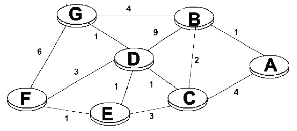

    

    
答案：

    每个 1 分。

    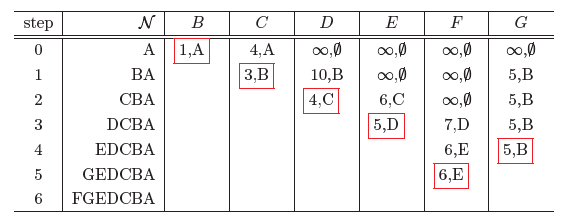

    

    ***

4. （9 分）考虑如下子网，V1, V2, V3, V4, V5 为路由器，采用距离矢量路由算法。假设每个节点初始时知道到它的每个邻居的距离。请回答以下问题：

    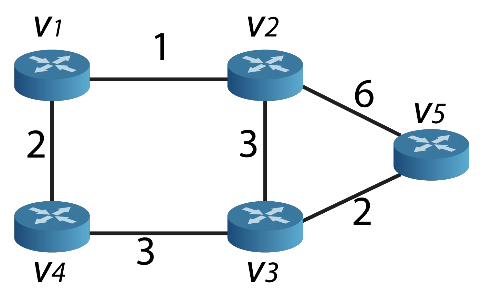

    1）给出节点 V2，V3 和 V5 三个节点的初始距离向量。（3 分）

    2）当 V5 收到来自邻居节点 V2 和 V3 的距离向量以后，请问 V5 如何更新自己的距离向量和下一跳？（3 分）

    3）假设 V3 和 V5 间链路断开，分析 V2 路由器的路由表中存储的 V2 到 V5 的距离的变化过程。（2 分）

    4）在 V3 和 V5 间链路断开一段时间后，进一步假设 V2 和 V5 间链路也断开，分析 V2 路由器在构造路由表，生成 V2 到 V5 的距离时会出现什么问题？（1 分）

    

    
答案：

    1）每行 1 分，共 3 分。

    |  | v1 | v2 | v3 | v4 | v5 |
    | --- | --- | --- | --- | --- | --- |
    | v2 | 1 | 0 | 3 | 无穷 | 6 |
    | v3 | 无穷 | 3 | 0 | 3 | 2 |
    | v5 | 无穷 | 6 | 2 | 无穷 | 0 |

    2）每行 1.5 分，共 3 分。

    |  | v1 | v2 | v3 | v4 | v5 |
    | --- | --- | --- | --- | --- | --- |
    | v5 | 7 | 5 | 2 | 5 | 0 |
    | 下一跳 | v2 | v3 | v3 | v3 | v5 |

    3）所有路由器/节点重新查找到 V5 的路径。所有路由器通过 V2 到 V5。路由器 V2 到 V5 的距离为 6。（2 分）

    4）会出现“无穷计算问题”。（1 分）

    

***

### 四、综合分析题（本大题共 2 题，共 33 分）

1. （15 分）主机 1 和主机 2 之间的一个 TCP 连接经历了下图所示的拥塞窗口变化，请回答以下问题：

    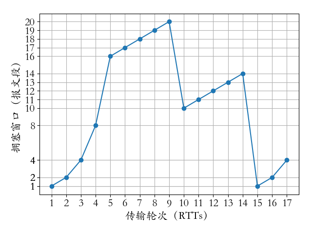

    （1）指出该 TCP 连接属于拥塞避免阶段的时间间隔。（2 分）

    （2）分别指出第 9 个传输轮次之后拥塞窗口变化的原因，以及第 14 个传输轮次之后拥塞窗口变化的原因。（2 分）

    （3）第 1、10、15 个传输轮次里慢启动阈值（ssthresh）的值分别为多少，并说明理由？（3 分）

    （4）如果没有任何报文丢失，第 19 个传输轮次的拥塞窗口大小是多少？（2 分）

    （5）假设主机 1 和主机 2 新建一个 TCP 连接，主机 1 的拥塞控制初始阈值是 32KB，主机 1 向主机 2 始终以 MSS = 1KB 大小的段发送数据，并一直有数据发送。主机 2 为该连接分配 16KB 接收缓存，并对每个数据段进行确认。忽略段传输延迟，若主机 2 接收的数据全部存入缓存没有被取走，试问主机 1 从连接建立成功时刻起，未发送超时的情况下，经过 1RTT、2RTT、3RTT 和 4RTT 后的发送窗口大小分别为多少？（注：发送窗口大小由拥塞窗口大小和接收窗口大小共同决定）（6 分）

    

    
答案：

    1）[5, 9]，[10, 14]。（每项 1 分，共 2 分）

    2）第 9 个：通过三个冗余 ACK 检测到了报文的丢失。

    第 14 个：根据定时器超时检测到了报文的丢失。

    （每项 1 分，共 2 分）

    3）第 1 个：16，因为拥塞窗口超过 16 个报文段以后进入了拥塞避免阶段。

    第 10 个：10，因为遇到报文丢失时，ssthresh 由之前的拥塞窗口减半，$20/2=10$。

    第 15 个：7，因为遇到报文丢失时，ssthresh 由之前的拥塞窗口减半，$14/2=7$。

    （每项 1 分，共 3 分）

    4）第 18 个传输轮次窗口为 7，因为新的 ssthresh 为 7；第 19 个传输轮次窗口为 8，因为进入了拥塞避免阶段。（2 分）

    5）计算过程如下：

    - 经过 1 个 RTT 后，第二次发送时，rwnd = 15KB，cwnd = 2KB，发送窗口取较小值：2KB。（1.5 分）
    - 经过 2 个 RTT 后，第三次发送时，rwnd = 13KB，cwnd = 4KB，发送窗口取较小值：4KB。（1.5 分）
    - 经过 3 个 RTT 后，第四次发送时，rwnd = 9KB，cwnd = 8KB，发送窗口取较小值：8KB。（1.5 分）
    - 经过 4 个 RTT 后，第五次发送时，rwnd = 1KB，cwnd = 16KB，发送窗口取较小值：1KB。（1.5 分）

    

    ***

2. （18 分）网络结构如下图所示，回答以下问题。

    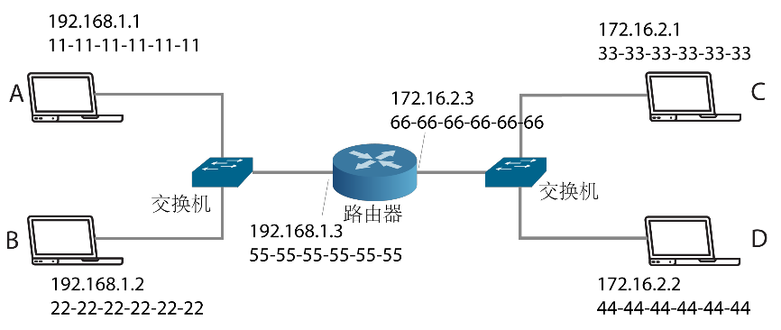

    1）主机 C 向主机 D 发送一个 IP 分组，主机 C 将请求路由器帮助转发该分组吗？为什么？（2 分）

    2）请填写下面表格中不同场景下的以太网帧的源和目的 IP、源和目的 MAC 地址分别是什么？（3 分）

    | 数据帧 | 源 IP 地址 | 源 MAC 地址 | 目的 IP 地址 | 目的 MAC 地址 |
    | --- | --- | --- | --- | --- |
    | A 发送给 B | 192.168.1.1 |  | 192.168.1.2 |  |
    | A 发送给 D（192.168.1.0 网络中） | 192.168.1.1 |  | 172.16.2.2 |  |
    | A 发送给 D（172.16.2.0 网络中） | 192.168.1.1 |  | 172.16.2.2 |  |

    3）主机 C 向主机 B 发送一个 IP 分组，假设主机 C 的 ARP 表为空，路由器的 ARP 表是最新的，请描述发生在子网 172.16.2.0/24 内部的 ARP 相关步骤。（2 分）

    4）假设 192.168.1.0 网络的 MTU 值为 1500 字节，172.16.2.0 网络的 MTU 值为 512 字节。如果主机 A 发送一个报文给主机 D，其报文头的字段值如下图所示。请问，路由器是否会对该报文进行分片？如果需要分片，请计算出分片数量，并给出每个分片的属性（包括分片大小、序列号、offset 值、MF 值）。如果不需要分片，请给出原因。（5 分）

    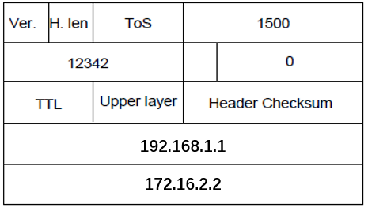

    5）如果主机 A 又发送一个报文给主机 D，其报文头的字段值如下图所示。请问，路由器是否会对该报文进行分片？如果需要分片，请计算出分片数量，并给出每个分片的属性（包括分片大小、序列号、offset 值、MF 值）。如果不需要分片，请给出原因。（3 分）

    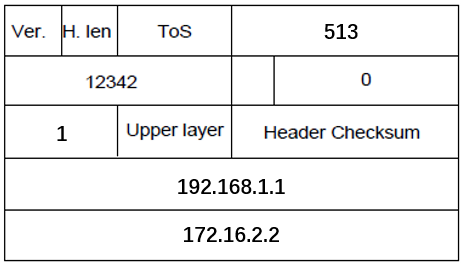

    6）假设主机 A 向主机 D 发送的 IP 分组报文头的字段值（10 进制）如下图所示。

    i）请计算该报文 Options 域填充的字节数是多少？（1 分）

    ii）该报文的第一个字节和最后一个字节的编号是多少？（2 分）

    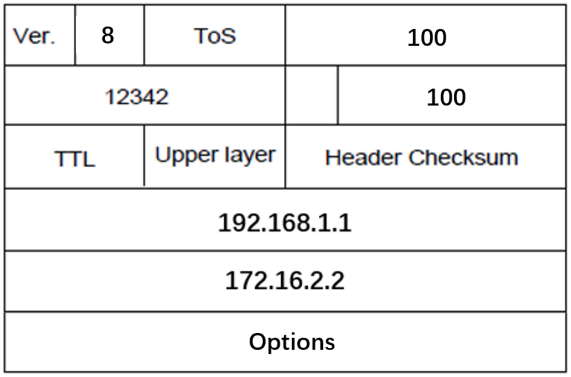

    

    
答案：

    1）不需要（1 分），因为 C 和 D 同属于一个局域网。（1 分）

    2）（每项 0.5 分，共 3 分）

    | 数据帧 | 源 IP 地址 | 源 MAC 地址 | 目的 IP 地址 | 目的 MAC 地址 |
    | --- | --- | --- | --- | --- |
    | A 发送给 B | 192.168.1.1 | 11-11-11-11-11-11 | 192.168.1.2 | 33-33-33-33-33-33 |
    | A 发送给 D（192.168.1.0 网络中） | 192.168.1.1 | 11-11-11-11-11-11 | 172.16.2.2 | 55-55-55-55-55-55 |
    | A 发送给 D（172.16.2.0 网络中） | 192.168.1.1 | 66-66-66-66-66-66 | 172.16.2.2 | 44-44-44-44-44-44 |

    3）C 要查询 172.16.2.3 的 MAC 地址，C 用一个以太网广播帧发送一个 ARP 请求分组。（1 分）

    路由器收到请求以后，用一个以太网帧发送给 C 一个 ARP 响应分组，其中包含 172.16.2.3 的 MAC 地址 66-66-66-66-66-66。该以太网帧的目的地址为 33-33-33-33-33-33。（1 分）

    4）需要分片。（1 分）

    512 字节 - 20 字节头 = 492 字节，但是 492 字节 mod 8 != 0，所以取 488 字节作为分片后的 IP 报文数据域长度。分片后的每个报文长度为 488+20=508 字节。

    1480 字节/488 字节 ≈ 4，所以需要 4 个分片，每个分片大小及序列号如下：

    - Fragment 1：分片大小为 508 字节（488 字节数据域+20 字节头），序列号为 12342，Offset 为 0，MF flag 为 1；
    - Fragment 2：分片大小为 508 字节（488 字节数据域+20 字节头），序列号为 12342，Offset 为 61，MF flag 为 1；
    - Fragment 3：分片大小为 508 字节（488 字节数据域+20 字节头），序列号为 12342，Offset 为 122，MF flag 为 1；
    - Fragment 4：分片大小为 36 字节（16 字节数据域+20 字节头），序列号为 12342，Offset 为 183，MF flag 为 0；

    （每个 1 分，共 4 分）

    5）不需要分片。（1 分）

    理由：当路由器收到该数据报文时，会对其 TTL 值减 1。该数据报文的 TTL 将会变为 0，所以，路由器将会直接丢弃到该报文。不需要进行分片。（2 分）

    6）问题 i：因为头部长度字段为 8，即头部长度为 32 字节，因此，Options 域填充的字节数为 32 字节 - 20 字节 = 12 字节。（1 分）

    问题 ii：头部长度为 32 字节，分组总长度为 100 字节，因此 payload/数据域的长度为 68 字节。另外，偏移位（Offset）值为 100，即该分组的第一个字节编号为 800，则最后一个字节的编号为 867。（2 分）

    

***

## 2023-2024学年上学期期末试卷（B）（含答案）

### 一、单项选择题（本大题共 15 小题，每小题 2 分，共 30 分）

1. 设信道带宽为 3400HZ，采用 PCM 编码，采样周期为 125μs，每个样本量化为 256 个等级，则信道的数据速率为（    ）。

    A. 10Kb/s

    B. 16Kb/s

    C. 56Kb/s

    D. 64Kb/s

    

    
答案：

    D

    

    ***

2. 曼彻斯特编码的效率是（    ）%。

    A. 40

    B. 50

    C. 80

    D. 100

    

    
答案：

    B

    

    ***

3. RIP 是一种基于（    ）算法的路由协议。

    A. 链路状态

    B. 距离矢量

    C. 泛洪路由

    D. 集中式路由

    

    
答案：

    B

    

    ***

4. TCP 协议使用三次握手机制建立连接，当请求方发出 SYN 连接请求后，等待对方回答（    ），这样可以防止建立错误的连接。

    A. SYN,ACK

    B. FIN,ACK

    C. PSH,ACK

    D. RST,ACK

    

    
答案：

    A

    

    ***

5. 采用 DHCP 分配 IP 地址无法做到提高域名解析速度，当客户机发送 dhcp discover 报文时采用（    ）方式发送。

    A. 广播

    B. 任意播

    C. 组播

    D. 单播

    

    
答案：

    A

    

    ***

6. IP 地址分为公网地址和私网地址，以下地址中属于私网地址的是（    ）。

    A. 127.0.0.1

    B. 10.216.33.124

    C. 172.34,21.15

    D. 192.32.146.23

    

    
答案：

    B

    

    ***

7. 如果子网 172.6.32.0/20 被划分为子网 172.6.32.0/26，则下面的结论中正确的是（    ）。

    A. 被划分为 62 个子网

    B. 每个子网有 64 个主机地址

    C. 被划分为 32 个子网

    D. 每个子网有 62 个主机地址

    

    
答案：

    D

    

    ***

8. 在局域网标准中，100BASE-T 规定从收发器到集线器的距离不超过（    ）米。

    A. 100

    B. 185

    C. 300

    D. 1000

    

    
答案：

    A

    

    ***

9. 802.11 在 MAC 层采用了（    ）协议。

    A. CSMA/CD

    B. CSMA/CA

    C. DQDB

    D. 令牌传递

    

    
答案：

    B

    

    ***

10. IEEE 802.16 工作组提出的无线接入系统空中接口标准是（    ）。

    A. GPRS

    B. UMB

    C. LTE

    D. WiMAX

    

    
答案：

    D

    

    ***

11. 对于选择重发 ARQ 协议，如果帧编号字段为 k 位，则窗口 w 大小为（    ）。

    A. $w \le 2^k - 1$

    B. $w \le 2^{k-1}$

    C. $w = 2^k$

    D. $w < 2^{k-1}$

    

    
答案：

    B

    

    ***

12. 下图表示了某个数据的两种编码，这两种编码分别是（    ）。

    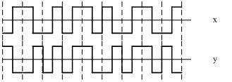

    A. X 为差分曼彻斯特码，Y 为曼彻斯特码

    B. X 为差分曼彻斯特码，Y 为双极性码

    C. X 为曼彻斯特码，Y 为差分曼彻斯特码

    D. X 为曼彻斯特码，Y 为不归零码

    

    
答案：

    C

    

    ***

13. IPv6 协议数据单元由一个固定头部和若干个扩展头部以及上层协议提供的负载组成，其中用于标识松散源路由功能的扩展头是（    ）。

    A. 目标头部

    B. 路由选择头部

    C. 分段头部

    D. 安全封装负荷头部

    

    
答案：

    B

    

    ***

14. CSMA/CD 协议可以利用多种监听算法来减小发送冲突的概率，下面关于各种监听算法的描述中，正确的是（    ）。

    A. 非持续型监听算法有利于减少网络空闲时间

    B. 持续型监听算法有利于减少冲突的概率

    C. P-持续型监听算法无法减少网络的空闲时间

    D. 持续型监听算法能够及时抢占信道

    

    
答案：

    D

    

    ***

15. 采用 CRC 进行差错校验，生成多项式为 $G(X)=X^4+X+1$，信息码字为 10111，则计算出的 CRC 校验码是（    ）。

    A. 0000

    B. 0100

    C. 0010

    D. 1100

    

    
答案：

    D

    

***

### 二、填空题（每空 1 分，共 10 分）

1. 光纤的规格分为 ________ 和 ________ 两种。

    

    
答案：

    单模光纤；多模光纤

    

    ***

2. 最常用的两种多路复用技术为 ________ 和 ________，其中，前者是同一时间同时传送多路信号，而后者是将一条物理信道按时间分成若干个时间片轮流分配给多个信号使用。

    

    
答案：

    FDM；TDM

    

    ***

3. 数据链路层的成帧技术主要有：________，________，________ 和物理层编码违禁法四种。

    

    
答案：

    字符计数法；字符填充法；位填充法

    

    ***

4. 采用海明码纠正一位差错，若信息位为 10 位，则冗余位至少应为 ________ 位。

    

    
答案：

    4

    

    ***

5. 常用的 IP 地址有 A、B、C 三类，128.11.3.31 是一个 ________ 类 IP 地址，其网络标识（netid）为 ________。

    

    
答案：

    B；128.11.0.0

    

***

### 三、计算题（本大题共 5 小题，共 30 分）

1. （6 分）以太网中共享信道分配策略是采用基于 CSMA/CD 的二进制指数后退算法，站点发送某个数据帧时发生了六次冲突后，该站点延迟时隙数（k）为 5 的概率是多少？在 10Mbps 以太网中，发生 6 次冲突后 K=5 时延迟的时间是多少？

    

    
答案：

    发生 6 次冲突后，站点从 `{0, 1, 2, ..., 63}` 选择一个数作为延时时隙。该站点延迟时隙数（k）为 5 的概率是 `1/64`。（3 分）

    延时时间：`5 * 51.2 = 256μs`。（3 分）

    

    ***

2. （6 分）Internet 中 IP 数据包分段技术有非常重要的作用。考虑向 MTU 为 520 字节的链路发送一个 2000 字节的 IP 数据包，假设原始数据包上 id 号为 123。通过该链路传递这个包，应该生成多少个分段？给出每个分段的 id、长度、MF 标志和 Offset 字段的值。

    

    
答案：

    共需要分为：`⌈1980/500⌉=4` 个碎片。（2 分）

    | Identifier | Total length | MF flag | Offset |
    | --- | --- | --- | --- |
    | 123 | 516 | 1 | 0 |
    | 123 | 516 | 1 | 62 |
    | 123 | 516 | 1 | 124 |
    | 123 | 512 | 0 | 186 |

    每行 1 分。

    

    ***

3. （6 分）通信的双方采用循环冗余码进行错误检测，假设双方协商的产生式为 $G(x)=x^5+x^2+1$。当接收方收到如下带循环冗余码的数据帧：$(9703)_{16}$，试分析接收方收到的数据帧是否正确，并说明理由。

    

    
答案：

    1. $(9703)_{16}=(1001,0111,0000,0011)_2$。（1 分）

    2. $G(x)=x^5+x^2+1$ 对应的产生式（二进制表示）：`100101`。（1 分）

    3. $(1001,0111,0000,0011)_2$ 除以 `100101`（逻辑除法）得到的余数为 `10100`。（3 分）

    4. 因此，接收方收到的数据帧是错误的。（1 分）

    

    ***

4. （6 分）假设 A、B、C、D 四个移动站点的芯片码序列如下所示。

    | 站点 | 芯片码序列 |
    | --- | --- |
    | A | `(-1 -1 -1 +1 +1 -1 +1 +1)` |
    | B | `(-1 -1 +1 -1 +1 +1 +1 -1)` |
    | C | `(-1 +1 -1 +1 +1 +1 -1 -1)` |
    | D | `(-1 +1 -1 -1 -1 -1 +1 -1)` |

    （1）如果 A、B、C 通过一个 CDMA 系统同时传输了位 0，试分析接收端得到的时间片序列是什么？

    （2）一个 CDMA 接收器得到了下面的时间片 `(-1 +1 -3 +1 -1 -3 +1 +1)`，请问哪些移动站传输了数据？每个站发送了什么位？

    

    
答案：

    （1）结果是通过对 A、B、C 求反再将这三个码片序列相加得到的。

    结果是 `(+3 +1 +1 -1 -3 -1 -1 +1)`。（2 分）

    （2）

    `(-1 +1 -3 +1 -1 -3 +1 +1) * (-1 -1 -1 +1 +1 -1 +1 +1)/8 = 1`

    `(-1 +1 -3 +1 -1 -3 +1 +1) * (-1 -1 +1 -1 +1 +1 +1 -1)/8 = -1`

    `(-1 +1 -3 +1 -1 -3 +1 +1) * (-1 +1 -1 +1 +1 +1 -1 -1)/8 = 0`

    `(-1 +1 -3 +1 -1 -3 +1 +1) * (-1 +1 -1 -1 -1 -1 +1 -1)/8 = 1`

    结果是 A 和 D 发送了位 1，B 发送了位 0，C 没有发送。（4 分）

    

    ***

5. （6 分）试计算在一个包括 5 段链路的连接上传输一帧所需的单程端到端时延。5 段链路中有 2 段是卫星链路，有 3 段是广域网链路。每条卫星链路又由上行链路和下行链路两部分组成，传播时延为 250ms。每一个广域网的范围为 1500km，其传播时延可按 150000km/s 来计。每段链路的传输速率均为 48kb/s，帧长为 1440 位。

    

    
答案：

    5 段链路的传播时延：`250 * 2 + (1500 / 150000) * 3 * 1000 = 530ms`。（2 分）

    5 段链路的发送时延：`1440 / (48 * 1000) * 5 * 1000 = 150ms`。（2 分）

    所以 5 段链路单程端到端时延：`530 + 150 = 680ms`。（2 分）

    

***

### 四、综合分析题（本大题共 3 题，共 30 分）

1. （10 分）TCP 拥塞窗口 cwnd 大小与 RTT 的关系如下表所示：

    | cwnd | 1 | 2 | 4 | 8 | 16 | 30 | 31 | 32 | 33 | 34 | 35 | 36 | 18 |
    | --- | --- | --- | --- | --- | --- | --- | --- | --- | --- | --- | --- | --- | --- |
    | RTT | 1 | 2 | 3 | 4 | 5 | 6 | 7 | 8 | 9 | 10 | 11 | 12 | 13 |
    | cwnd | 19 | 20 | 21 | 22 | 1 | 2 | 4 | 8 | 11 | 12 | 13 | 14 | 15 |
    | RTT | 14 | 15 | 16 | 17 | 18 | 19 | 20 | 21 | 22 | 23 | 24 | 25 | 26 |

    （1）试画出拥塞窗口与 RTT 的关系曲线。（2 分）

    （2）指明 TCP 工作在慢启动阶段的时间段。（2 分）

    （3）指明 TCP 链接拥塞避免阶段的时间段。（2 分）

    （4）在 RTT=12、RTT=17 之后发送方是通过收到的三个重复的确认还是通过超时检测到丢失了报文段？（2 分）

    （5）在 RTT=14 和 RTT=20 时，阈值 ssthresh 分别被设置为多大？（2 分）

    

    
答案：

    （1）

    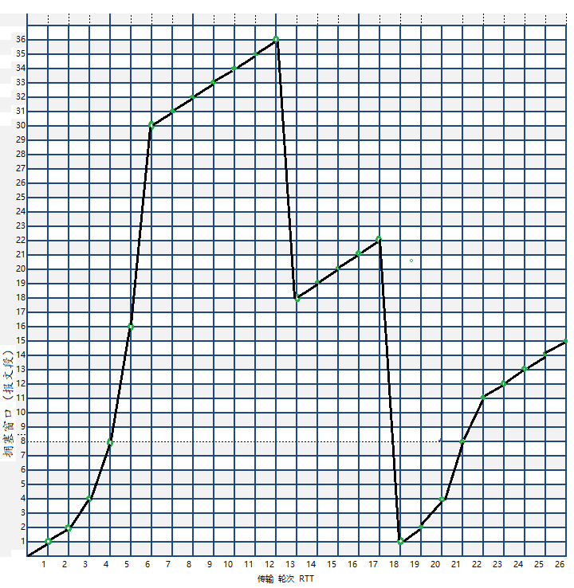

    （2）RTT：1—6，18—22

    （3）RTT：6—12，13—17，22-26

    （4）RTT=12：收到三个重复的确认，RTT=17：超时检测到丢失了报文段。

    （5）RTT=14 时，阈值 ssthresh 为 18，RTT=20 时，阈值 ssthresh 为 11。

    

    ***

2. （10 分）网络结构如下图所示，回答以下问题。

    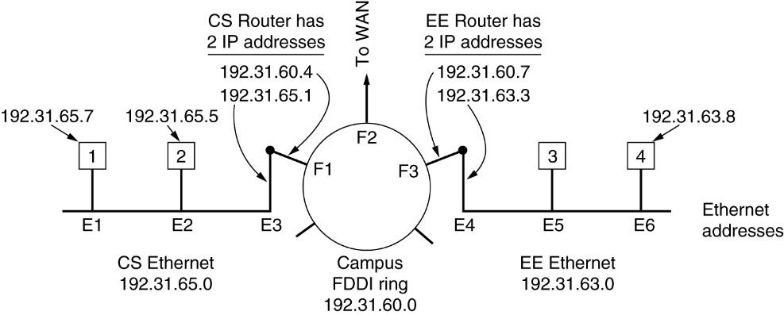

    （1）主机 1 分别向主机 2 和主机 4 各发送一个 IP 分组，需要路由器帮助转发该分组吗？为什么？（2 分）

    （2）主机 1、2、3、4 的缺省网关是什么？（2 分）

    （3）请填写下面表格。（6 分）

    | 数据帧 | 源 IP 地址 | 目的 IP 地址 | 源 MAC 地址 | 目的 MAC 地址 |
    | --- | --- | --- | --- | --- |
    | 主机 1 发送给主机 2 |  |  |  |  |
    | 主机 1 发送给主机 4（CS Ethernet 中） |  |  |  |  |
    | 主机 1 发送给主机 4（EE Ethernet 中） |  |  |  |  |

    

    
答案：

    （1）主机 1 分别向主机 2 发送 IP 分组，不需要路由器帮助转发该分组，因为 1 和 2 同属一个局域网 CS。（2 分）

    主机 1 分别向主机 4 发送 IP 分组，需要路由器帮助转发该分组，因为 1 和 4 不属于同一个局域网。（2 分）

    （2）主机 1、2 的缺省网关为 192.31.65.1，主机 3 和 4 的缺省网关为 192.31.63.3。

    （3）（每行 2 分，共 6 分）

    | 数据帧 | 源 IP 地址 | 目的 IP 地址 | 源 MAC 地址 | 目的 MAC 地址 |
    | --- | --- | --- | --- | --- |
    | 主机 1 发送给主机 2 | 192.31.65.7 | 192.31.65.5 | E1 | E2 |
    | 主机 1 发送给主机 4（CS Ethernet 中） | 192.31.65.7 | 192.31.63.8 | E1 | E3 |
    | 主机 1 发送给主机 4（EE Ethernet 中） | 192.31.65.7 | 192.31.63.8 | E4 | E6 |

    

    ***

3. （10 分）如下所示某企业内部网，通过三个路由器连接 3 个局域网。

    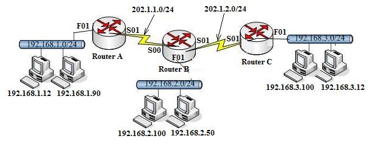

    构建路由表使得 192.168.1.0/24 和 192.168.3.0/24 能够访问网络 192.168.2.0/24，但是 192.168.1.0/24 和 192.168.3.0/24 之间不能互相访问。请回答下列问题：

    1.1）分析路由器 A 两端口的 IP 地址及子网掩码。

    F01 = (                                 )

    S01 = (                                 )

    1.2）构建路由器 A 路由表。

    | Destination | Mask | Next Hop |
    | --- | --- | --- |
    |  |  |  |
    |  |  |  |
    |  |  |  |

    2.1）分析路由器 B 三个端口的 IP 地址及子网掩码。

    F01 = (                                 )

    S00 = (                                 )

    S01 = (                                 )

    2.2）构建路由器 B 路由表。

    | Destination | Mask | Next Hop |
    | --- | --- | --- |
    |  |  |  |
    |  |  |  |
    |  |  |  |
    |  |  |  |
    |  |  |  |

    3.1）分析路由器 C 两个端口的 IP 地址及子网掩码。

    F01 = (                                 )

    S01 = (                                 )

    3.2）构建路由器 C 路由表。

    | Destination | Mask | Next Hop |
    | --- | --- | --- |
    |  |  |  |
    |  |  |  |
    |  |  |  |

    

    
答案：

    1.1）（1 分）

    F01 = 192.168.1.1  255.255.255.0

    S01 = 202.1.1.1  255.255.255.0

    1.2）（2 分）A 路由表

    | Destination | Mask | Next Hop |
    | --- | --- | --- |
    | 192.168.2.0 | 255.255.255.0 | 202.1.1.2 |
    | 192.168.1.0 | 255.255.255.0 | Direct |
    | 202.1.1.0 | 255.255.255.0 | Direct |

    2.1）（1 分）

    F01 = 192.168.2.1  255.255.255.0

    S00 = 202.1.1.2  255.255.255.0

    S01 = 202.1.2.2  255.255.255.0

    2.2）（3 分）B 路由表

    | Destination | Mask | Next Hop |
    | --- | --- | --- |
    | 192.168.1.0 | 255.255.255.0 | 202.1.1.1 |
    | 192.168.3.0 | 255.255.255.0 | 202.1.2.1 |
    | 192.168.2.0 | 255.255.255.0 | Direct |
    | 202.1.1.0 | 255.255.255.0 | Direct |
    | 202.1.2.0 | 255.255.255.0 | Direct |

    3.1）（1 分）

    F01 = 192.168.3.1  255.255.255.0

    S01 = 202.1.2.1  255.255.255.0

    3.2）（2 分）C 路由表

    | Destination | Mask | Next Hop |
    | --- | --- | --- |
    | 192.168.2.0 | 255.255.255.0 | 202.1.2.2 |
    | 192.168.3.0 | 255.255.255.0 | Direct |
    | 202.1.2.0 | 255.255.255.0 | Direct |

    

