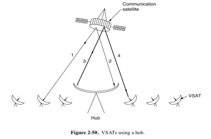
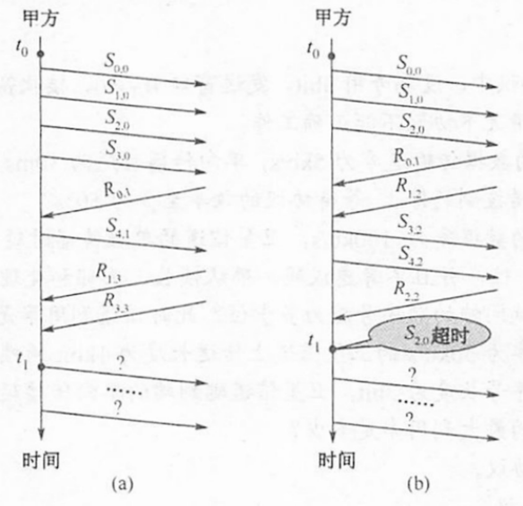

## 2025-2026学年上学期期中试卷（含答案）

### 一、单项选择题（本大题共 10 小题，每小题 2 分，共 20 分）

1. 在 OSI 参考模型中，功能需由应用层的相邻层实现的是（  ）。

    A. 对话管理

    B. 数据格式转换

    C. 路由选择

    D. 可靠数据传输

    

    
答案：

    B

    

    ***

2. 假设 OSI 参考模型的应用层欲发送 400B 的数据（无拆分），除物理层和应用层外，其他各层在封装 PDU 时均引入 20B 的额外开销，则应用层的数据传输效率约为（  ）。

    A. 80%

    B. 83%

    C. 87%

    D. 91%

    

    
答案：

    A

    

    ***

3. 下列选项中，不属于网络体系结构所描述的内容是（  ）。

    A. 网络的层次

    B. 每层使用的协议

    C. 协议的内部实现细节

    D. 每层必须完成的功能

    

    
答案：

    C

    

    ***

4. 下列因素中，不会影响信道数据传输速率的是（  ）。

    A. 信噪比

    B. 频率带宽

    C. 调制速率

    D. 信号传播速率

    

    
答案：

    D

    

    ***

5. 下列选项中，不属于物理层接口规范定义范畴的是（  ）。

    A. 接口形状

    B. 引脚功能

    C. 物理地址

    D. 信号电平

    

    
答案：

    C

    

    ***

6. 若信道在无噪声情况下的极限数据传输速率不小于信噪比为 30dB 条件下的极限数据传输速率，则信号状态数至少是（  ）。

    A. 4

    B. 8

    C. 16

    D. 32

    

    
答案：

    D

    

    ***

7. 在无噪声的情况下，若某通信链路的带宽为 3kHz，采用 4 个相位，每个相位具有 4 种振幅的 QAM 调制技术，则该通信链路的最大数据传输速率是（  ）。

    A. 12kb/s

    B. 24kb/s

    C. 48kb/s

    D. 96kb/s

    

    
答案：

    B

    

    ***

8. 对于信道比较可靠且对实时性要求高的网络，数据链路层采用（  ）比较合适。

    A. 无确认的无连接服务

    B. 有确认的无连接服务

    C. 无确认的面向连接服务

    D. 有确认的面向连接服务

    

    
答案：

    A

    

    ***

9. 数据链路层采用了回退 N 帧（GBN）协议，发送方已经发送了编号为 0~7 的帧。计时器超时时，若发送方只收到 0、2、3 号帧的确认，则发送方需要重发的帧数是（  ）。

    A. 2

    B. 3

    C. 4

    D. 5

    

    
答案：

    C

    

    ***

10. 若甲向乙发送数据时采用 CRC 校验，生成多项式 $G(X)=X^4+X+1$（即 $G=10011$），则乙方接收到比特串（  ）时，可以断定其在传输过程中未发生错误。

    A. 10111 0000

    B. 10111 0100

    C. 10111 1000

    D. 10111 1100

    

    
答案：

    D

    

### 二、填空题（每空 2 分，共 20 分）

1. 单比特奇偶校验码的海明距离是（  ）。

    

    
答案：

    2

    

    ***

2. 一个带宽为 $B$ Hz 的信道，其信号等于噪声，则信道容量为（  ）bps。

    

    
答案：

    $B$

    

    ***

3. 信道速率为 4kb/s，采用停止等待协议。传播时延 $t_p=20ms$，确认帧长度和处理时间均可忽略。帧长至少为（  ）bit 才能使信道利用率达到 80%。

    

    
答案：

    640

    

    ***

4. 二进制信号在信噪比为 127:1 的 4kHz 信道上传输，最大数据传输速率可以达到（  ）。

    

    
答案：

    8kb/s

    

    ***

5. 一般将从 0 到某个最大频率的信号称为（  ）信号，可以通过（  ）将上述信号搬移至某个更大频率范围的信号。

    

    
答案：

    基带；调制

    

    ***

6. 测得一个以太网的数据波特率是 40MBaud/s，那么其数据率是（  ）。

    

    
答案：

    20Mb/s

    

    ***

7. 你收到以下数据片段：`0110 0111 1100 1111 0111 1101`。该协议使用位填充。请给出去除填充后的数据（  ）。

    

    
答案：

    `0110 0111 1101 1110 1111 11`

    

    ***

8. 在 $n$ 个结点的星形拓扑结构中，有（  ）条物理链路。

    

    
答案：

    $n-1$

    

    ***

9. 最早的计算机网络是（  ）。

    

    
答案：

    ARPANET

    

### 三、简答题（本大题共 4 小题，每小题 5 分，共 20 分）

1. 基站为设备 A 和 B 安排一个时隙，使用下表所示码片序列发送数据。在此期间，其他电台保持沉默。由于噪音，一些码片会丢失。基站接收以下序列：$(0,0,?,-2,?,?,0,-2)$。站 A 和 B 传输的比特值是多少？

    | 站点 | 码片 |
    | --- | --- |
    | A | 00011011 |
    | B | 00101110 |
    | C | 01011100 |
    | D | 01000010 |

    

    
答案：

    A 站的码片序列为 $(-1,-1,-1,+1,+1,-1,+1,+1)$；（1 分）

    B 站的码片序列为 $(-1,-1,+1,-1,+1,+1,+1,-1)$。（1 分）

    其他站点沉默。

    当 A 站发送的码片序列为 $(+1,+1,+1,-1,-1,+1,-1,-1)$，（1 分）

    B 站的码片序列为 $(-1,-1,+1,-1,+1,+1,+1,-1)$ 时（1 分）

    可与基站接收的码片序列中已知位置信息 $(0,0,?,-2,?,?,0,-2)$ 一致。

    可知 A 站和 B 站发送的比特值分别是 0 和 1。（1 分）

    

    ***

2. 在选择性重传协议中，设编号用 3bit，发送窗口尺寸 $W_S=6$，接收窗口尺寸 $W_R=3$。试找出一种情况，使得在此情况下协议不能正确工作。

    

    
答案：

    对于选择重传协议，发送窗口尺寸不能超过 $2^{n-1}$，题中用 3 位编号，即发送窗口尺寸最大值为 4，所以题目中的场景是无法正常工作的。（说明选择性重传协议的发送窗口尺寸的上限得 2 分）

    一种可能的情况如下：发送方发出的所有数据帧都被接收方正确接收，而接收方回送的应答帧均不能达到发送方时，由发送方超时重发的数据帧将被接收方视为新的数据帧，从而协议不能正确工作。（3 分）

    

    ***

3. 在 T1（或 E1）数字电话系统中，为什么 PCM 语音信号采样时间设置为 $125\mu s$？

    

    
答案：

    $125\mu s$ 的采样时间相当于每秒 8000 个样本，即采样频率 8000Hz（2 分）。根据奈奎斯特定理，在 4kHz 话音信道中捕获所有信息需要满足用两倍的频率进行采样，即 8kHz。（3 分）

    

    ***

4. 假设消息 9CA3 使用 4 位 Checksum 传输。Checksum 的值是多少？

    

    
答案：

    9CA3 的二进制是 `1001 1100 1010 0011`。（1 分）

    `0011 + 1010 = 1101`

    `1101 + 1100 = 1001 + 1 = 1010`

    `1010 + 1001 = 0011 + 1 = 0100`

    对 `0100` 取 1 的补码（即取反），为 `1011`。（运算过程 3 分，结果 1 分）

    

### 四、综合计算题（本大题共 4 小题，共 40 分）

1. 现有 16 位消息使用海明码传输。需要多少个校验位才能确保接收器能够检测和纠正单位错误？为消息 `1101 0011 0011 0101` 计算采用海明码编码后传输的位模式。假设使用偶校验。

    

    
答案：

    根据 $m+r+1\leq 2^r$，对于 $m=16$，$r$ 的最小值为 5。（1 分）

    以下为编号自右向左递增的结果。

    （列出校验位的位置，0.5 分）

    | 21 | 20 | 19 | 18 | 17 | 16 | 15 | 14 | 13 | 12 | 11 | 10 | 9 | 8 | 7 | 6 | 5 | 4 | 3 | 2 | 1 |
    | --- | --- | --- | --- | --- | --- | --- | --- | --- | --- | --- | --- | --- | --- | --- | --- | --- | --- | --- | --- | --- |
    | 1 | 1 | 0 | 1 | 0 |  | 0 | 1 | 1 | 0 | 0 | 1 | 1 |  | 0 | 1 | 0 |  | 1 |  |  |

    $$SUM(21,19,17,15,13,11,9,7,5,3)=1+0+0+0+1+0+1+0+0+1=0,\ R_1=0$$

    （1.5 分）

    $$SUM(19,18,15,14,11,10,7,6,3)=0+1+0+1+0+1+0+1+1=1,\ R_2=1$$

    （1.5 分）

    $$SUM(21,20,15,14,13,12,7,6,5)=1+1+0+1+1+0+0+1+0=1,\ R_4=1$$

    （1.5 分）

    $$SUM(15,14,13,12,11,10,9)=0+1+1+0+0+1+1=0,\ R_8=0$$

    （1.5 分）

    $$SUM(21,20,19,18,17)=1+1+0+1+0=1,\ R_{16}=1$$

    （1.5 分）

    采用海明码编码后传输的位模式为：`1101 0101 1001 1001 01110`。（1 分）

    以下为编号自左向右递增的结果。

    （列出校验位的位置，0.5 分）

    | 1 | 2 | 3 | 4 | 5 | 6 | 7 | 8 | 9 | 10 | 11 | 12 | 13 | 14 | 15 | 16 | 17 | 18 | 19 | 20 | 21 |
    | --- | --- | --- | --- | --- | --- | --- | --- | --- | --- | --- | --- | --- | --- | --- | --- | --- | --- | --- | --- | --- |
    |  |  | 1 |  | 1 | 0 | 1 |  | 0 | 0 | 1 | 1 | 0 | 0 | 1 |  | 1 | 0 | 1 | 0 | 1 |

    $$SUM(3,5,7,9,11,13,15,17,19,21)=1+1+1+0+1+0+1+1+1+1=0,\ R_1=0$$

    （1.5 分）

    $$SUM(3,6,7,10,11,14,15,18,19)=1+0+1+0+1+0+1+0+1=1,\ R_2=1$$

    （1.5 分）

    $$SUM(5,6,7,12,13,14,15,20,21)=1+0+1+1+0+0+1+0+1=1,\ R_4=1$$

    （1.5 分）

    $$SUM(9,10,11,12,13,14,15)=0+0+1+1+0+0+1=1,\ R_8=1$$

    （1.5 分）

    $$SUM(17,18,19,20,21)=1+0+1+0+1=1,\ R_{16}=1$$

    （1.5 分）

    采用海明码编码后传输的位模式为：`0111 1011 0011 0011 10101`。（1 分）

    

    ***

2. 使用 CRC 方法传输比特流 `1001 1101`。生成多项式为 $x^3+1$。

    （1）请计算实际传输的比特串。

    （2）假设从左数第三位在传输过程中被反转。说明接收端如何检测到此错误。

    （3）给出一个出错的位模式使得接收端无法检测到传输比特串中的位错误，并用多项式除法给出接收端检测不到此错误的过程。

    

    
答案：

    （1）数据位：`10011101`；生成式：`1001`。

    附加三个 0 后的消息为 `10011101000`。（1 分）

    `10011101000` 除以 `1001` 的余数为 `100`。（3 分）

    因此，实际传输的位串是 `10011101100`。（1 分）

    （2）接收到的 bitstream 在左侧的第 3 位有错误，则为 `10111101100`。（1 分）

    将其除以 `1001` 会得到 `100` 的余数，这与 0 不同。因此，接收方检测到错误并可以请求重传。（1 分）

    （3）如果传输的比特流转换为 `1001` 的任意倍数，则不会检测到错误。例如，出错的位模式恰好为 `1001`，即接收方接收到的位模式为 `10011101100 + 1001 = 10011100101`（1 分），使用多项式除法除以 `1001`（过程略），可以整除，即无法检测到出错的位模式。（2 分）

    

    ***

3. 假设下图中的上行链路为 1 Mbps，下行链路为 7 Mbps，请分别在下面两种场景中，分析将一个 1GB 文件从一个 VSAT 通过卫星和 hub 传输到另一个 VSAT 需要多长时间？卫星距地面 35800 公里，信号传播速率为 $3\times 10^8$ 米/秒。

    

    （1）场景 1：使用电路交换。电路建立时间为 1.2 秒。

    （2）场景 2：使用分组交换。假设分组大小为 64 KB，卫星和 hub 的交换延迟为 10 微秒，分组头大小为 32 字节。

    

    
答案：

    （1）系统中带宽最低的链路（1Mbps）是瓶颈。

    以 1Mbps 发送 1GB 的传输时间是 $1024\times 8$ 秒。（2 分）

    传播延迟可以计算为 $4\times(35800/300000)=480$ 毫秒。（1 分）

    $$t_{cs}=d_{conn}+d_{trans}+d_{prop}$$

    $$=1.2s+1GB/1Mbps+4\times35800km/(3\times10^8m/s)$$

    $$=1.2s+1024\times8s+0.480s=8193.68s$$

    （结果 1 分）

    （2）带宽最低的链路（1Mbps）是瓶颈。

    使用 64KB 的数据包，一个 1GB 的文件中有 16K 个数据包。这会增加 $16K\times32=512K$ 字节的头部需要传输。（1 分）

    传输时间为传输整个文件（数据+头部）的时间 $(1024.5\times8)$ + 存储转发延迟 $\left(3\times((64KB+32B))/1Mbps\right)$。（2 分）

    传播延迟 $4\times(35800/300000)=480$ 毫秒。（1 分）

    三个交换机（卫星和 hub）的每个交换时间 0.01 毫秒相加来计算。（1 分）

    $$t_{ps}=d_{trans}+d_{prop}+d_{queue}+d_{proc}$$

    $$=(1GB+(1GB/64KB)\times32B)/1Mbps+3\times((64KB+32B))/1Mbps+4\times35800km/(3\times10^8m/s)+3\times10\times10^{-6}s$$

    $$=1024.5\times8s+1.537s+0.480s+0.00003s$$

    $$=8198.01703s$$

    （结果 1 分）

    

    ***

4. 甲乙双方均采用回退 N 帧协议（GBN）进行持续的双向数据传输，且双方始终采用捎带确认，帧长均为 1000B。$S_{xy}$ 和 $R_{xy}$ 分别表示甲方和乙方发送的数据帧，其中 $x$ 是发送序号，$y$ 是确认序号（表示希望接收对方的下一帧序号），数据帧的发送序号和确认序号字段均为 3 比特。信道传输速率为 100Mb/s，单向传播延迟为 0.48ms。下图给出了甲方发送数据帧和接收数据帧的两种场景，其中 $t_0$ 为初始时刻，此时甲方的发送和确认序号均为 0，$t_1$ 时刻甲方有足够多的数据待发送。请回答下列问题。

    

    （1）对于图（a），$t_0$ 时刻到 $t_1$ 时刻期间，甲方可以断定乙方已正确接收的数据帧数是多少？正确接收的是哪几个帧（请用 $S_{xy}$ 形式给出）？

    （2）对于图（a），从 $t_1$ 时刻起，甲方在不出现超时且未收到乙方新的数据帧之前，最多还可以发送多少个数据帧？其中第一个帧和最后一个帧分别是哪个（请用 $S_{xy}$ 形式给出）？

    （3）对于图（b），从 $t_1$ 时刻起，甲方在不出现新的超时且未收到乙方新的数据帧之前，需要重发多少个数据帧？重发的第一个帧是哪个帧（请用 $S_{xy}$ 形式给出）？

    （4）甲方可以达到的最大信道利用率是多少？

    

    
答案：

    （1）$t_0$ 时刻到 $t_1$ 时刻期间，甲方可以断定乙方已正确接收 3 个数据帧（1 分），分别是 $S_{0,0}$，$S_{1,0}$，$S_{2,0}$（2 分）。$R_{3,3}$ 说明乙发送的数据帧确认号是 3，即希望甲发送序号 3 的数据帧，说明乙已经接收序号为 0~2 的数据帧。

    （2）从 $t_1$ 时刻起，甲方最多还可以发送 5 个数据帧（1 分），其中第一个帧是 $S_{5,2}$（1 分），最后一个数据帧是 $S_{1,2}$（1 分）。发送序号 3 位，有 8 个序号。在 GBN 协议中，发送窗口最大为 7。此时已发送 $S_{3,0}$ 和 $S_{4,1}$，所以最多还可以发送 5 个帧。

    （3）甲方需要重发 3 个数据帧（1 分），重发的第一个帧是 $S_{2,3}$（1 分）。在 GBN 协议中，发送方发送 N 帧后，检测出错，则需要发送出错帧及其之后的帧。$S_{2,0}$ 超时，所以重发的第一帧是 $S_2$。已收到乙的 $R_2$ 帧，所以确认号应为 3。

    （4）（2 分）甲方可以达到的最大信道利用率是

    $$
    \frac{7\times8\times1000/100M}{2\times0.48ms+2\times8\times1000/100M}\times100\%=50\%
    $$

    

