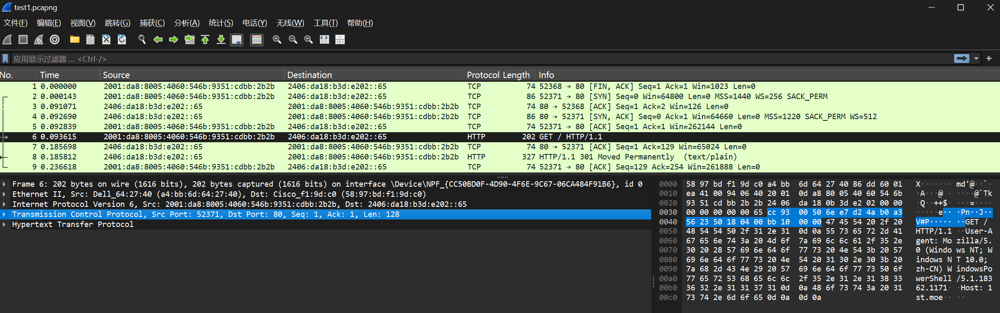
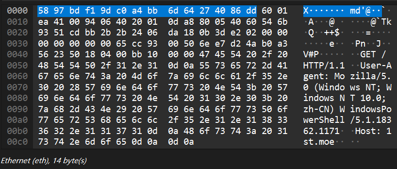
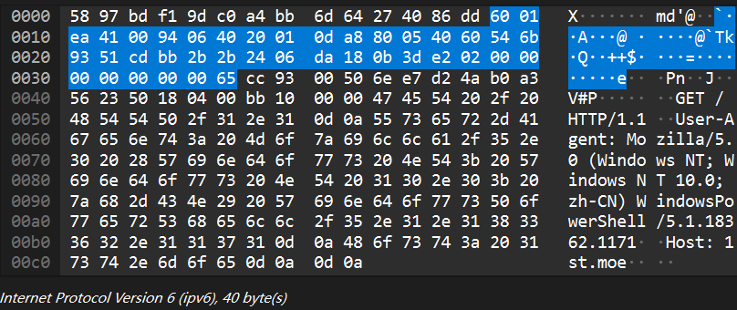
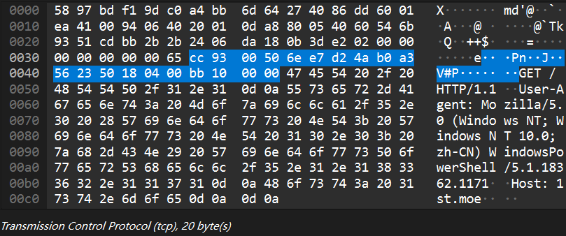
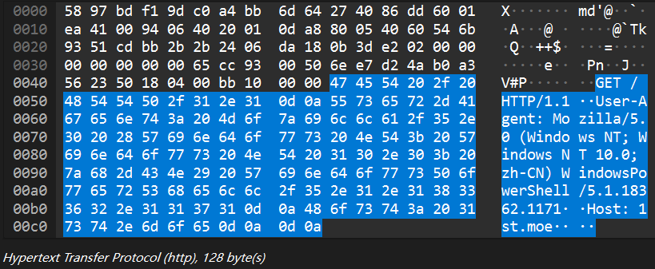
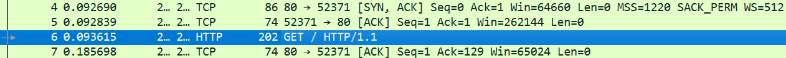
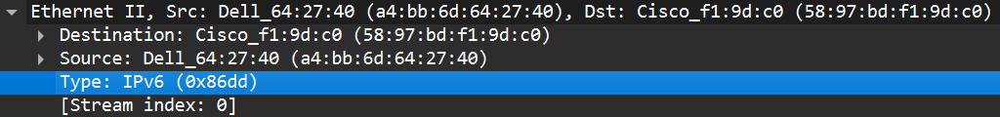
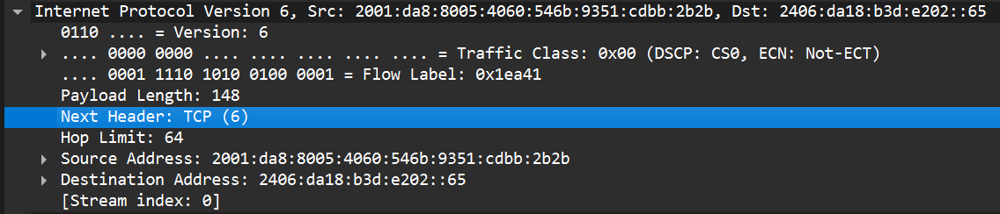

**华东师范大学软件学院实验报告**

**一、实验目的**

1. 学会使用curl与wget指令

2. 学会通过Wireshark获取数据包

3. 了解协议层数据包的结构

4. 学会计算并分析协议开销

**二、实验内容与实验步骤**

1. 在控制台中输入"curl <http://1st.moe/"，并观察到"200> OK"

2. 启动Wireshark，选择监听以太网，并将捕获过滤器设置为tcp port
    > 80，关闭混杂模式，并启用"enable network name resolution"选项

3. 关闭所有浏览器窗口后开始捕获

4. 重新在控制台输入"curl [**http://1st.moe/**](http://1st.moe/)"

5. 停止Wireshark捕获

**三、实验环境**

> B226机房电脑

**四、实验过程与分析**

1. 实验过程

    1) 捕获内容如图所示

> {width="17.007cm"
> height="5.3cm"}

2. 1) 分析协议包的内容

> {width="8.504cm"
> height="3.6cm"}{width="8.504cm"
> height="3.579cm"}{width="8.504cm"
> height="3.556cm"}{width="8.504cm"
> height="3.489cm"}

> 根据如上四张图片，可以发现各个协议所占的字节数为

+---------------------------------------+-------------+
| > 协议                                | > 字节数    |
+---------------------------------------+-------------+
| > Ethernet (eth)                      | > 14 bytes  |
+---------------------------------------+-------------+
| > Internet Protocol Version 6 (ipv6)  | > 40 bytes  |
+---------------------------------------+-------------+
| > Transmission Control Protocol (tcp) | > 20 bytes  |
+---------------------------------------+-------------+
| > Hypertext Transfer Protocol (http)  | > 128 bytes |
+---------------------------------------+-------------+

> 则包的结构大致如下

+-------------------+--------------------+------------+-------------+
| > eth             | > ip               | > tcp      | > http      |
+-------------------+--------------------+------------+-------------+
| > 14 bytes        | > 40 bytes         | > 20 bytes | > 128 bytes |
+-------------------+--------------------+------------+-------------+
| > Ethernet Header | > Ethernet Payload |            |             |
+-------------------+--------------------+------------+-------------+
| > IP Header       | > IP Payload       |            |             |
+-------------------+--------------------+------------+-------------+

3. 问题

    1) 分析协议开销

> 一个GET本身的大小为128
> bytes，而其相应产生的SYN、ACK请求也应算入其开销中。根据图片

> {width="17.096cm"
> height="1.281cm"}

> 可以计算得出由于协议产生的总开销为86+74+(202-128)+74=308
> bytes，从而计算得出比值约为0.4156，考虑到信息传输的稳定性，协议开销是值得的。

4. 1) 以太网头部中哪一部分是解复用键并且告知它的下一个高层指的是IP，在这一包内哪一个值可以表示IP

> 根据图片

> {width="17.096cm"
> height="2.009cm"}

> {width="17.096cm"
> height="3.667cm"}

> 可以直观看出ipv6对应的分解键为0x86dd，tcp对应的分解键为6

5. 故障分析

> 在实验过程中出现了控制台有反馈但Wireshark没有捕获的情况，经排查后发现是由于控制台指令输入错误：误将http输入为https所致。

**五、实验结果总结**

1. 实验完成了对一个HTTP包的拆解与分析，其大体结构大致如下

+-------------------+--------------------+------------+-------------+
| > Eth             | > ip               | > tcp      | > http      |
+-------------------+--------------------+------------+-------------+
| > 14 bytes        | > 40 bytes         | > 20 bytes | > 128 bytes |
+-------------------+--------------------+------------+-------------+
| > Ethernet Header | > Ethernet Payload |            |             |
+-------------------+--------------------+------------+-------------+
| > IP Header       | > IP Payload       |            |             |
+-------------------+--------------------+------------+-------------+

2. 实验通过curl指令与Wireshark软件完成，在其中熟悉网络工具的使用，并体会到其强大之处

3. 通过查询相关资料，了解开销、分解键等概念

**六、附录**

**无**
