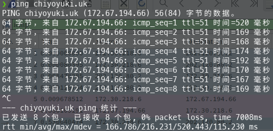
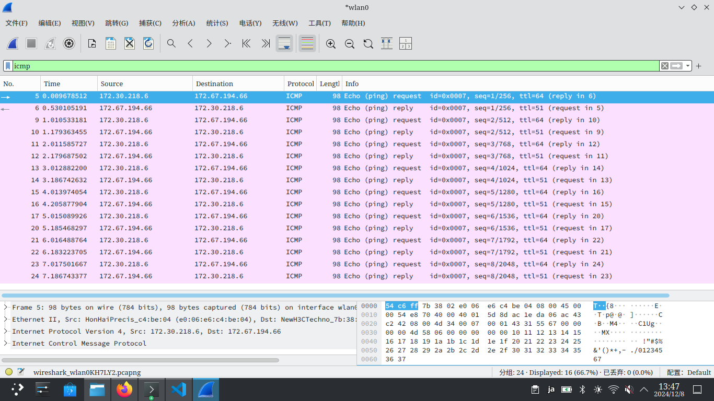
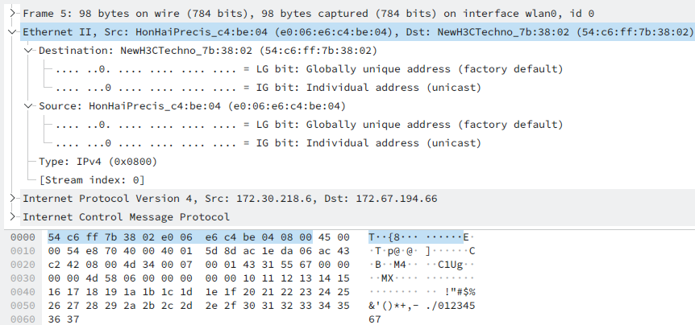
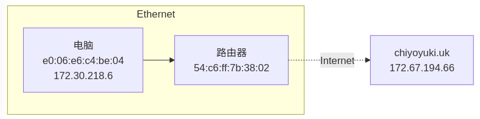
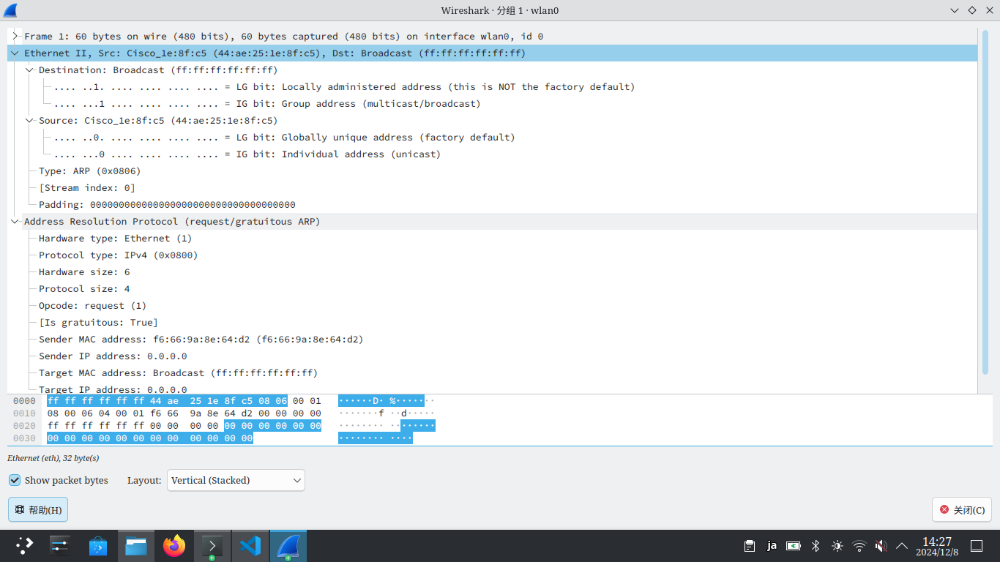

# 华东师范大学软件学院实验报告

## 一、实验目的

学习以太网帧的组成

## 二、使用内容与实验步骤

1. 捕获帧
    1. 对一个远程服务器使用 ping 指令发送信息，并检查是否有回复；
    2. 启动 Wireshark ，选择过滤 icmp ，开启“启用 MAC 名称解析”选项，开始捕获以太网帧；
    3. 重复第一步；
    4. 终止 ping 指令，返回 Wireshark 并停止捕获。
2. 检查捕获到的数据
    1. 选择捕获到的任意数据包，查看其结构与组成数据包字节的详细信息；
    2. 展开以太网报头字段并查看详细信息。
3. 以太网帧结构
    绘制一个显示以太网头字段位置与大小的 ping 报文图。
4. 以太网地址范围
    绘制一张图，显示电脑、路由器、远程服务器的相对位置。  
    用以太网地址标注计算机与路由器，IP 地址标注计算机与远程服务器。  
    并显示以太网和互联网其他部分在图中的位置。
5. 广播帧
    启动 Wireshark ，选择过滤 ether multicast ，等待一段时间，捕获广播与组播以太网帧，并根据结果完成以下两个任务：  
    1. 找到广播以太网地址
    2. 找到以太网地址的哪一位确认是单播还是组播

## 三、实验环境

- 实验仪器：ThinkPad X230i
- 操作系统：Arch GNU/Linux x86\_64
- 以太网控制器：Intel Corporation 82575LM Gigabit Network Connection
- 网络控制器：Realtek Semiconductor Co., Ltd. RTL8188CE 820.11b/g/n WiFi Adapter
- 网络连接：校园网ECNU-1X

## 四、实验过程与分析

1. 捕获帧  
      
    
2. 检查捕获到的数据  
    
3. 以太网帧结构  
    <table>
        <tr>
            <td align="center" colspan='3'>Ethernet II</td>
            <td align="center">IP&ICMP</td>
        </tr>
        <tr>
            <td align="center">Destination</td>
            <td align="center">Source</td>
            <td align="center">Type</td>
            <td align="center" rowspan='2'>60 Bytes</td>
        </tr>
        <tr>
            <td align="center">6 Bytes</td>
            <td align="center">6 Bytes</td>
            <td align="center">2 Bytes</td>
        </tr>
        <tr>
            <td align="center" colspan='3'>Ethernet Header</td>
            <td align="center">Ethernet Payload</td>
        </tr>
    </table>
4. 以太网地址范围  
    
5. 广播帧  
    捕获内容如图：  
      
    1. 以太网地址为 ff:ff:ff:ff:ff:ff，在 Wireshark 中标注为 Broadcast
    2. 第一个字节的末位为1是组播，反之则是单播，所有比特均为1则是广播

## 五、试验结果总结

在本次实验中，我顺利地完成了各项任务，了解并学习到了以太网传输的各项细节
