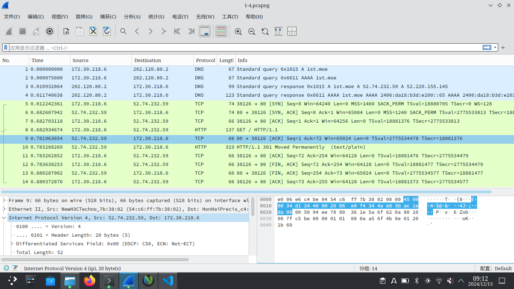
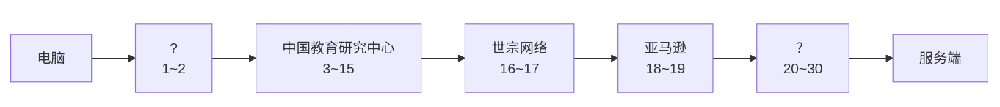

# 华东师范大学软件学院实验报告

## 一、实验目的

学习 IP 协议的相关内容

## 二、使用内容与实验步骤

1. 捕获轨迹
    1. 对一个远程服务器使用 wget/curl 指令，并检查是否成功；
    2. 对同一远程服务器使用 traceroute 指令，查看访问的路径；
    3. 启动 Wireshark ，选择过滤 tcp port 80 ，并勾选“启用网络名称检查”
    4. 重复第一步
    5. 返回 Wireshark ，停止捕获。
2. 检查捕获到的数据
    1. 选择任意捕获到的数据包，查看其结构与组成数据包字节的详细信息；
    2. 展开 IP 报头字段并查看详细信息。
3. IP 结构
    1. 绘制一个 IP 字段位置与大小的报文图
    2. 回答下列问题
        1. 电脑与远程服务端的 IP 地址分别是多少？
        2. 总长字段包括 IP 报头与 IP 负载还是仅计算 IP 负载？
        3. 对于不同数据包，标识字段的值是不同还是相同？
        4. 电脑发送的数据包的 TTL 字段的初始值是什么？是最大可能值还是一个较小的值？
        5. 如何通过查看数据包确认其是否被分段？
        6. IP 报头长度是多少，它如何在报头字段中编码？
4. IP 路径
    绘制 1.2 步骤中访问的路径
5. IP 报头校验
    通过如下步骤检验 IP 报头校验和是否正确
    1. 将报头划分为等长的 10 段，每段长度为 2 个字节，将其视为 10 个十六进制数字；
    2. 将 10 个 16 进制数字相加，计算他们的和；
    3. 将得到的和分为两段，使得其中的一段为最右边的 4 位 16 进制数，计算两段之和；
    4. 检查结果是否为 0xffff 。

## 三、实验环境

- 实验仪器：ThinkPad X230i
- 操作系统：Arch GNU/Linux x86\_64
- 以太网控制器：Intel Corporation 82575LM Gigabit Network Connection
- 网络控制器：Realtek Semiconductor Co., Ltd. RTL8188CE 820.11b/g/n WiFi Adapter
- 网络连接：校园网ECNU-1X

## 四、实验过程与分析

1. 捕获轨迹
    
    traceroute 获取到的信息如下：

    ``` bash
    traceroute to 1st.moe (52.74.232.59), 30 hops max, 60 byte packets
     1  * * *
     2  10.100.5.1 (10.100.5.1)  8.795 ms  8.962 ms  9.096 ms
     3  202.120.95.246 (202.120.95.246)  9.451 ms  9.092 ms  9.243 ms
     4  202.120.95.254 (202.120.95.254)  12.480 ms  12.777 ms  13.331 ms
     5  10.255.16.1 (10.255.16.1)  12.974 ms  13.249 ms  12.734 ms
     6  10.255.249.253 (10.255.249.253)  12.382 ms  11.127 ms  11.127 ms
     7  10.255.38.254 (10.255.38.254)  10.087 ms  9.632 ms  9.452 ms
     8  202.112.27.13 (202.112.27.13)  9.268 ms  6.546 ms  6.331 ms
     9  101.4.117.58 (101.4.117.58)  6.248 ms  9.316 ms  9.147 ms
    10  * * *
    11  101.4.115.250 (101.4.115.250)  37.316 ms  37.288 ms  36.908 ms
    12  * * *
    13  * * 101.4.114.194 (101.4.114.194)  33.724 ms
    14  101.4.114.170 (101.4.114.170)  38.219 ms 101.4.117.102 (101.4.117.102)  44.767 ms  44.589 ms
    15  101.4.114.222 (101.4.114.222)  67.753 ms  67.658 ms  63.246 ms
    16  203.131.254.213 (203.131.254.213)  85.750 ms  85.593 ms  85.431 ms
    17  203.131.242.222 (203.131.242.222)  67.546 ms  67.933 ms  67.157 ms
    18  52.93.157.242 (52.93.157.242)  67.671 ms 52.93.157.226 (52.93.157.226)  67.991 ms  68.002 ms
    19  52.93.35.125 (52.93.35.125)  67.392 ms 52.93.35.109 (52.93.35.109)  68.086 ms 52.93.35.35 (52.93.35.35)  68.009 ms
    20  * * *
    21  * * *
    22  * * *
    23  * * *
    24  * * *
    25  * * *
    26  * * *
    27  * * *
    28  * * *
    29  * * *
    30  * * *
    ```

2. 

3.
    1. IP结构
        <table align="center">
            <tr>
                <td align="center" colspan='12'>IP</td>
                <td align="center">TCP</td>
            </tr>
            <tr>
                <td align="center">Version</td>
                <td align="center">Header Length</td>
                <td align="center">Differentiated Services Field</td>
                <td align="center">Total Length</td>
                <td align="center">Identification</td>
                <td align="center">Flags</td>
                <td align="center">Fragment Offset</td>
                <td align="center">TTL</td>
                <td align="center">Protocal</td>
                <td align="center">Header Checksum</td>
                <td align="center">Source Address</td>
                <td align="center">Destinatoin Address</td>
                <td align="center" rowspan='2'>32 Bytes</td>
            </tr>
            <tr>
                <td align="center">4 bits</td>
                <td align="center">4 bits</td>
                <td align="center">1 Byte</td>
                <td align="center">2 Bytes</td>
                <td align="center">2 Bytes</td>
                <td align="center">3 bits</td>
                <td align="center">13 Bits</td>
                <td align="center">1 Byte</td>
                <td align="center">1 Byte</td>
                <td align="center">2 Bytes</td>
                <td align="center">4 Bytes</td>
                <td align="center">4 Bytes</td>
            </tr>
            <tr>
                <td align="center" colspan='12'>Ethernet Header</td>
                <td align="center">Ethernet Payload</td>
            </tr>
        </table>
    2.  
        1. 服务端 IP 地址为 52.74.232.59；电脑 IP 地址为 172.30.218.6
        2. 总长字段为 52 = 20 + 32 ，所以计算时包含 IP 报头与 IP 负载
        3. 不同
        4. 电脑发送的 TTL 值为 38 ，是一个较小的值
        5. 通过查看 Flags 字段
        6. 长度为 20 Bytes ，编码在 IP 报头第一个字节的 4~8 位
4.  
    
5. 执行如下代码：

    ``` c
    #include<bits/stdc++.h>

    using namespace std;

    int main()
    {
        printf("%x",0x4500+0x0034+0xd124+0x4000+0x2606+0xe0f4+0x344a+0xe83b+0xda06+0xac1e);
        return 0;
    }
    ```

    其结果为0x4fffb，计算4+fffb=ffff，故正确。
