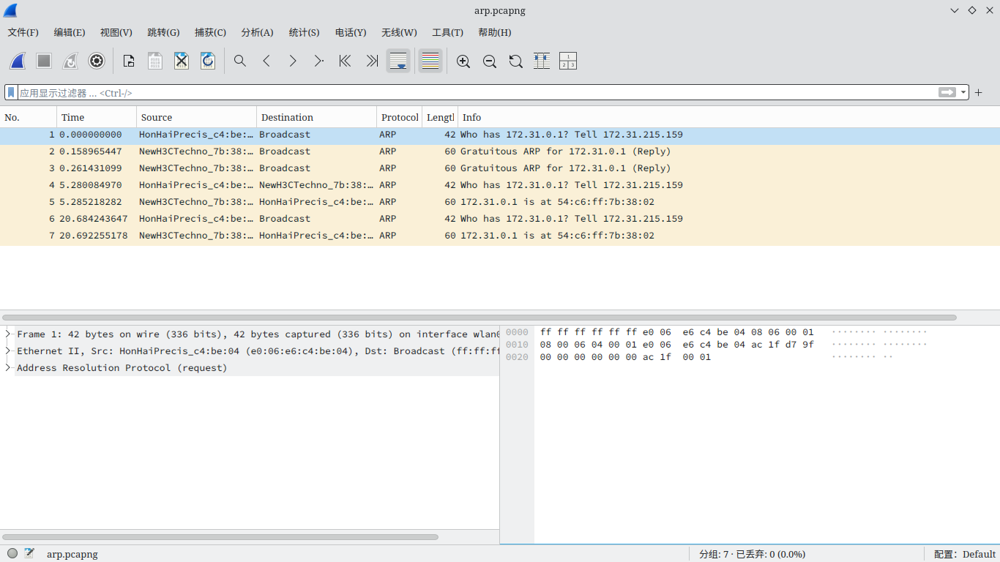
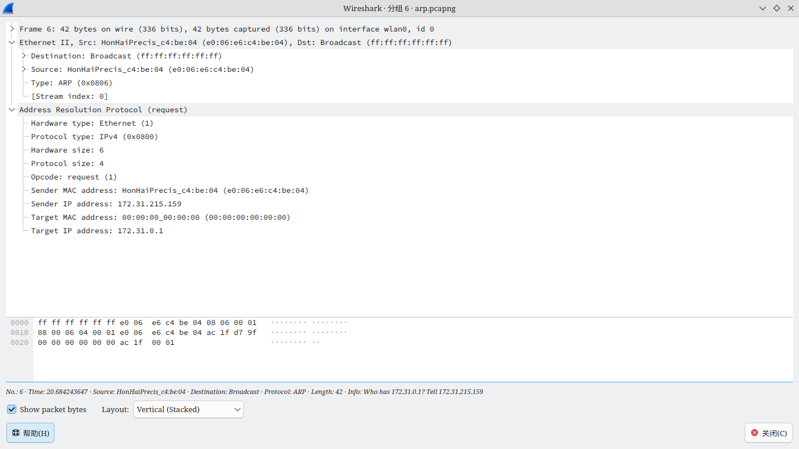
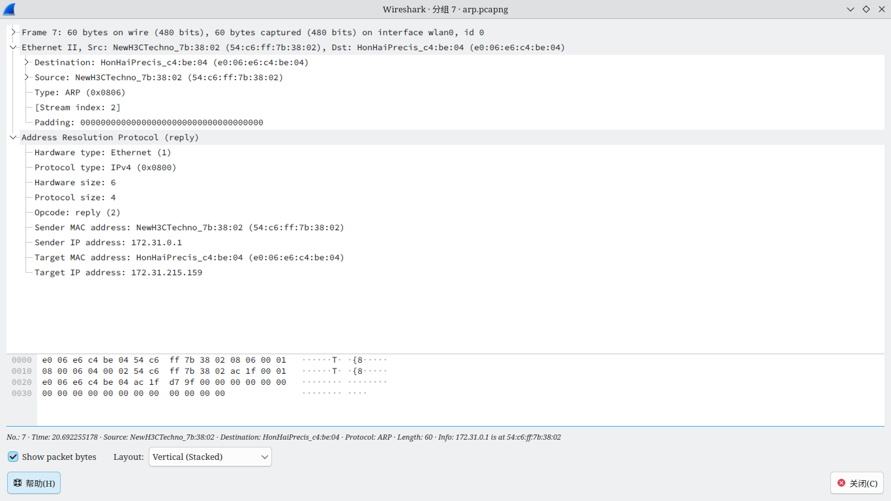

# <center>华东师范大学软件学院实验报告</center>
| **实验课程：** 计算机网络 | **年级:** 2024         | **实验成绩：**            |
| :------------------------ | :--------------------- | :------------------------ |
| **实验名称：** ARP        | **姓名：**       | **实验日期：** 2024.12.13 |
| **实验编号：** 4          | **学号：**  | **实验时间：** 2学时      |

## 一、实验目的

了解 ARP 的工作原理。

## 二、使用内容与实验步骤

1. 捕获
    1. 使用`ifconfig`指令查找电脑的以太网地址。
    2. 使用`route`指令查看默认网关 ip 地址。
    3. 启动 Wireshark ，将过滤器设置为`arp`，开始捕获。
    4. 使用`arp -a`指令查看 ARP 缓存，并使用`sudo arp -d 网关ip地址`从缓存中清除默认网关。
    5. 使用浏览器浏览网页一段时间。
    6. 在捕获到 arp 流量后停止捕获。
2. 检查捕获
    1. 将页面内的过滤器设置为`eth.addr == 电脑以太网地址`。
    2. 查看捕获到的内容
3. ARP 请求与应答
    绘制计算机与默认网关之间发送 ARP 请求与回复数据包的图解。
4. 以太网上的 ARP 详细信息
    回答以下问题
    1. 什么操作码用于请求，什么操作码用于回复。
    2. 请求的 ARP 报头有多大？回复的 ARP 报头有多大？
    3. 对于未知目标 MAC 地址的请求中携带什么值？
    4. 什么以太网类型值表明 ARP 是更高级协议？
    5. ARP 回复是否为广播？

## 三、实验环境

- 实验仪器：ThinkPad X230i
- 操作系统：Arch GNU/Linux x86\_64
- 以太网控制器：Intel Corporation 82575LM Gigabit Network Connection
- 网络控制器：Realtek Semiconductor Co., Ltd. RTL8188CE 820.11b/g/n WiFi Adapter
- 网络连接：校园网ECNU-1X

## 四、实验过程与分析

1. 捕获
    1. 执行`ifconfig`指令，得到的输出如下：
        ```
        enp0s25: flags=4099<UP,BROADCAST,MULTICAST>  mtu 1500
            ether 3c:97:0e:27:a3:96  txqueuelen 1000  (Ethernet)
            RX packets 0  bytes 0 (0.0 B)
            RX errors 0  dropped 0  overruns 0  frame 0
            TX packets 0  bytes 0 (0.0 B)
            TX errors 0  dropped 0 overruns 0  carrier 0  collisions 0
            device interrupt 20  memory 0xf2500000-f2520000  

        lo: flags=73<UP,LOOPBACK,RUNNING>  mtu 65536
            inet 127.0.0.1  netmask 255.0.0.0
            inet6 ::1  prefixlen 128  scopeid 0x10<host>
            loop  txqueuelen 1000  (Local Loopback)
            RX packets 1511  bytes 158325 (154.6 KiB)
            RX errors 0  dropped 0  overruns 0  frame 0
            TX packets 1511  bytes 158325 (154.6 KiB)
            TX errors 0  dropped 0 overruns 0  carrier 0  collisions 0

        wlan0: flags=4163<UP,BROADCAST,RUNNING,MULTICAST>  mtu 1500
            inet 172.31.215.159  netmask 255.255.0.0  broadcast 172.31.255.255
            inet6 fe80::eb67:d196:62b:626a  prefixlen 64  scopeid 0x20<link>
            ether e0:06:e6:c4:be:04  txqueuelen 1000  (Ethernet)
            RX packets 4206  bytes 2310892 (2.2 MiB)
            RX errors 0  dropped 0  overruns 0  frame 0
            TX packets 4771  bytes 2531632 (2.4 MiB)
            TX errors 0  dropped 76 overruns 0  carrier 0  collisions 0
        ```
        在 `wlan0` 下的 `ether` 一行可以得知计算机以太网地址为 `e0:06:e6:c4:be:04` 。
    2. 执行 `route` 指令，得到的输出如下：
        ```
        Kernel IP routing table
        Destination     Gateway         Genmask         Flags Metric Ref    Use Iface
        default         _gateway        0.0.0.0         UG    600    0        0 wlan0
        172.31.0.0      0.0.0.0         255.255.0.0     U     600    0        0 wlan0
        ```
        可以得知默认网关的 ip 地址为 `172.31.0.0` 。
    3. 启动捕获。
    4. 执行 `arp -a` 指令，得到输出 `_gateway (172.31.0.1) at 54:c6:ff:7b:38:02 [ether] on wlan0` 。随后执行 `sudo arp -d 172.31.0.1` 指令清除缓存，该指令没有输出，若重复执行，则会得到 `No ARP entry for 172.31.0.1` 输出。
    5. 在观察到已经捕获 7 个 ARP 流量包后停止捕获，其界面如图：<br>
        
2. 检查捕获<br>
    *因为捕获到的包数量较少，故不设置过滤器。*<br>
    请求包：<br>
    
    回复包：<br>
    
3. ARP 请求与回复
    其图例如下
    ```mermaid
    flowchart LR
    computer[计算机<br>MAC e0:06:e6:c4:be:04<br>IP 172.31.215.159]
    gateway[网关<br>MAC 54:c6:ff:7b:38:02<br>IP 172.31.0.1]
    computer--request<br>Who has 172.31.0.1? Tell 172.31.215.159-->gateway
    gateway--reply<br>172.31.0.1 is at <font color="red"><b>54:c6:ff:7b:38:02</b></font>-->computer
    ```
4. 以太网上的 ARP 详细信息
    1. 请求的操作码为 `0x0001` ，回复的操作码为 `0x0002` 。
    2. 请求与回复的的 ARP 报头均为 28 bytes，对于报文，请求的报文为 42 bytes，回复的报文为60 bytes。
    3. 目标 MAC 地址为 `00:00:00_00:00:00` 。
    4. 以太网报头中的 `type` 字段为 `0x0806` 。
    5. ARP 回复为单播而非广播。
