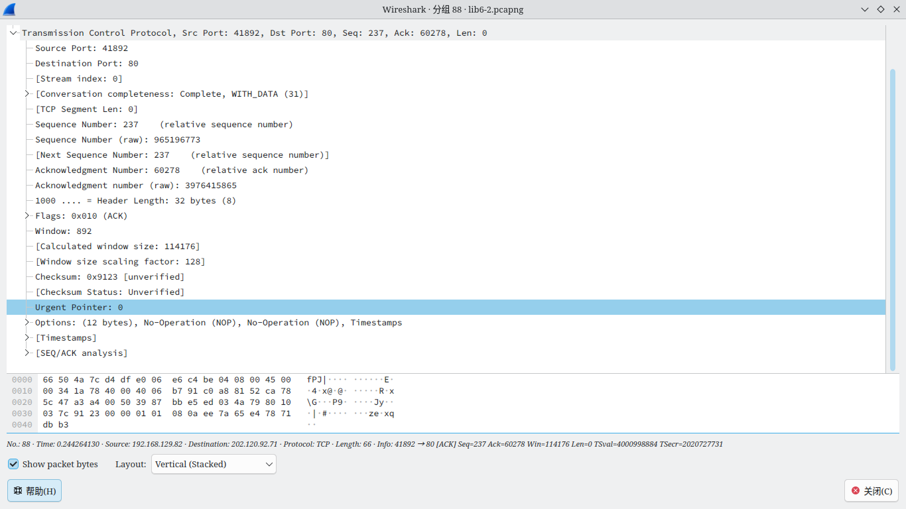
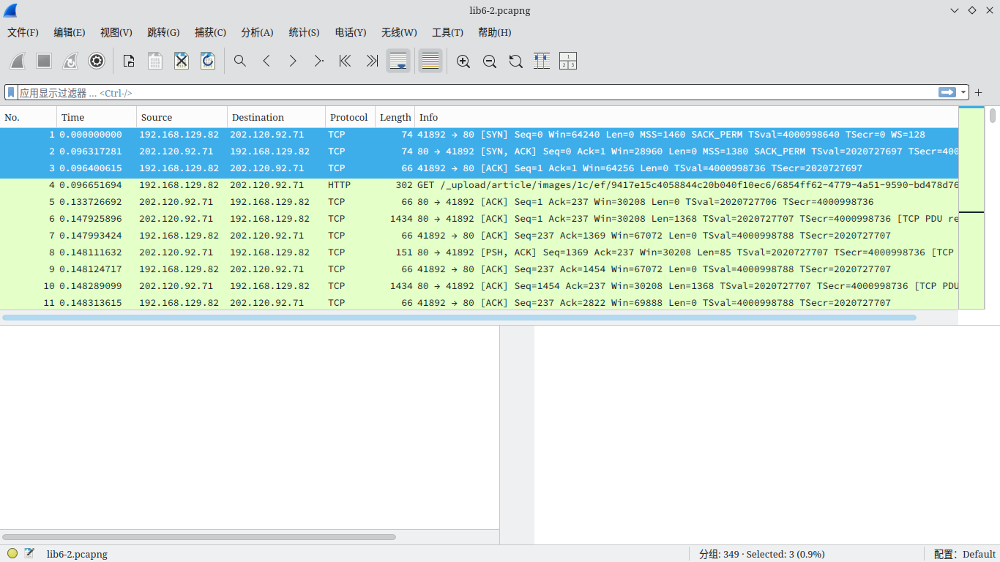
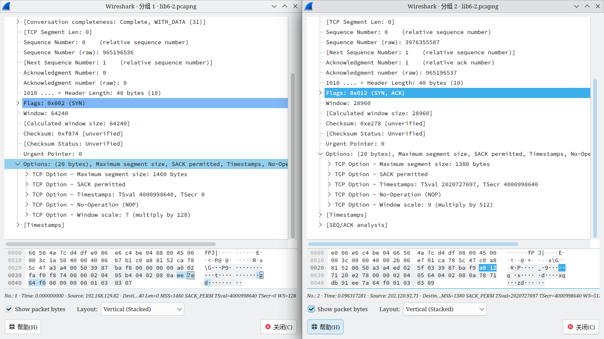
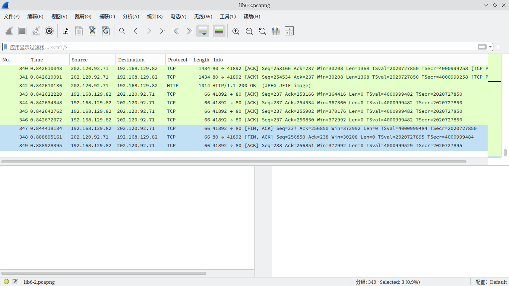
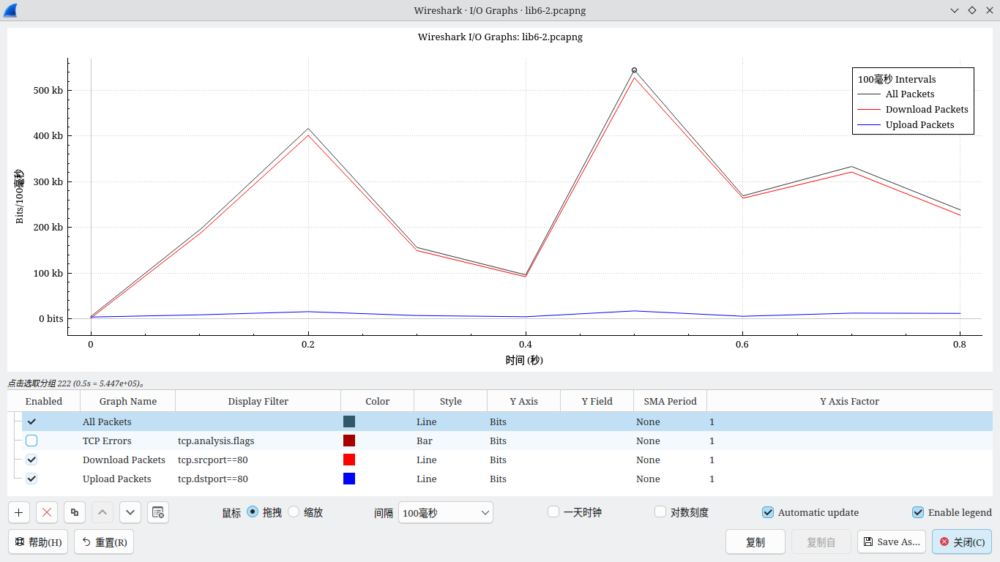
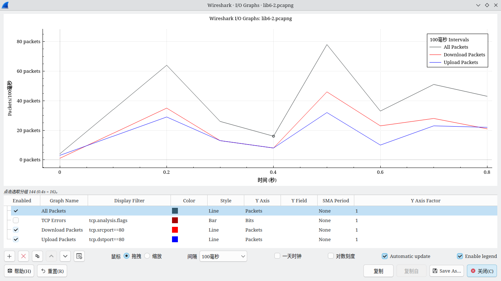

# <center>华东师范大学软件学院实验报告</center>
| **实验课程：** 计算机网络 | **年级:** 2024         | **实验成绩：**                              |
| :------------------------ | :--------------------- | :------------------------------------------ |
| **实验名称：** TCP        | **姓名：**       | **实验日期：** <br>2024.12.27<br>2025.01.03 |
| **实验编号：** 6          | **学号：**  | **实验时间：** 2学时                        |

## 一、实验目的

学习了解 TCP 的相关内容。

## 二、使用内容与实验步骤

1. 捕获

    1. 找到一个可以使用 HTTP 下载的中等大小单一资源。

    2. 使用 wget 或 curl 命令尝试下载，确保可以在几秒内下载至少 500 KB 的内容。

    3. 启用 Wireshark ，将过滤器设置为 "tcp and host $DOMAIN" ，其中 $DOMAIN 为远程服务器的域名，并开始捕获。

    4. 重复 1.2 中的命令。

    5. 返回 Wireshark 并停止捕获。

2. 检查捕获到的内容

    选择一个协议列为 TCP 的数据包，展开 TCP 协议部分。捕获到的内容中协议列除了初始 HTTP GET 和末尾的 HTTP 相应包之外均为 TCP 。在一个 TCP 包中，大致可以看到如下内容：

    1. 源端口（可能为 80）与目标端口。

    2. 序列号字段，告知第一个有效负载字节在字节流中的位置。

    3. 确认字段，告知反向字节流中最后接收的位置。

    4. 报头长度，TCP 报头的长度。

    5. 标志字段。

    6. 校验和，用于检查传输错误。

    7. 选项字段。（可能不存在）

    8. TCP 有效负载，表示正在传输的内容.（可能不存在）

3. TCP 段结构

    绘制一个 TCP 段结构图。

4. TCP 建立与拆除。

    - 三次握手

        查找带有 SYN 标志的 TCP 段以及其后的数据包的详细信息。绘制三次握手的时间序列图，序列图应包括如下内容：

        - 每个段上的序列号与 ACK 号（如果存在）

        - 以毫秒为单位的时间

        - 到服务器的往返时间估计，即 SYN 和 SYN-ACK 段之间的差值

    - 连接选项

        SYN 数据包中携带了哪些 TCP 选项。

    - FIN/RST 拆除

        查找带有 FIN 或 RES 标志的 TCP 段及其之后的数据包的详细信息。并绘制时间序列图，要求同三次握手的时间序列图。

5. TCP 数据传输

    在统计菜单下，选择“IO图表”，观察并回答以下问题：

    1. TCP 连接运行良好后，下载方向的大致数据速率是多少（分别计算 packets/s 与 bits/s）

    2. 查看下载数据包，通过观察包的大小与 TCP 有效负载的大小，计算下载率中有多少百分比是内容？

    3. 传输方向的大致数据速率是多少？

    4. 如果最近从服务器接收的 TCP 段的序列号为 x ，那么下一个传输的 TCP 段携带什么 ACK 号？

    检查捕获到的下载数据包是否具有如下特征：

    - 延迟 ACK。

    - 接受到的段的序列号增加，后续传输的段的 ACK 号也相应增加。

    - 在初始获取之后，传输的段的序列号不增加，接收段上的 ACK 编号也不增加。

    - 每个段都带有大于等于 0 的窗口信息。

## 三、实验环境

- 实验仪器：ThinkPad X230i
- 操作系统：Arch GNU/Linux x86\_64
- 以太网控制器：Intel Corporation 82575LM Gigabit Network Connection
- 网络控制器：Realtek Semiconductor Co., Ltd. RTL8188CE 820.11b/g/n WiFi Adapter
- 网络连接：校园网 ECNU-1X

## 四、实验过程与分析

1. 捕获

2. 检查捕获到的内容

    捕获到的内容如图所示：

    

3. TCP 段结构

    <table align="center">
        <tr>
            <td align="center" colspan=20>TCP 报头</td>
            <td align="center">TCP 负载</td>
        </tr>
        <tr>
            <td align="center">源端口<td>
            <td align="center">目标端口<td>
            <td align="center">序列号<td>
            <td align="center">确认号<td>
            <td align="center">报头长度<td>
            <td align="center">Flags<td>
            <td align="center">窗口<td>
            <td align="center">校验和<td>
            <td align="center">紧急指针<td>
            <td align="center">Options<td>
            <td a序列号: 0, ACK号: 1lign="center">TCP Payloads</td>
        </tr>
        <tr>
            <td align="center">2 bytes<td>
            <td align="center">2 bytes<td>
            <td align="center">4 bytes<td>
            <td align="center">4 bytes<td>
            <td align="center">4 bits<td>
            <td align="center">12 bits<td>
            <td align="center">2 bytes<td>
            <td align="center">2 bytes<td>
            <td align="center">2 bytes<td>
            <td align="center">12 bytes<td>
            <td align="center">Many bytes</td>
        </tr>
    </table>

4. TCP 建立与拆除。

    - 三次握手

        SYN及其之后包的信息如图所示：

        

        根据所得到的信息画图：

        ```mermaid
        sequenceDiagram
            autonumber
            participant Client
            participant Server
            Client->>Server: 0th ms, SYN, 序列号: 0
            Note left of Client: Δ = 96ms
            Server->>Client: 96th ms, SYN-ACK, 序列号: 0, ACK号: 1
            Client->>Server: 96th ms, ACK, 序列号: 1, ACK号: 1
        ```

    - 连接选项

        SYN 包具体信息如图所示：

        

        故可以观察到 SYN 包携带的选项有：

        - Maximum segment size(最大段大小)
        - SACK permitted(SACK 许可)
        - Timestamps(时间戳)
        - NOP(无操作)
        - Window sacle(窗口比例)

    - FIN/RST 拆除

        FIN及其之后包的信息如图所示：

        

        根据所得到的信息画图：

        ```mermaid
        sequenceDiagram
            autonumber
            participant Client
            participant Server
            Client->>Server: 844th ms, FIN-ACK, 序列号: 237, ACK号: 256850
            Note left of Client: Δ = 45ms
            Server->>Client: 889th ms, FIN-ACK, 序列号: 256850, ACK号: 238
            Client->>Server: 889th ms, ACK, 序列号: 238, ACK号: 256851
        ```

5. TCP 数据传输
    
    IO 图表如图：

    

    

    1. 下载方向的大致数据速率是
        
        $$
        \frac{\frac{1}{8}(18+35+13+8+46+23+28+21) packets}{0.1 s} = 240\ packets/s
        $$
        
        $$
        \frac{\frac{1}{8}(185300+401500+149100+91780+527700+263900+321200+226600) bits}{0.1 s} =2708850\ bits/s
        $$

    2. 查看下载数据包，通过观察包的大小与 TCP 有效负载的大小，计算下载率中有多少百分比是内容？

        $$
        \frac{1368 bytes}{1434 bytes}=\frac{228}{239} \approx 95.40\%
        $$

    3. 传输方向的大致数据速率是

        $$
        \frac{\frac{1}{8}(16+29+13+8+32+10+23+22) packets}{0.1 s} = 191.25\ packets/s
        $$
        
        $$
        \frac{\frac{1}{8}(8448+15310+6864+4224+16990+5280+12140+11620) bits}{0.1 s} =101095\ bits/s
        $$

    4. 如果最近从服务器接收的 TCP 段的序列号为 x ，那么下一个传输的 TCP 段携带什么 ACK 号？

        **x+TCP 负载字节数**
