# <center>华东师范大学软件学院实验报告</center>
| **实验课程：** 计算机网络         | **年级:** 2024         | **实验成绩：**            |
| :-------------------------------- | :--------------------- | :------------------------ |
| **实验名称：** Socket Programming | **姓名：**       | **实验日期：** 2025.01.03 |
| **实验编号：** 7                  | **学号：**  | **实验时间：** 2学时      |

## 一、实验目的

了解套接字编程相关内容。

## 二、使用内容与实验步骤

使用实验手册中所给出的示例代码，并进行相关测试。

## 三、实验环境

- 实验仪器1：ThinkPad X230i
  - 操作系统：6.12.9-arch1-1 x86_64 GNU/Linux
  - 以太网控制器：Intel Corporation 82575LM Gigabit Network Connection
  - 网络控制器：Realtek Semiconductor Co., Ltd. RTL8188CE 820.11b/g/n WiFi Adapter

- 实验仪器2：raspberrypi 4B
  - 操作系统：6.6.47+rpt-rpi-v8 aarch64 GNU/Linux

- 网络连接：宿舍 Wifi

## 四、实验过程与分析

本地测试记录如下图：

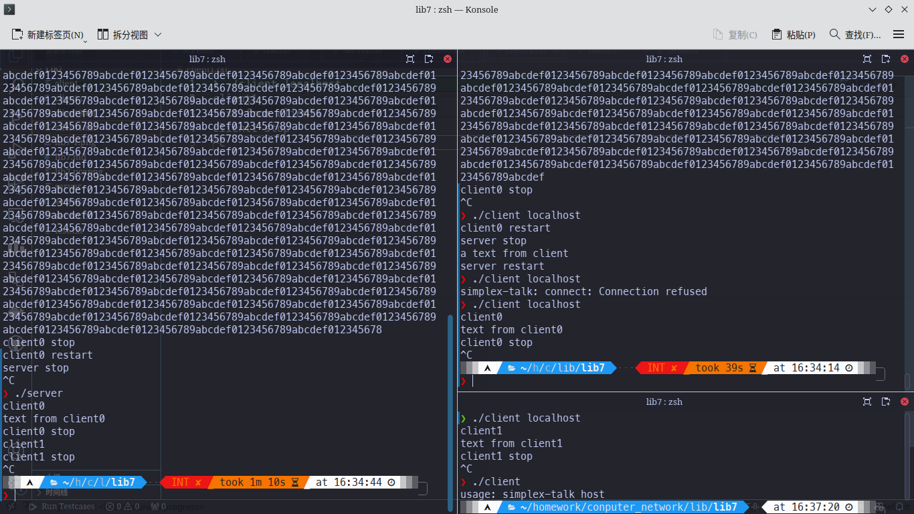

实验步骤

1. 启动 Wireshark，根据代码中常量定义，将过滤选项设置为`tcp.port==7701`，对 `Loopback: lo` 进行捕获

2. 启动服务端

3. 启动0号客户端,此时 Wireshark 捕获到三次握手包，观察到0号客户端采用44514端口：

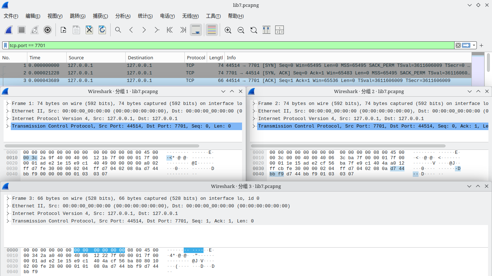

4. 发送文本测试

    1. 0号客户端发送测试文本0（测试短文本)：`text0:hello, world`，服务端显示：`text0:hello, world`，正常发送，Wireshark 捕获到的包信息如下。

        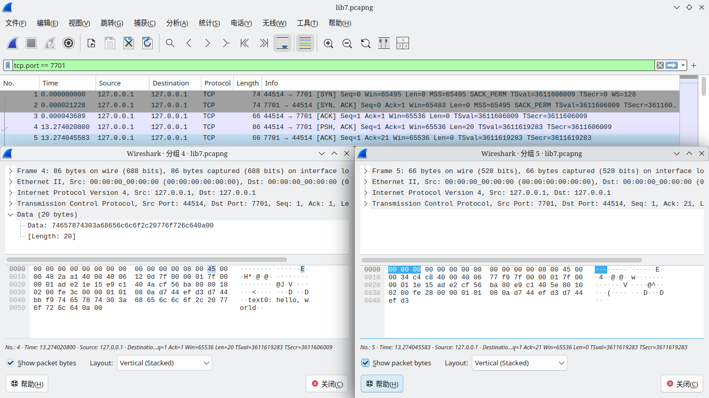    

    2. 0号客户端发送测试文本1（测试ACSII可显示字符)：text1: !"#\$%&'()\*+,-./0123456789:;<=>?\`ABCDEFGHIJKLMNOPQRSTUVWXYZ[\]^\_@abcdefghijklmnopqrstuvwxyz{|}~，服务端显示：text1: !"#\$%&'()\*+,-./0123456789:;<=>?\`ABCDEFGHIJKLMNOPQRSTUVWXYZ[\]^\_@abcdefghijklmnopqrstuvwxyz{|}~，正常发送，Wireshark 捕获到的包信息如下。

        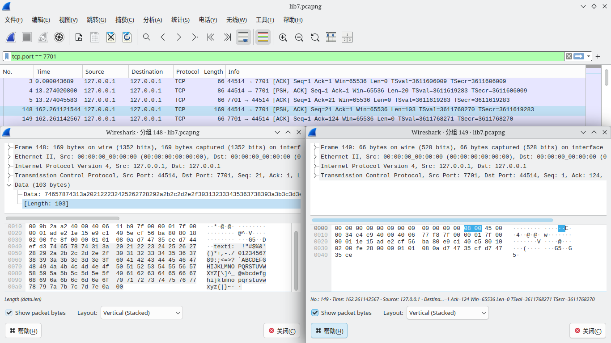

    3. 0号客户端发送测试文本2（测试tab字符)：`text2:\t        \t`，服务端显示：`text2:\t        \t`，正常发送，Wireshark 捕获到的包信息如下。

        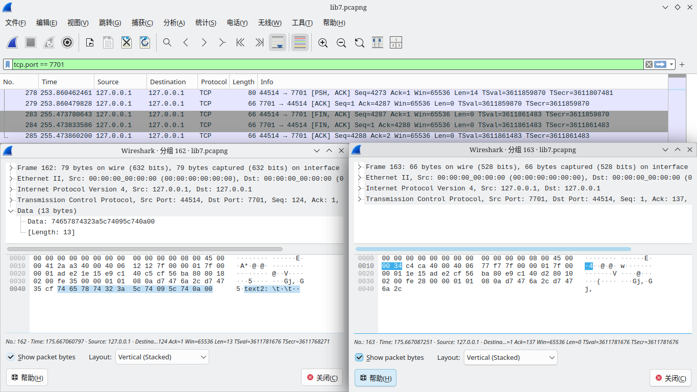

        可以观察到 tab 以正常形式（ACSII码为9）发出

    4. 0号客户端发送测试文本3（测试中文文本)：`text3:你好，世界`，服务端显示：`text3:你好，世界`，正常发送，Wireshark 捕获到的包信息如下。

        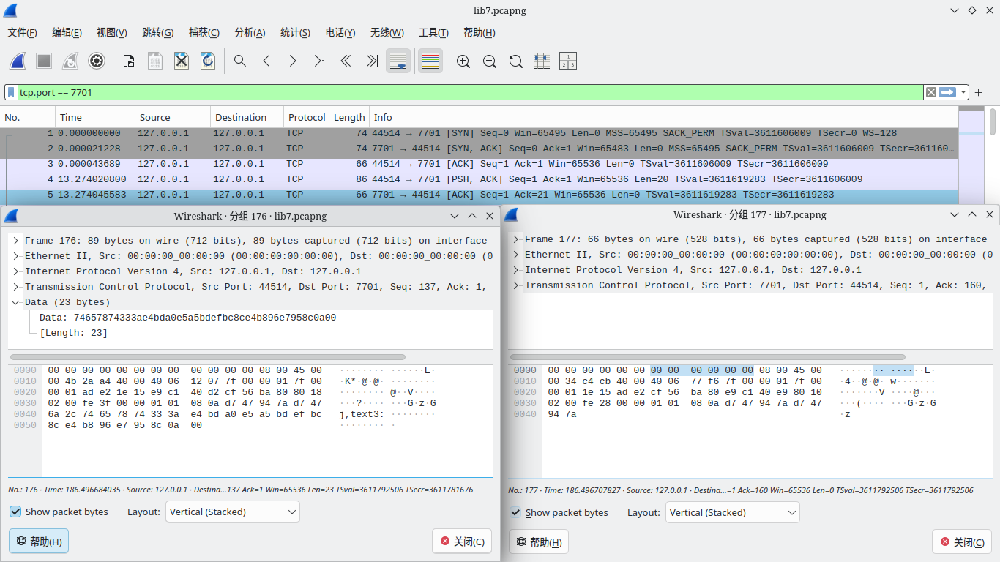
        
    5. 0号客户端发送测试文本4（测试长文本)：`text4:0123456789abcdef...0123456789abcdef`（共计32774字节），服务端显示：`text4:0123456789abcdef...012345678`（共计4096字节），文本发送不正常，仅发送前 4096 字节，检查 Wireshark ，可以发现0号客户端共发送16个包，前15个包中每个包携带255字节的文本，最后一个包携带16字节的文本，捕获到的第一个与最后一个客户端包信息如下。

        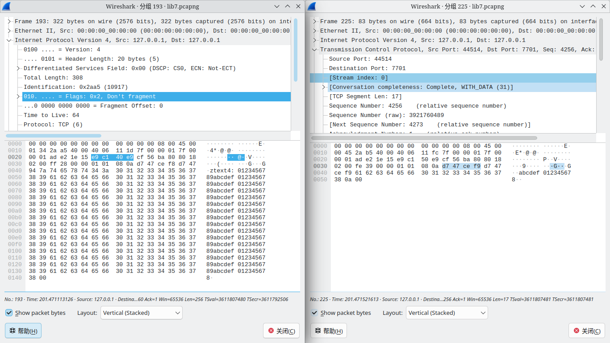

        可以观察到 IP 协议头中 DF 为 1 ，故数据未经 IP 分片，数据的分段发生在 TCP 加工阶段。

5. 断连测试

    1. 断开0号客户端连接，捕获到由0号客户端发出的结束请求

        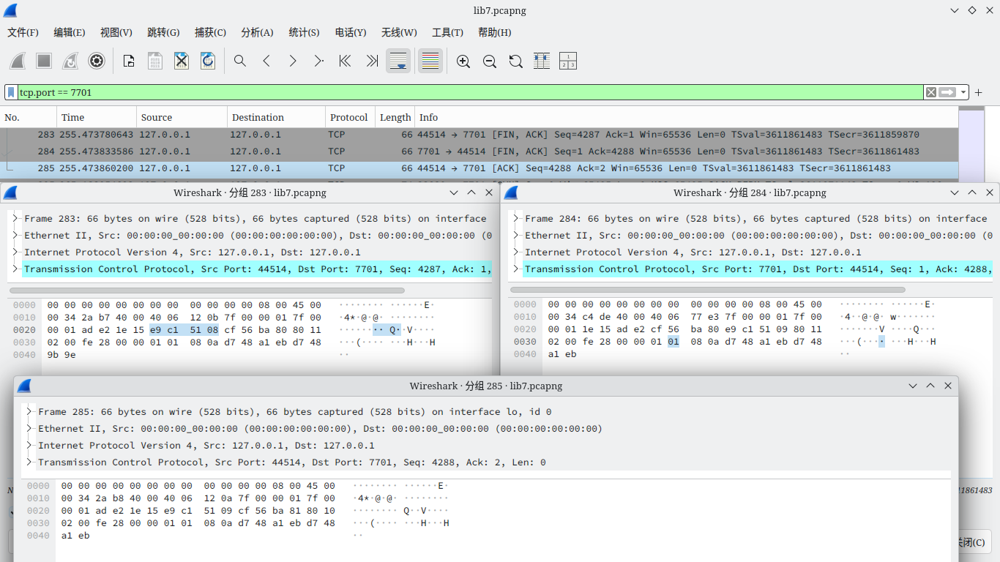

    2. 重新恢复0号客户端连接

    3. 断开服务端连接，捕获到由服务端发出的结束请求（FIN），0号客户端发送ACK确认，但未得到服务端的ACK确认，于是0号客户端将在等待2MSL后自动断开连接，捕获到的包信息如下：

        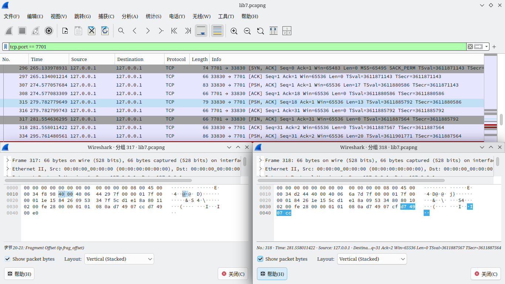

    4. 0号客户端发送文本`a text from client`， Wireshark 捕获到的内容如下

        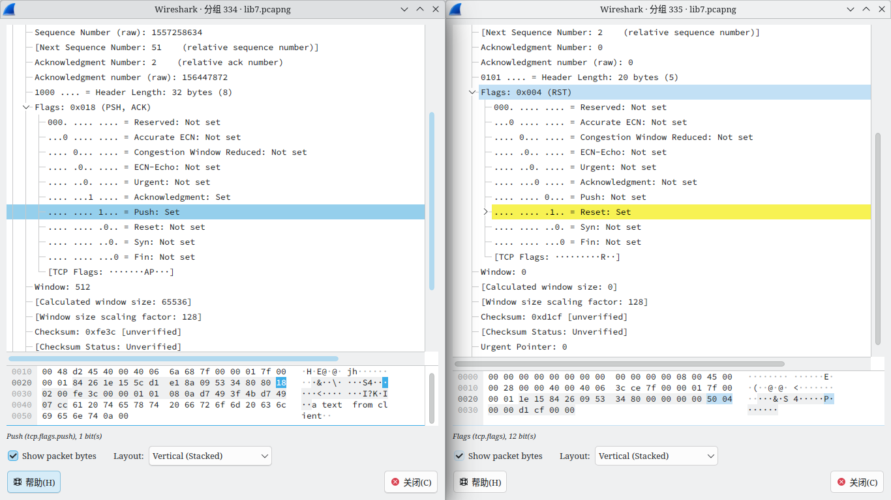

        0号客户端发送了带有 PSH 的信息包，端口收到后优先处理该数据包，由于服务端已经关闭，7701端口空闲，故返回带有RST的数据报。

    5. 0号客户端发送文本`server restart`，按下回车后客户端自动退出，Wireshark 没有捕获到消息

    6. 执行指令`./client localhost`，尝试重新启动客户端，收到报错`simplex-talk: connect: Connection refused`，捕获到的包信息如下

        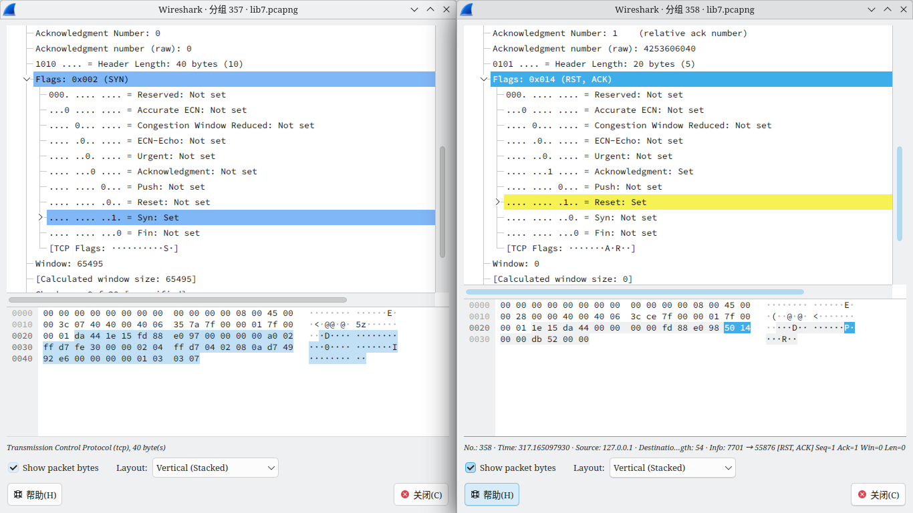

        0号客户端发送了带有 SYN 的信息包，由于服务端已经关闭，7701端口空闲，故返回带有RST的数据报，0号客户端收到后报告错误并退出
    
    7. 执行指令`./client`，不指定地址，报错`usage: simplex-talk host`

6. 多客户端测试
    
    1. 重新启动服务端
    2. 启动0号客户端，观察 Wireshark ，可以发现0号客户端使用端口为53092
    3. 0号客户端发送文本`client0`，服务端显示：`client0`，正常发送。
    4. 启动1号客户端，观察 Wireshark ，可以发现1号客户端使用端口为43676，Wireshark 捕获包信息如下：

        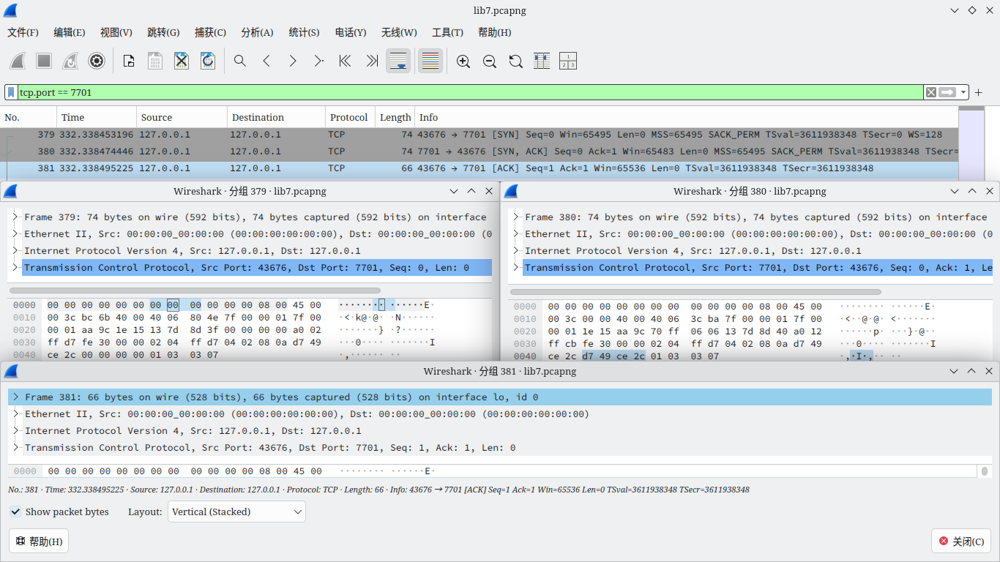        

    5. 1号客户端发送文本`client1`，服务端没有显示，但 Wireshark 捕获到信息包。
    6. 0号客户端发送文本`text from client0`，服务端显示`text from client0`，正常发送。
    7. 1号客户端发送文本`text from client1`，服务端没有显示，但 Wireshark 捕获到信息包。
    8. 0号客户端发送文本`client0 stop`，服务端显示`client0 stop`，正常发送。
    9. 0号客户端断开连接，服务端显示`client1`
    10. 0号客户端发送文本`client1 stop`，服务端显示`client1 stop`，正常发送。
    11. 断开服务端连接。

    1 号客户端发送的三个携带文本的信息包如下：

    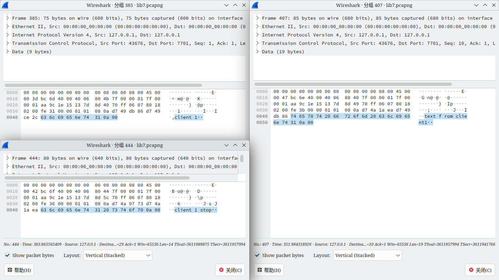

7. 端口占用测试

    1. 启动服务端，Wireshark 未捕获到内容
    2. 启动第二个服务端，报错`simplex-talk: bind: Address already in use`，Wireshark 未捕获到内容
    3. 启动客户端
    4. 关闭服务端
    5. 尝试重新启动服务端，报错`simplex-talk: bind: Address already in use`，Wireshark 未捕获到内容
    6. 客户端退出
    7. 尝试重新启动服务端，服务端正常运行
    
    测试截图如下：
    
    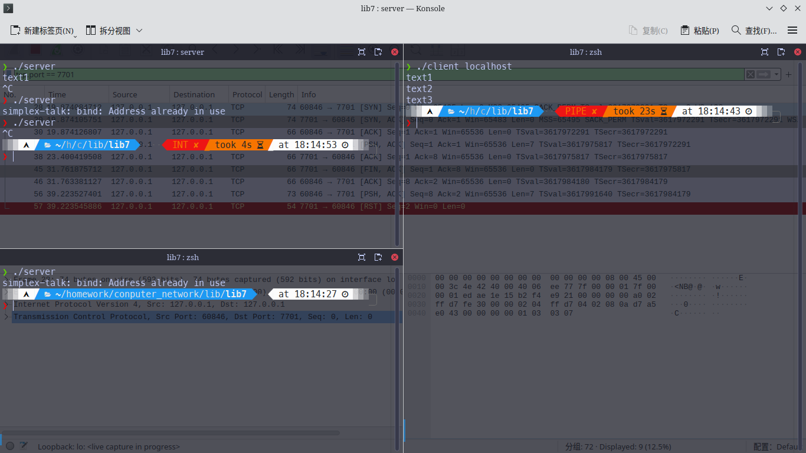

8. 局域网通信测试

    1. 通过 ssh 连接并控制同一局域网下的另一设备

    2. 通过 ftp 上传源代码server.c与client.c

    3. 在 ssh 所控制设备上编译

    4. 启动 Wireshark ，将过滤器设置为`tcp.port == 7701`，对wlan0进行捕获

    5. 在远程主机上执行`./server`，在电脑上执行`./client 192.168.31.135`，成功连接

    6. 在客户端上发送信息，远程服务端成功收到

    7. 交换客户端与服务端，仍能成功通信

    通信记录与 Wireshark 捕获截图如下：

    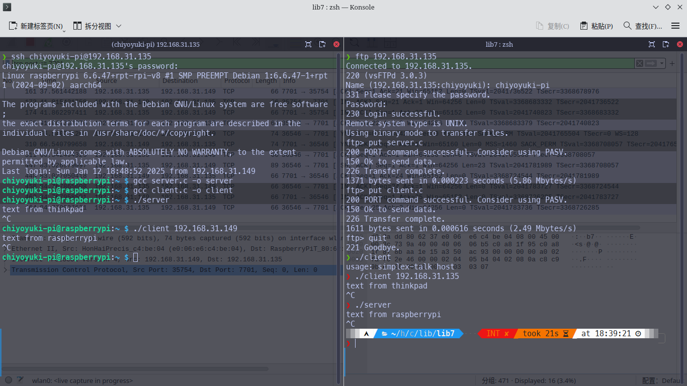

    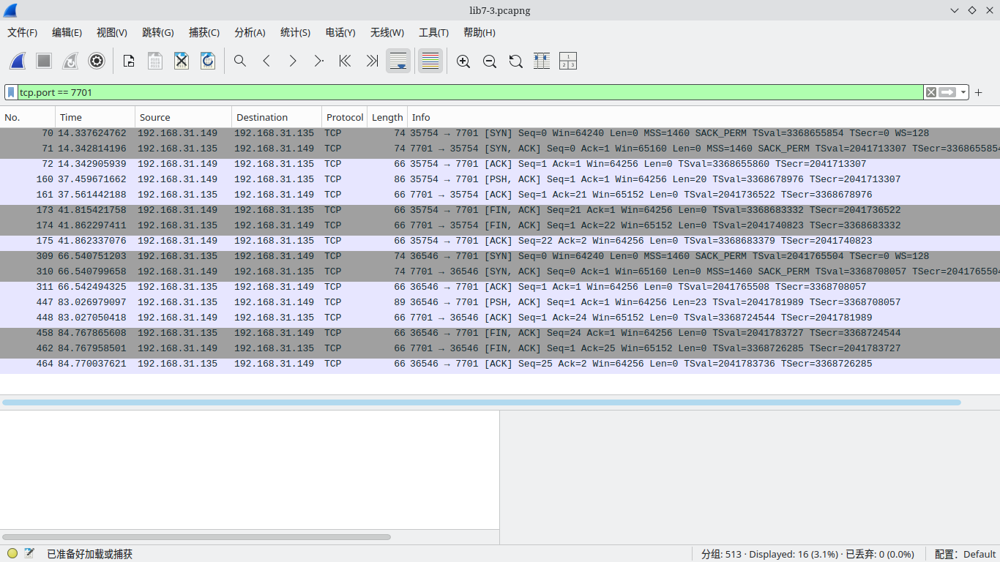

## 五、附录

客户端代码如下：

```c
/* Source: Peterson & Davie (2007), Computer Networks, a Systems Approach,
 *           4th ed., Morgan Kaufmann, p. 34-35.
 * Included stdlib.h, string.h, and strings.h so it compiles on Linux.
 * Changed port from 5432 (postgresql) to 7701 (unassigned).
 * - JLND Feb 7 2009
 */
#include<unistd.h>
#include <unistd.h>
#include <stdlib.h>
#include <string.h>
#include <strings.h>
#include <stdio.h>
#include <sys/types.h>
#include <sys/socket.h>
#include <netinet/in.h>
#include <netdb.h>
#define SERVER_PORT 7701
#define MAX_LINE 256

int
main(int argc, char * argv[])
{
  FILE *fp;
  struct hostent *hp;
  struct sockaddr_in sin;
  char *host;
  char buf[MAX_LINE];
  int s;
  int len;

  if (argc==2) {
    host = argv[1];
  }
  else {
    fprintf(stderr, "usage: simplex-talk host\n");
    exit(1);
  }

  /* translate host name into peer’s IP address */
  hp = gethostbyname(host);
  if (!hp) {
    fprintf(stderr, "simplex-talk: unknown host: %s\n", host);
    exit(1);
  }

  /* build address data structure */
  bzero((char *)&sin, sizeof(sin));
  sin.sin_family = AF_INET;
  bcopy(hp->h_addr, (char *)&sin.sin_addr, hp->h_length);
  sin.sin_port = htons(SERVER_PORT);

  /* active open */
  if ((s = socket(PF_INET, SOCK_STREAM, 0)) < 0) {
    perror("simplex-talk: socket");
    exit(1);
  }
  if (connect(s, (struct sockaddr *)&sin, sizeof(sin)) < 0) {
    perror("simplex-talk: connect");
    close(s);
    exit(1);
  }

  /* main loop: get and send lines of text */
  while (fgets(buf, sizeof(buf), stdin)) {
    buf[MAX_LINE-1] = '\0';
    len = strlen(buf) + 1;
    send(s, buf, len, 0);
  }
}
```

服务端代码如下：

```c
/* Source: Peterson & Davie (2007), Computer Networks, a Systems Approach,
 *           4th ed., Morgan Kaufmann, p. 35-36.
 * Included stdlib.h, string.h, and strings.h so it compiles on Linux.
 * Changed port from 5432 (postgresql) to 7701 (unassigned).
 * - JLND Feb 7 2009
 */
#include<unistd.h>
#include <stdlib.h>
#include <string.h>
#include <strings.h>
#include <stdio.h>
#include <sys/types.h>
#include <sys/socket.h>
#include <netinet/in.h>
#include <netdb.h>
#define SERVER_PORT 7701
#define MAX_PENDING 5
#define MAX_LINE 256

int
main()
{
  struct sockaddr_in sin;
  char buf[MAX_LINE];
  int len;
  int s, new_s;

  /* build address data structure */
  bzero((char *)&sin, sizeof(sin));
  sin.sin_family = AF_INET;
  sin.sin_addr.s_addr = INADDR_ANY;
  sin.sin_port = htons(SERVER_PORT);
 
  /* setup passive open */
  if ((s = socket(PF_INET, SOCK_STREAM, 0)) < 0) {
    perror("simplex-talk: socket");
    exit(1);
  }
  if ((bind(s, (struct sockaddr *)&sin, sizeof(sin))) < 0) {
    perror("simplex-talk: bind");
    exit(1);
  }
  listen(s, MAX_PENDING);
 
  /* wait for connection, then receive and print text */
  while(1) {
    if ((new_s = accept(s, (struct sockaddr *)&sin, &len)) < 0) {
      perror("simplex-talk: accept");
      exit(1);
    }
    while (len = recv(new_s, buf, sizeof(buf), 0))
      fputs(buf, stdout);	
    close(new_s);
  }
}
```
