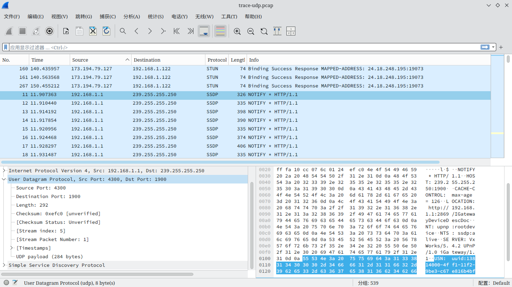
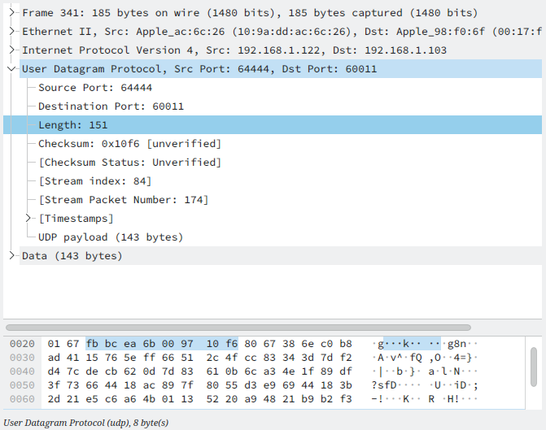
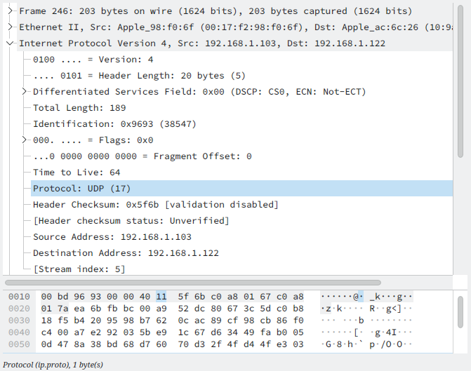
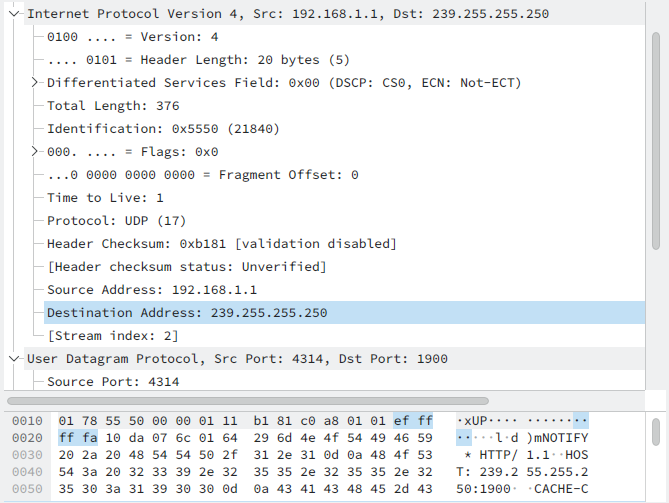

# 华东师范大学软件学院实验报告

## 一、实验目的

学习 UDP 的构成等详细信息。

## 二、使用内容与实验步骤

1. 捕获
    1. 启动 Wireshark ，关闭混杂，将过滤器设置为“udp”，开始捕获。
    2. 浏览网页以产生 UDP 流量。
    3. 停止浏览，等待一分钟左右观察背景 UDP 流量。
    4. 停止捕获。
2. 检查捕获到的数据  
    观察所捕获到的流量包，UDP 协议包包括如下字段：源端口、目标端口、长度、校验和。  
    **注意：协议列所列出的协议可能是 UDP 之上的应用程序协议名称而非 UDP**
3. UDP 消息结构  
    制作一份 UDP 报文图例并回答如下问题：  
    1. 长度字段包含什么？
        1. UDP 有效负载
        2. UDP 有效负载与 UDP 报头
        3. UDP 有效负载、UDP 报头与底层报头
    2. UDP 校验和的长度为多少？（以位为单位）
    3. UDP 报头的长度为多少字节？
4. UDP 使用  
    回答如下问题：  
    1. 给出标识上层协议为 UDP 的 IP 协议字段的值
    2. 检查 UDP 消息并提供**当电脑既不是源IP地址也不是目标IP地址时**使用的目标 IP 地址
    3. 捕获到的 UDP 消息的典型大小为多少

## 三、实验环境

- 实验仪器：ThinkPad X230i
- 操作系统：Arch GNU/Linux x86\_64
- 以太网控制器：Intel Corporation 82575LM Gigabit Network Connection
- 网络控制器：Realtek Semiconductor Co., Ltd. RTL8188CE 820.11b/g/n WiFi Adapter
- 网络连接：校园网ECNU-1X

## 四、实验过程与分析

1. 捕获  
    本步骤采用老师所提供的捕获文件
2. 检查捕获到的数据  
    捕获包如图所示  
    
3. UDP 消息结构  
    观察下图所列出的包  
    
    1. UDP 报头为 8 bytes，负载为 143 bytes，二者之和恰为 UDP 长度字段所标注的 151 bytes，故 UDP 长度字段包括 **UDP 有效负载与 UDP 报头**。
    2. UDP 校验和的长度为 2 bytes，即 16 位。
    3. UDP 报头的长度为 8 bytes。
    UDP 报文结构如下表所示：  
    <table align="center">
        <tr>
            <td align="center" colspan='4'>UDP Header</td>
            <td align="center">UDP Payload</td>
        </tr>
        <tr>
            <td align="center">Source Port</td>
            <td align="center"> Destination Port</td>
            <td align="center">Length</td>
            <td align="center">Checksum</td>
            <td align="center" rowspan='2'> many bytes</td>
        </tr>
        <tr>
            <td align="center">2 bytes</td>
            <td align="center">2 bytes</td>
            <td align="center">2 bytes</td>
            <td align="center">2 bytes</td>
        </tr>
    </table>
4. UDP 使用
    1. 如图所示，IP 协议字段的值为 0x11 ，即 17  
        
    2. 如图所示，目标 IP 地址为 239.255.255.250  
        
    3. 捕获到的 UDP 消息大小大多在 100 bytes 与 300 bytes 之间。
