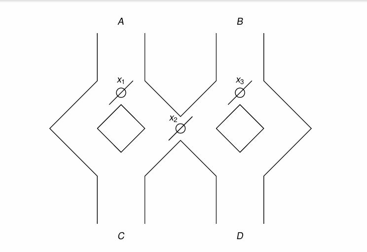

## 2025春季学期计算理论基础期末考试试卷（回忆版）

> 注：这次考试的形式是五道题自行选四个做, 每题25分, 多做没有加分；此外, 原卷面是英文, 请大家注意

1. 给出接受以下语言的DFA:  
    所有以 $1$ 开头, 能被 $5$ 整除的二进制串, 如 $101, 1010, 1111$, 左侧（自动机读入的第一个符号）为最高位, 右侧为最低位

2. 请给出 DFA 化简中 State Elimination Technique 的复杂度的 tight bound, 要有明确的推理过程

3. A marble is dropped at A and B. Levers x1, x2 and x3 cause the marble to fall either to the left or to the right. Whenever a marble encounters a lever, it causes the lever to reverse after the marble passes, so the next marble will take the opposite branch. The game wins when there is a marble falls through C. The levers are all initialized to the left. Model this toy by a DFA.

>这里是人工翻译：
在 A 点和 B 点分别掉落一个弹珠。控制杆 x1, x2, x3 会使弹珠向左或向右落下。每当弹珠经过任意一个控制杆，总会使控制杆反转，使得下一个弹珠选择另一个岔路。当存在一个弹珠掉落到 C 点使游戏胜利。拉杆初始全部设置为向左。请用 DFA 为这个小玩具建模。

4. 证明语言 $L = \{a^nb^nc^md^m (n \geq m \geq 1) \cup a^nb^mc^md^n (n \geq m \geq 1)\}$ 不是 CFL

5. 构造如下的图灵机, 其功能为：给定三个非负整数 $n, m, k$, 判断 $n + m$ 是否等于 $k$.

    输入的形式为：
    $$\underbrace{11……1}_\text{n个}0\underbrace{11……1}_\text{m个}0\underbrace{11……1}_\text{k个}$$
