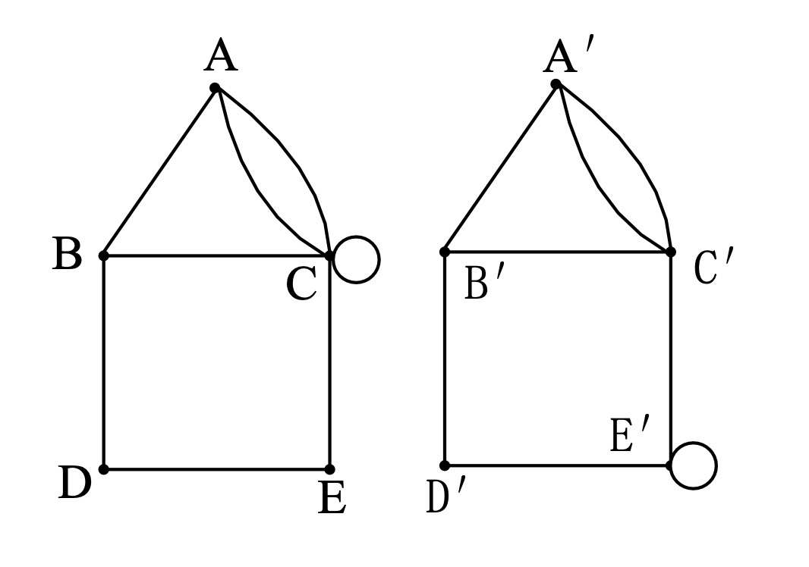
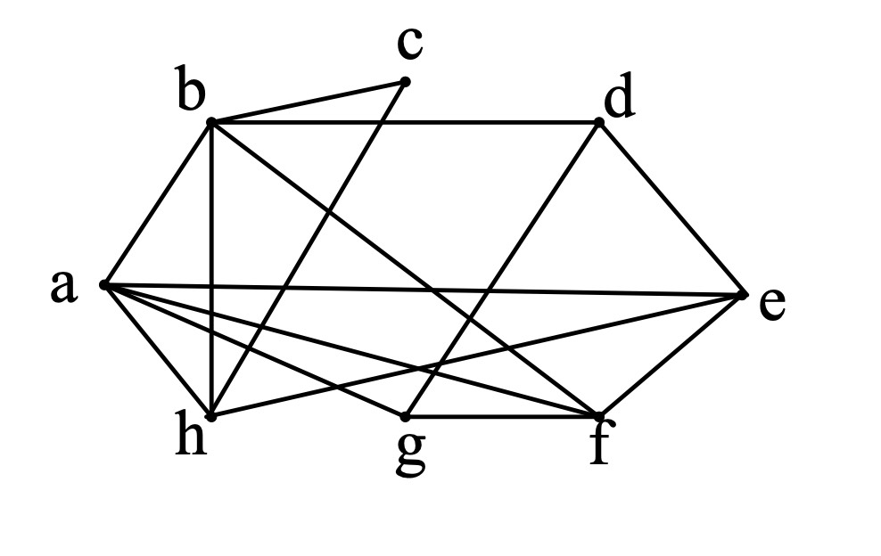
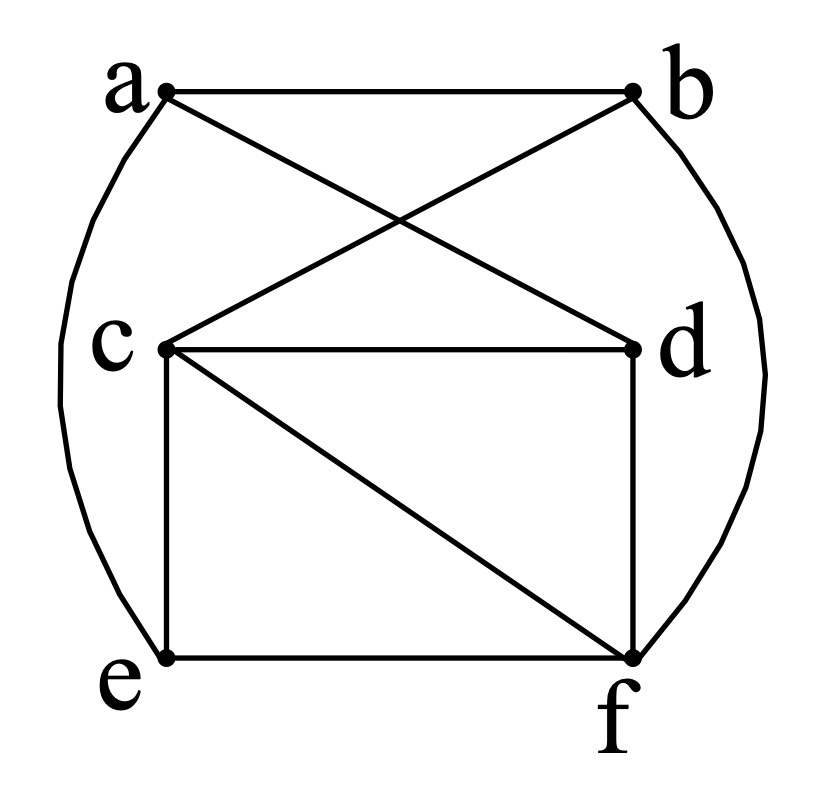

## 2014-2015学年下学期期末试卷（A）

### 一、（8 分）

Complete the following questions:

Premises:

If Kristi swims every day or walks every day, then her cholesterol（胆固醇）drops.

If her cholesterol drops, then she feels better.

She does not feel better.

Conclusion: Kristi does not walk every day.

(Let $S$ = "Kristi swims every day."

Let $W$ = "Kristi walks every day."

Let $C$ = "Kristi's cholesterol drops"

Let $F$ = "Kristi feels better".)

Questions:

a) Translating premises and conclusion into logical expressions.

b) Show that conclusion.

***

### 二、（7 分）

Suppose that $g$ is a function from $A$ to $B$ and $f$ is a function from $B$ to $C$.

1). Show that if both $f$ and $g$ are one-to-one, then $f\circ g$ is also one-to-one.

2). Show that if both $f$ and $g$ are onto, then $f\circ g$ is also onto.

***

### 三、（10 分）

若一个关系 $R$ 被称为环，当且仅当 $aRb$，$bRc$ 蕴含 $cRa$。证明：$R$ 是自反的并且它是环，当且仅当 $R$ 是等价关系。

***

### 四、（7 分）

Given the set $\{2,3,\ldots,2n+1\}$, prove that if you take any $n+1$ elements from the set, then there must be at least 2 co-prime（互质）elements.（两个连续的自然数一定是互质数。）

***

### 五、（7 分）

Let $n$ be a nonnegative integer. Then

$$
\sum_{k=0}^{n}2^k\binom{n}{k}=3^n
$$

***

### 六、（8 分）

Find a recurrence relation for the number of bit strings that contain the string 01.

1) What are the initial conditions?

2) How many bits strings of length five contain the string? (You must give the value of the number of bit strings)

***

### 七、（8 分）

How many one-to-one functions are there from a set with $m$ elements to one with $n$ elements?

***

### 八、（8 分）

Find all solutions of the recurrence relation

$$
a_n=4a_{n-1}-4a_{n-2}+2^n
$$

with initial condition $a_0=1,a_1=2$

***

### 九、（7 分）

Use generating functions to solve the recurrence relation

$$
a_k=a_{k-1}+2a_{k-2}+2^k
$$

with initial conditions $a_0=4$ and $a_1=12$.

***

### 十、（5 分）

How many different strings can be made from the letters in ABRACADABRA, using all the letters.

***

### 十一、（5 分）

设 $a_1,a_2,\ldots,a_n$ 是 $1,\ldots,n$ 的一个排列，证明，当 $n$ 为奇数时，$(a_1-1)(a_2-2)\cdots(a_n-n)$ 是一个偶数。

***

### 十二、（20 分）

回答下列问题

1). A sequence $d_1,d_2,\ldots,d_n$ is called graphic if it is the degree sequence of a simple graph. Determine whether this sequence is graphic. If yes, draw such a graph.

$$
3,3,4,5,5,6
$$

2). Let $G$ be a graph with $v$ vertices and $e$ edges. Let $M$ be the maximum degree of the vertices of $G$, and let $m$ be the minimum degree of the vertices of $G$. Show that:

(a). $\dfrac{2e}{v}\ge m$;

(b). $\dfrac{2e}{v}\le M$

3). Determine whether the given pair of graphs is isomorphic（同构）. Please briefly explain the reason.

    

4). Find the chromatic number（着色数）of the following graph. Please color these vertices.

    

5). Determine whether the given graph is planar. Please briefly explain the reason.

    
