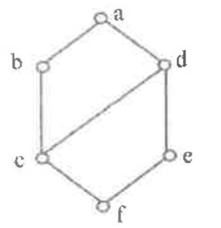
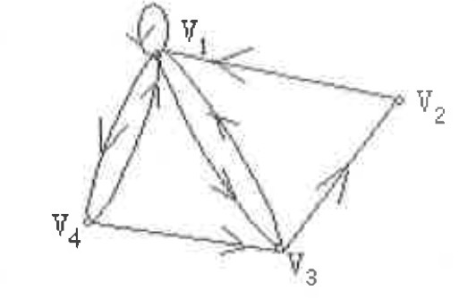
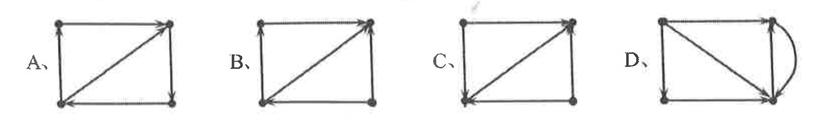
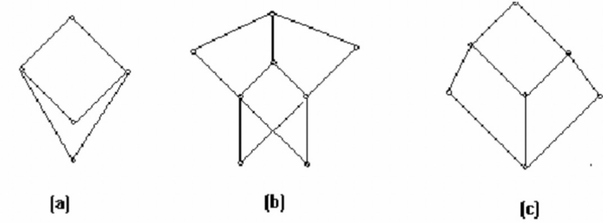
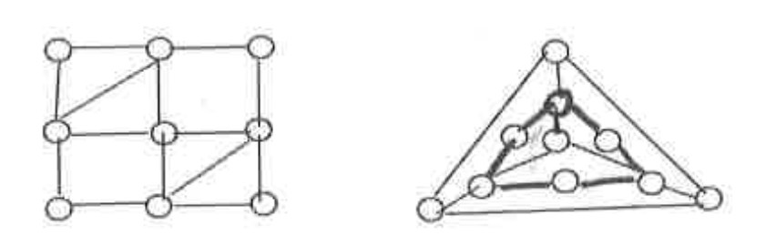

## 2017-2018学年下学期期末试卷（A）

### 说明

- 该卷试题风格个人感觉不像软院离散数学，因此建议改试卷仅供参考。

### 一、选择题（每题 2 分，共 20 分）

1. 设 $R,S$ 是集合 $A$ 上的关系，则下列说法正确的是（ ）。

   A. 若 $R,S$ 是自反的，则 $R\circ S$ 是自反的；

   B. 若 $R,S$ 是反自反的，则 $R\circ S$ 是反自反的；

   C. 若 $R,S$ 是对称的，则 $R\circ S$ 是对称的；

   D. 若 $R,S$ 是传递的，则 $R\circ S$ 是传递的。

    ***

2. 如下图所示的格中，互为补元的两个元素是（ ）。

   A. $b,d$

   B. $c,e$

   C. $b,e$

   D. $c,d$

    

    ***

3. 下图中从 $v_1$ 到 $v_3$ 长度为 3 的通路有（ ）条。

   A. 0

   B. 1

   C. 2

   D. 3

    

    ***

4. 关于图的一些说法正确的是（ ）。

   A. 偶数顶点数的完全图是欧拉图

   B. 完全二叉树必有奇数个顶点

   C. 一个边带权图的最小生成树只有一棵

   D. $K_{3,3}$ 是极大可平面图

    ***

5. 在下面所示的 4 个图中，（ ）不是单向联通图。

    

    ***

6. 一棵树有 2 个 2 度顶点，1 个 3 度顶点，3 个 4 度顶点，则其 1 度顶点为（ ）。

   A. 5

   B. 7

   C. 8

   D. 9

    ***

7. 下列等价关系正确的是（ ）。

   A. $\forall x(P(x)\vee Q(x))\Leftrightarrow \forall xP(x)\vee \forall xQ(x)$

   B. $\exists x(P(x)\vee Q(x))\Leftrightarrow \exists xP(x)\vee \exists xQ(x)$

   C. $\forall x(P(x)\to Q)\Leftrightarrow \forall xP(x)\to Q$

   D. $\exists x(P(x)\to Q)\Leftrightarrow \exists xP(x)\to Q$

    ***

8. 实数集 $\mathbb{R}$ 的下列运算不满足交换律的是（ ）。

   A. $a\circ b=|a-b|$

   B. $\displaystyle a\circ b=\frac{a+b}{2}$

   C. $a\circ b=a+2b$

   D. $a\circ b=\sqrt{a^2+b^2}$

    ***

9. 设 $A=\{1,2,3,\cdots,10\}$，定义 $A$ 上的关系 $R=\{(x,y)\mid x,y\in A\wedge x+y=10\}$，则 $R$ 具有的性质为（ ）。

   A. 自反性

   B. 对称性

   C. 传递性、对称性

   D. 传递性

    ***

10. 以下序列中，（ ）是简单可图的。

    A. $(4,4,3,3,2,2)$

    B. $(3,3,3,1)$

    C. $(5,4,3,2,2)$

    D. $(6,6,3,2,2,2,1)$

***

### 二、填空题（每题 2 分，共 20 分）

1. 令 $F(x)$：$x$ 是汽车；$G(y)$：$y$ 是火车；$H(x,y)$：$x$ 比 $y$ 快。则命题“不存在比所有火车都快的汽车”符号化形式为 $\underline{\qquad}$。

    ***

2. 谓词公式 $\forall xP(x)\to \exists xQ(x)$ 的前束范式为 $\underline{\qquad}$。

    ***

3. 在 1 到 100 之间（含 1 和 100）既不能被 2 也不能被 3 还不能被 5 整除的自然数有 $\underline{\qquad}$ 个。

    ***

4. 设 $S=\{1,2,3,4,5,6\}$，定义 $*$ 运算：对于 $\forall x,y\in S$，有 $x*y=x+y-xy$。则 $S$ 中关于 $*$ 的幺等元为 $\underline{\qquad}$。

    ***

5. 集合 $A=\{a,b,c,d\}$ 上的二元关系共有 $\underline{\qquad}$ 个，等价关系共有 $\underline{\qquad}$ 个。

    ***

6. 若 8 阶无向简单图 $G$ 有 8 条边，则图 $G$ 的补图有 $\underline{\qquad}$ 条边。

    ***

7. 设 $S=\{1,2,3,4\}$，$S$ 上定义的二元运算 $*$ 如下表所示，元素 3 的阶为 $\underline{\qquad}$。

   | $*$ | 1 | 2 | 3 | 4 |
   | --- | --- | --- | --- | --- |
   | 1 | 1 | 2 | 3 | 4 |
   | 2 | 2 | 4 | 1 | 3 |
   | 3 | 3 | 1 | 4 | 2 |
   | 4 | 4 | 3 | 2 | 1 |

    ***

8. 下图所示的偏序集中，是格的为 $\underline{\qquad}$。

    

    ***

9. 当 $n\ \underline{\qquad}$ 时，$n$ 阶完全无向图 $K_n$ 是平面图，当 $n$ 为 $\underline{\qquad}$ 时，$K_n$ 是欧拉图。

    ***

10. 已知一棵无向树 $T$ 有三个 3 度顶点，一个 2 度顶点，其余的都是 1 度顶点，则 $T$ 中有 $\underline{\qquad}$ 个 1 度顶点。

***

### 三、计算题（每题 10 分，共 30 分）

1. 设集合 $A=\{1,2,\cdots,12\}$，$R$ 为 $A$ 上的整除关系。

   (1)（4 分）画出偏序集 $\langle A,R\rangle$ 的 Hasse 图；

   (2)（3 分）写出 $A$ 的所有极大元和极小元；

   (3)（3 分）写出 $B=\{2,3,6\}$ 的最小元和最大元。

    ***

2. 通过生成函数求解递推关系 $a_k=3a_{k-1},\ k=1,2,3,\cdots$，且初始条件为 $a_0=2$。

    ***

3. (1)（5 分）判断左图是否为欧拉图，若是，请给出一个欧拉回路（用阿拉伯数字在边上标明顺序），若不是，请说明原因；

   (2)（5 分）判断右图是否为哈密顿图，若是，请给出一个哈密顿回路（用阿拉伯数字在顶点上标明顺序），若不是，请说明原因。

    

***

### 四、证明题（每题 10 分，共 30 分）

1. 证明：
   $$
   (\neg P\wedge(\neg Q\wedge R))\vee(Q\wedge R)\vee(P\wedge R)\Leftrightarrow R.
   $$

    ***

2. Let $m,n$ and $r$ be nonnegative integers with $r$ not exceeding either $m$ or $n$. Then
   $$
   \binom{m+n}{r}=\sum_{k=0}^{r}\binom{m}{r-k}\binom{n}{k}.
   $$

    ***

3. $R$ 是集合 $X$ 上的一个自反关系，求证：$R$ 是对称和传递的，当且仅当 $\langle a,b\rangle$ 和 $\langle a,c\rangle$ 在 $R$ 中有 $\langle b,c\rangle$ 在 $R$ 中。
