---
title: oopcpp实践2025-2026-1全作业
---

import Tabs from '@theme/Tabs';
import TabItem from '@theme/TabItem';

## 作业

### 1. ClassDraw

#### 题目

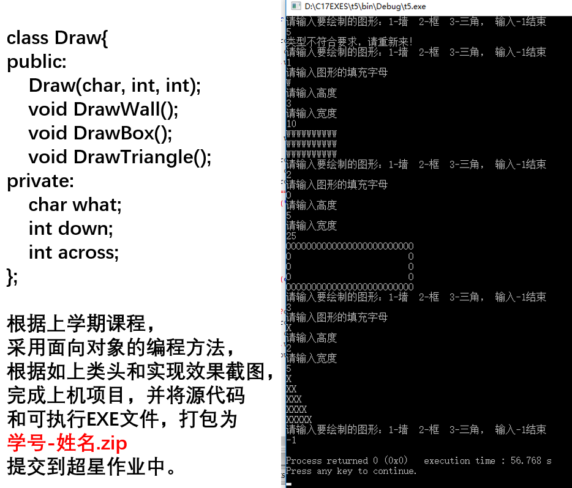

#### 参考答案

<Tabs>
<TabItem value="Draw.h" label="Draw.h">
```cpp title="Draw.h"
#pragma once

/*
 * @Description: 绘制类
*/
class Draw
{
public:
 Draw(char what, int down, int across);
 void DrawWall();
 void DrawBox();
 void DrawTriangle();
private:
 char what;
 int down;
 int across;
};
```
</TabItem>

<TabItem value="Draw.cpp" label="Draw.cpp">
```cpp title="Draw.cpp"
#include "Draw.h"
#include <iostream>
#include <cassert>

/*
 * @Description: 绘制类的构造函数
 * @param {char} what 绘制的字符
 * @param {int} down 绘制的行数
 * @param {int} across 绘制的列数
*/
Draw::Draw(char what, int down, int across) {
	assert(down >= 0 && across >= 0 && "down or across should >= 0 !");	// 断言，确保 down 和 across 大于等于 0
	this->what = what;
	this->down = down;
	this->across = across;
}

/*
 * @Description: 绘制墙
*/
void Draw::DrawWall() {
	for (int i = 0; i < this->down; i++) {
		for (int j = 0; j < this->across; j++) {
			std::cout << this->what;
		}
		std::cout << std::endl;
	}
}

/*
 * @Description: 绘制盒子
*/
void Draw::DrawBox() {
	for (int i = 0; i < this->down; i++) {
		for (int j = 0; j < this->across; j++) {
			if (i != 0 && i != down - 1 && j != 0 && j != across - 1) {
				std::cout << " ";
			}
			else {
				std::cout << this->what;
			}
		}
		std::cout << std::endl;
	}
}

/*
 * @Description: 绘制三角形
*/
void Draw::DrawTriangle() {
	int h = down > across ? down : across;
	for (int i = 0; i < h; i++) {
		for (int j = 0; j < i+1; j++) {
			std::cout << this->what;
		}
		std::cout << std::endl;
	}
}
```
</TabItem>

<TabItem value="main.cpp" label="main.cpp">
```cpp title="main.cpp"
// file encode: UTF-8
#include "Draw.h"
#include <iostream>
#include <set>


const std::set<int> TYPES = { -1,1,2,3 };	// 合法的绘制类型

/*
 * @Description: 主函数
*/
int main()
{
    char what = ' ';
    int across = 0, down = 0, type = 0;
    while (true) {
        std::cout << "Please input the shape you want to draw: 1-wall, 2-box, 3-triangle, -1 for end" << std::endl;
        std::cin >> type;
        if (TYPES.count(type)) {
            if (type == -1) {
                return 0;
            }
            else {
                std::cout << "input the letter to fill the shape" << std::endl;
                std::cin >> what;
                std::cout << "height" << std::endl;
                std::cin >> down;
                std::cout << "width" << std::endl;
                std::cin >> across;
                if (down < 0 || across < 0) {
                    std::cout << "height and width should bigger than 0" << std::endl;
                    continue;
                }
                Draw draw(what, down, across);
                switch (type) {
                case 1:
                    draw.DrawWall();
                    break;
                case 2:
                    draw.DrawBox();
                    break;
                case 3:
                    draw.DrawTriangle();
                    break;
                }
            }
        }
        else {
            std::cout << "illegal input, please input again!" << std::endl;
        }
    }
    return 0;
}
```
</TabItem>
</Tabs>

### 2. ClassDecrypt

#### 题目

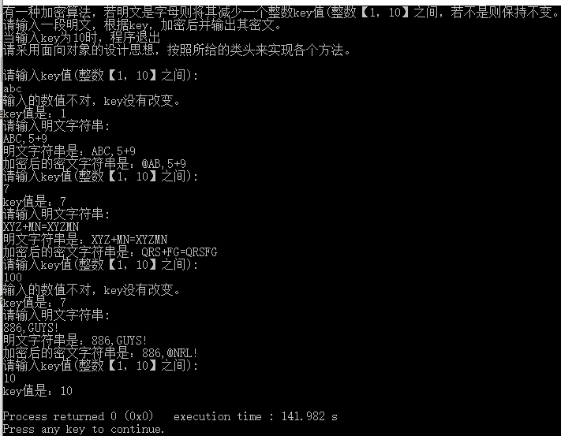

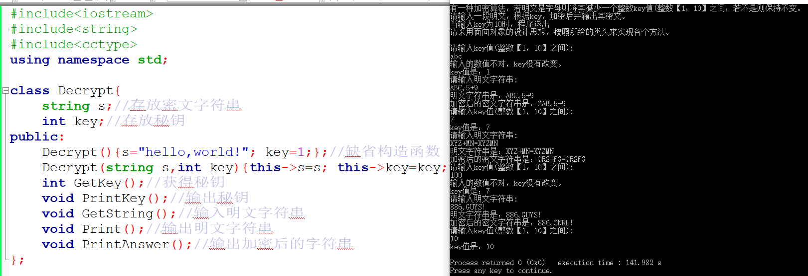

#### 参考答案

```cpp title="main.cpp"
#include<iostream>
#include<string>

class Decrypt {
    std::string s;
    int key;
public:
    Decrypt();
    Decrypt(std::string s,int key);
    int GetKey();
    void PrintKey();
    void GetString();
    void Print();
    void PrintAnswer();
};

Decrypt::Decrypt() { // 默认初始化
    this->s="hello,world!";
    this->key=1;
}

Decrypt::Decrypt(std::string s,int key) { // 按照给定的s与key初始化
    this->s=s;
    this->key=key;
}

int Decrypt::GetKey() { // 获取key值
    std::cout << "请输入key值（整数【1，10】之间）：\n";
    std::string num; // 采用string读入提高代码健壮性
    getline(std::cin,num); // 使用getline避免本行输入中出现空格污染后续输入
    if(num == "10") { // 特殊判断输入为10的情况
        this -> key = 10;
        return this -> key;
    }
    else if(num.size() == 1 && num[0]>='1' && num[0] <= '9') { // 如果输入合法，改变key值
        this->key = num[0] - '0';
        return this->key;
        
    }
    else { // 输入非法，输出提示
        std::cout << "输入的数值不对，key没有改变。\n";
        return 0;
    }
}

void Decrypt::PrintKey() { // 输出当前key值
    std::cout << "key值是：" << this -> key << '\n';
    if(this -> key == 10) { // 如果key在上一步被更改为10，终止程序
        exit(0);
    }
    return;
}


void Decrypt::GetString() { // 获取明文字符串
    std::cout << "请输入明文字符串：\n";
    std::string str;
    getline(std::cin,str); // 采用getline防止无法读入明文字符串中潜在的空格
    this->s=str;
    return ;
}

void Decrypt::Print() { // 输出明文字符串
    std::cout << "明文字符串是：";
    std::cout << this->s << '\n';
    return ;
}

void Decrypt::PrintAnswer() { // 加密字符串
    for(int i = 0; i < this->s.size(); i++) { // 加密并修改字符串
        if(this->s[i] >= 'a' && this->s[i] <= 'z') {
            this->s[i] -= key;
        }
        else if(this->s[i] >= 'A' && this->s[i] <= 'Z') {
            this->s[i] -= key;
        }
    }
    std::cout << "加密后的密文字符串是：" << this -> s << '\n'; // 在此处输出加密字符串
    return ;
}

int main() {
    Decrypt test;
    while(true) { // 循环在PrintKey()函数中key==10的情况下终止
        test.GetKey();
        test.PrintKey();
        test.GetString();
        test.Print();
        test.PrintAnswer();
    }
    return 0;
}
```

> 教师批语：
> 
> 程序的退出逻辑被放在了 PrintKey函数中，很怪。
> 一个更合理的做法是在 main函数的循环中检查 GetKey的返回值，并决定是否退出。

### 3. ClassRandom

#### 题目

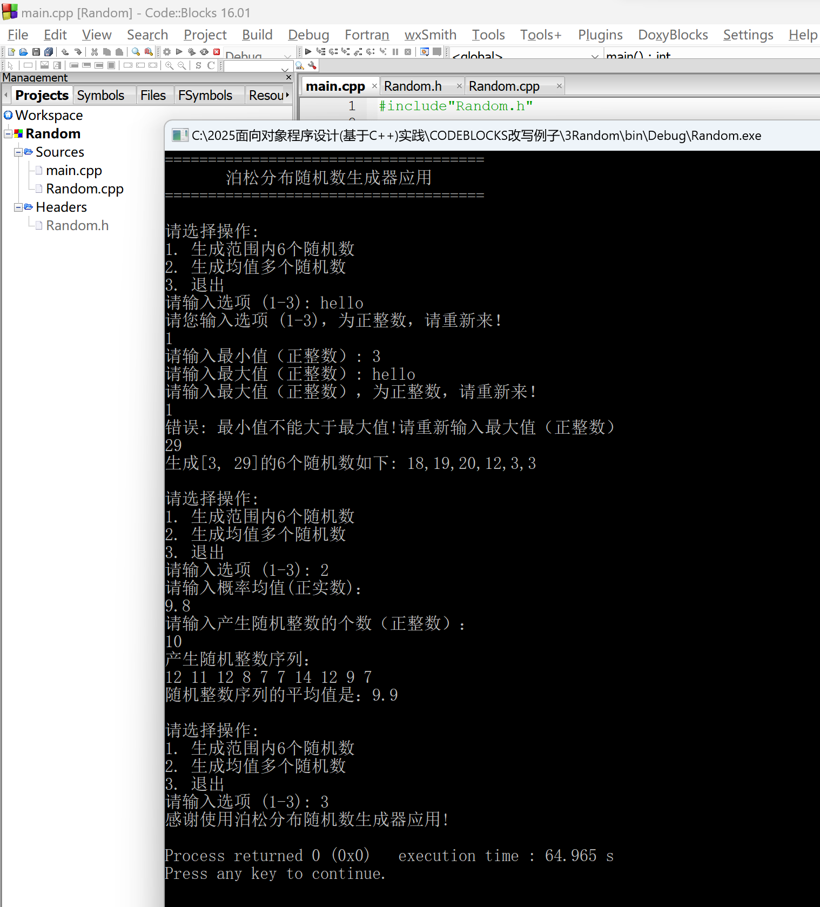

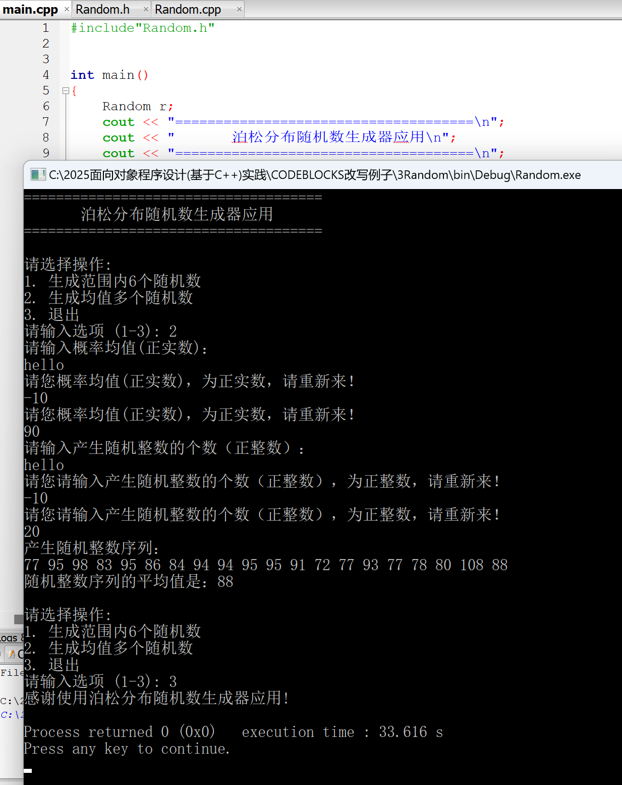

#### 参考答案

```cpp title="main.cpp"
#include <iostream>
#include <algorithm>
#include <cmath>
#include <time.h>
#include <string>
#include <vector>

class Random
{
public:
    int type,left, right, adv; //从左至右分别为 操作类型、最小值、最大值、均值
    Random(bool pseudo);
    int reseed();
    double random_real();
    int poisson(double mean);
    int input_positive_int();
    double input_positive_double();
    std::vector<int> rand6();

private:
    int seed, multiplier, add_on;
};

Random::Random(bool pseudo) // 构造函数
{
    if (pseudo)
        seed = 1;
    else
        seed = time(NULL) % INT_MAX;
    multiplier = 2743;
    add_on = 5923;
    type = 0;
}

int Random::reseed() // 种子生长函数
{
    seed = seed * multiplier + add_on;
    return seed;
}

double Random::random_real()
{
    double max = INT_MAX + 1.0; // INT_MAX = (2)31 -1
    double temp = reseed();
    if (temp < 0)
        temp = temp + max;
    return temp / max;
}

int Random::poisson(double mean)
{
    double limit = exp(-mean);
    double product = random_real();
    int count = 0;
    while (product > limit)
    {
        count++;
        product *= random_real();
    }
    return count;
}

int Random::input_positive_int() // 以字符串形式读入一个正整数
{
    std::string str;
    std::cin >> str;
    int res = 0;
    for (int i = 0; i < str.size(); i++)
    {
        if (str[i] >= '0' && str[i] <= '9')
        {
            res *= 10;
            res += str[i] - '0';
        }
        else
        {
            return -1;
        }
    }
    if(res <= 0) res = -1;
    return res;
}

double Random::input_positive_double() // 以字符串形式读入一个小数
{
    std::string str;
    std::cin >> str;
    double res = 0, now = 1;
    bool dot = false;
    for (int i = 0; i < str.size(); i++)
    {
        if (str[i] == '.') // 判断小数点是否出现过
        {
            if (dot)
            {
                return -1;
            }
            else
            {
                dot = true;
            }
        }
        else if (str[i] >= '0' && str[i] <= '9')
        {
            if(dot) // 处理小数部分
            {
                now /= 10;
                res += (str[i] - '0') * now;
            }
            else // 处理整数部分
            {
                res *= 10;
                res += str[i] - '0';
            }
        }
        else
        {
            return -1;
        }
    }
    if(res <= 0) res = -1;
    return res;
}

std::vector<int> Random::rand6() // 生成六个范围内的随机数
{
    std::vector<int> res(6);
    for (int i = 0; i < 6; i++)
    {
        res[i] = random_real() * (right - left) + left;
    }
    return res;
}

int main()
{
    Random r(false);
    std::cout << "=====================================\n";
    std::cout << "       泊松分布随机数生成器应用        \n";
    std::cout << "=====================================\n";
    while (r.type != 3)
    {
        std::cout << "\n";
        std::cout << "请选择操作：\n";
        std::cout << "1. 生成范围内6个随机数\n";
        std::cout << "2. 生成均值多个随机数\n";
        std::cout << "3. 退出\n";
        std::cout << "请输入选项（1-3）：";
        r.type = r.input_positive_int();

        while (r.type < 1 || r.type > 3)                                // 确保输入类型符合预期
        {                                                               // 我承认这么写看起来很丑
            std::cout << "请您输入选项（1-3），为正整数，请重新来！\n";     // 但我一时想不到相对更好的写法
            r.type = r.input_positive_int();
        }

        if (r.type == 1) // 生成区间内六个随机数
        {
            std::cout << "请输入最小值（正整数）：";
            r.left = r.input_positive_int();

            while (r.left < 1)
            {
                std::cout << "请输入最小值（正整数），为正整数，请重新来！\n";
                r.left = r.input_positive_int();
            }

            std::cout << "请输入最大值（正整数）：";
            r.right = r.input_positive_int();

            while (r.right < 1 || r.right < r.left)
            {
                if (r.right < 1)
                    std::cout << "请输入最大值（正整数），为正整数，请重新来！\n";
                else if (r.right < r.left)
                    std::cout << "错误：最小值不能大于最大值！请重新输入最大值（正整数）\n";
                r.right = r.input_positive_int();
            }

            std::vector<int> res = r.rand6();

            std::cout << "生成[" << r.left << "，" << r.right << "]的6个随机数如下：";
            for (int i = 0; i < 6; i++)
            {
                std::cout << res[i] << (i < 5 ? ", " : "\n");
            }
        }

        else if (r.type == 2) // 生成给定均值的泊松分布随机数
        {
            std::cout << "请输入概率均值(正实数)：\n";
            r.adv = r.input_positive_double();
            
            while (r.adv <= 0)
            {
                std::cout << "请您概率均值(正实数)，为正实数，请重新来！\n"; // 此处拼写错误系给定示例程序原文，故原文保留
                r.adv = r.input_positive_double();
            }

            int num;
            std::cout << "请输入产生随机整数的个数（正整数）：\n";
            num = r.input_positive_int();

            while (num < 1) {
                std::cout << "请您请输入产生随机整数的个数（正整数），为正整数，请重新来！\n";
                num = r.input_positive_int();
            }

            long long sum = 0; // 计算随机整数之和
            std::cout << "产生随机整数序列：\n";
            for(int i = 0; i < num; i++)
            {
                int res = r.poisson(r.adv);
                sum += res;
                std::cout << res << ' ';
            }
            // 示例程序计算均值似乎有误，已修复此问题
            std::cout << "\n随机整数序列的平均值是：" << (double)sum/num << '\n';
        }
    }
    std::cout << "感谢使用泊松分布随机数生成器应用！\n";
    return 0;
}
```

> 教师批语：
> 
> rand6 函数中，
> 生成随机数的公式为 random_real() * (right - left) + left，
> 这样生成的随机数范围实际上是 [left, right)，永远无法生成最大值 right 

### 4. ClassTime

#### 题目

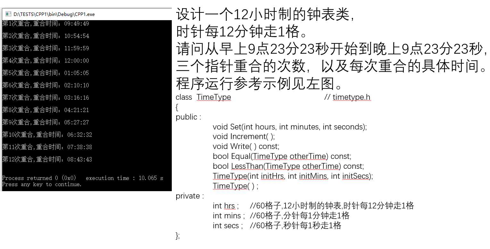

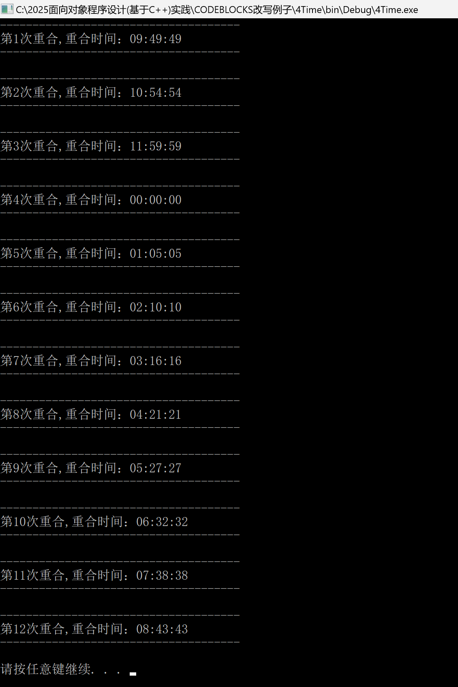

#### 参考答案

```cpp title="main.cpp"
#include <iostream>
#include <iomanip>
#include <string>

class TimeType
{
public:
    void Set(int hours, int minutes, int seconds);
    void Increment();
    void Write() const;
    bool Equal(TimeType otherTime) const;
    bool Lessthan(TimeType otherTime) const;
    TimeType(int initHrs, int initMins, int initSecs);
    TimeType();
    bool Overlap();

private:
    int hrs;
    int mins;
    int secs;
};

void TimeType::Set(int hours, int minutes, int seconds) // 将函数参数赋给类中的变量
{
    this->hrs = hours;
    this->mins = minutes;
    this->secs = seconds;
    return;
}

void TimeType::Increment() // 让类增加一秒
{
    this->secs++;
    if (this->secs == 60) // 处理 60 秒 -> 1 分钟进位
    {
        this->secs = 0;
        this->mins++;
    }
    if (this->mins == 60) // 处理 60 分钟 -> 1 小时进位
    {
        this->mins = 0;
        this->hrs++;
    }
    if (this->hrs == 24) // 处理 24 小时 -> 1 天进位
    {
        this->hrs = 0;
    }
    return;
}

void TimeType::Write() const
{
    if (this->hrs == 12 || this->hrs == 0) // 特殊处理 0 点和 12 点
        printf("12");
    else //输出当前小时
        printf("%02d", this->hrs%12);
    printf(":%02d:%02d\n", this->mins, this->secs); // 以保留两位有效数字形式输出当前分钟与秒
    return;
}

bool TimeType::Equal(TimeType otherTime) const // 当且仅当小时，分钟，秒三个变量均相等的时候返回 True
{
    return this->hrs == otherTime.hrs &&
           this->mins == otherTime.mins &&
           this->secs == otherTime.secs;
}

bool TimeType::Lessthan(TimeType otherTime) const // 将类中时间转换为自00:00:00过去了多少秒，然后比较大小，只能比较同一天内的时间
{
    return (this->hrs * 3600 + this->mins * 60 + this->secs) < (otherTime.hrs * 3600 + otherTime.mins * 60 + otherTime.secs);
}

TimeType::TimeType(int initHrs, int initMins, int initSecs) // 构造函数
{
    this->hrs = initHrs;
    this->mins = initMins;
    this->secs = initSecs;
}

TimeType::TimeType() // 构造函数
{
    this->hrs = 0;
    this->mins = 0;
    this->secs = 0;
}

bool TimeType::Overlap() // 判断三个指针是否重合
{
    return this->mins == this->secs && this->mins / 12 + this->hrs % 12 * 5 == this->mins;
}

int main()
{
    TimeType beg(9, 23, 23), end(21, 23, 23);
    int num = 0;
    for (TimeType i = beg; !i.Equal(end); i.Increment()) // 考虑到可能需要更换参数处理跨天的情况，故采用了 !!i.Equal(end) 而非 i.Increment() 作为循环条件
    {
        if (i.Overlap())
        {
            std::string s; // 作为吞掉输入的临时变量，无实际意义
            num++; // 计算当前是第多少次重合
            std::cout << "-------------------------------------\n"; //参考示例程序，输出上分割线
            std::cout << "第" << num << "次重合，重合时间：";
            i.Write();
            std::cout << "-------------------------------------\n";
            std::getline(std::cin, s); // 根据实际测试，示例程序应该是采用的getchar()，但是出于美观性的考虑，本处采用了getline()
        }
    }
    return 0;
}
```

### 5. CBrowser

#### 题目

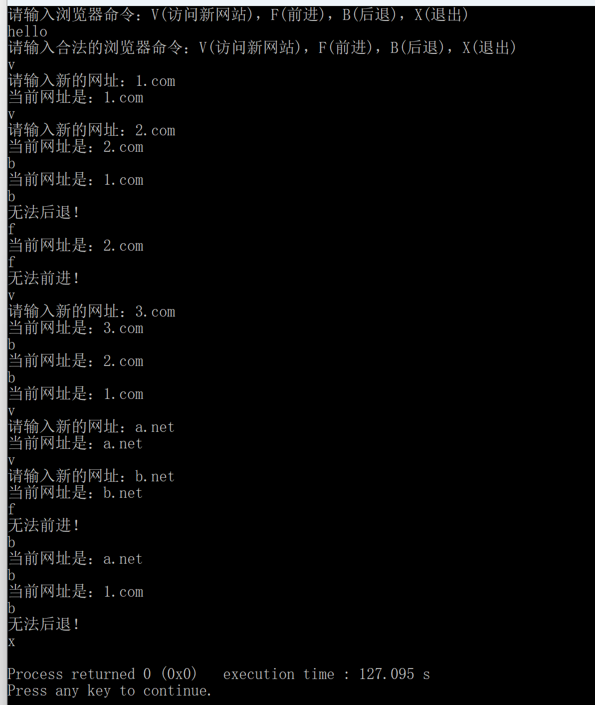

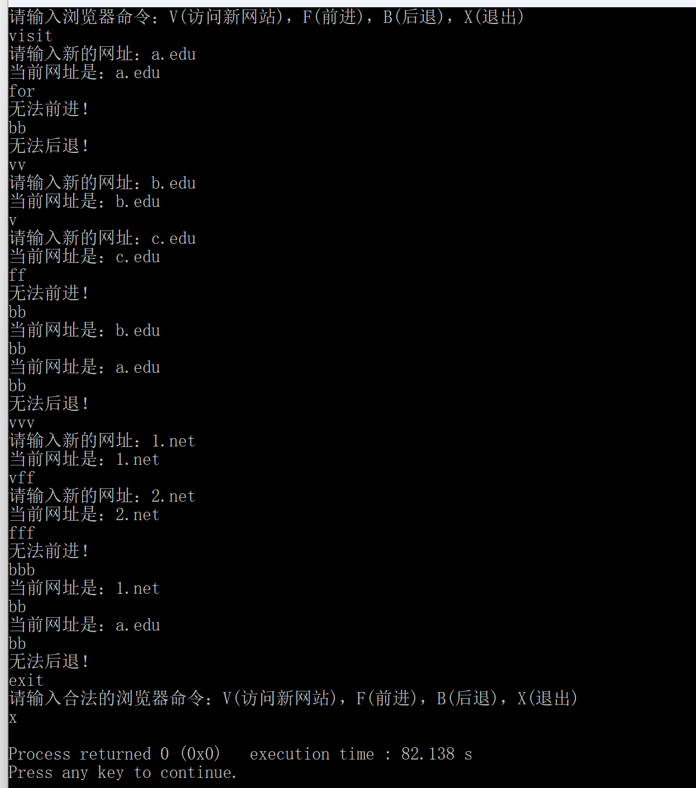

#### 参考答案 

<Tabs>
<TabItem value="brouser.h" label="brouser.h">
```cpp title="brouser.h"
template <class Node_entry>
struct Node
{
    // data members
    Node_entry entry;
    Node<Node_entry> *next;
    Node<Node_entry> *back;
    // constructors
    Node();
    Node(Node_entry item, Node<Node_entry> *link_back = 0, Node<Node_entry> *link_next = 0);
    ~Node();
};

template <class Node_entry>
class CBrowser
{
private:
    // data members
    Node<Node_entry> *current;          // 当前游标指针
public:
    // constructors
    bool CanForward();                  // 可以继续往前
    bool Forward();                     // 前进一个节点
    bool CanBack();                     // 可以继续后退
    bool Back();                        // 后退一个节点
    void NewSite(Node_entry site);      // 将新的site插入到current当前位置的后面
    Node<Node_entry> *GetCurrent();     // 获得当前游标指针current
    CBrowser();                         // 缺省构造，空链表
    ~CBrowser();                        // 析构，释放所有节点内存
};

template <class Node_entry>
Node<Node_entry>::Node()
{
    this->entry = "";
    this->back = nullptr;
    this->next = nullptr;
}

template <class Node_entry>
Node<Node_entry>::Node(Node_entry item, Node<Node_entry> *link_back, Node<Node_entry> *link_next)
{
    this->entry = item;
    this->back = link_back;
    this->next = link_next;
}

template <class Node_entry>             // 递归删除此节点及其所有后继节点
Node<Node_entry>::~Node()
{
    if (this->next != nullptr)
    {
        delete this->next;
    }
}

template <class Node_entry>             // 检测当前节点的next指针是否为空以判断是否存在后继节点
bool CBrowser<Node_entry>::CanForward()
{
    return (this->current->next != nullptr);
}

template <class Node_entry>
bool CBrowser<Node_entry>::Forward()
{
    if (this->CanForward())
    {
        this->current = this->current->next;
        return true;
    }
    else
    {
        return false;
    }
}

template <class Node_entry>             // 采用了含头节点的双向链表
bool CBrowser<Node_entry>::CanBack()    // 故检测当前节点的back指针的back指针是否为空检测该节点前驱节点是否为头节点
{                                       // 等价于检测该节点是否存在前驱节点
    return (this->current->back->back != nullptr); 
}

template <class Node_entry>
bool CBrowser<Node_entry>::Back()
{
    if (this->CanBack())
    {
        this->current = this->current->back;
        return true;
    }
    else
    {
        return false;
    }
}

template <class Node_entry>
void CBrowser<Node_entry>::NewSite(Node_entry site)
{
    delete this->current->next;     // 先删除当前节点的所有后继节点
    Node<Node_entry> *newSite = new Node<Node_entry>(site, this->current, nullptr);
    newSite->entry = site;          // 然后使当前节点的后继节点为新节点
    this->current->next = newSite;  // 设定指针
    this->current = newSite;        // 将当前节点转移至后继节点
}

template <class Node_entry>
Node<Node_entry> *CBrowser<Node_entry>::GetCurrent()
{
    return this->current;
}

template <class Node_entry>
CBrowser<Node_entry>::CBrowser()
{
    current = new Node<Node_entry>;
}

template <class Node_entry>
CBrowser<Node_entry>::~CBrowser()
{
    delete this->current;
}
```
</TabItem>
<TabItem value="main.cpp" label="main.cpp">
```cpp title="main.cpp"
#include <iostream>
#include <string>
#include "brouser.h"

int main()
{
    std::cout << "请输入浏览器命令：V(访问新网站)，F(前进)，B(后退)，X(退出)\n";
    CBrowser<std::string> log; // 创建浏览器历史记录链表
    char command = 0;          // 存储当前指令
    while (command != 'X')
    {
        std::string input;
        getline(std::cin, input); // 使用getline()读取字符串作为指令
        command = input.front();  // 取字符串首字符做指令模糊匹配

        if (command >= 'a' && command <= 'z') // 处理大小写敏感
        {
            command -= 'a';
            command += 'A';
        }

        std::string website;
        switch (command)
        {
        case 'V':
            std::cout << "请输入新的网址：";
            getline(std::cin, website); // 使用getline()读入新网址
            log.NewSite(website);
            std::cout << "当前网址是：" << log.GetCurrent()->entry << '\n';
            break;

        case 'F':
            if (log.Forward())
            {
                std::cout << "当前网址是：" << log.GetCurrent()->entry << '\n';
            }
            else
            {
                std::cout << "无法前进！\n";
            }
            break;

        case 'B':
            if (log.Back())
            {
                std::cout << "当前网址是：" << log.GetCurrent()->entry << '\n';
            }
            else
            {
                std::cout << "无法后退！\n";
            }
            break;

        case 'X':
            break;

        default:
            std::cout << "请输入合法的浏览器命令：V(访问新网站)，F(前进)，B(后退)，X(退出)\n"; // 处理读入非法命令的情况
            break;
        }
    }
    return 0;
}
```
</TabItem>
</Tabs>

### 6. CTypes

#### 题目

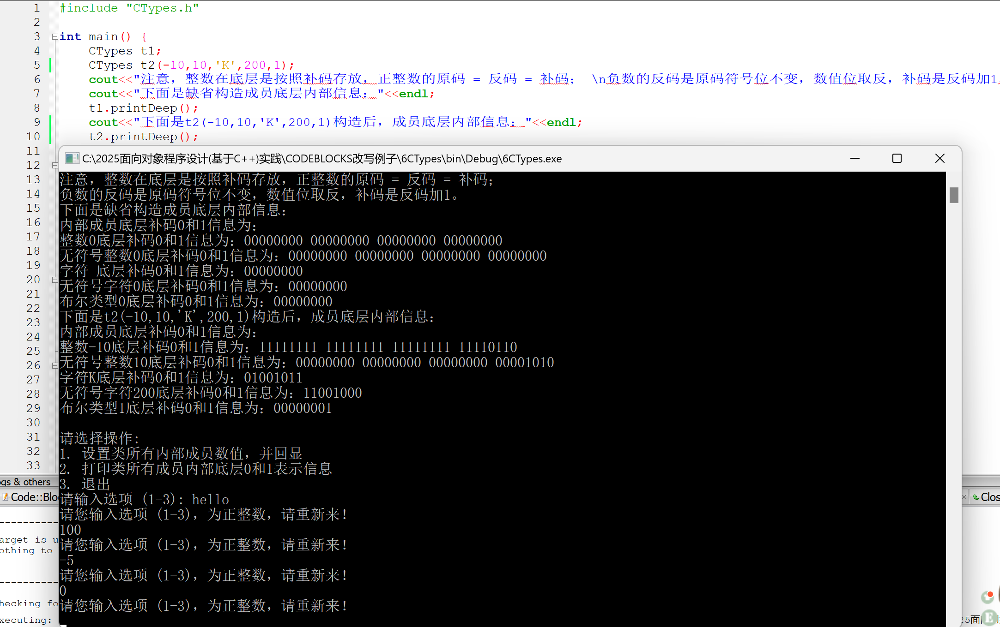

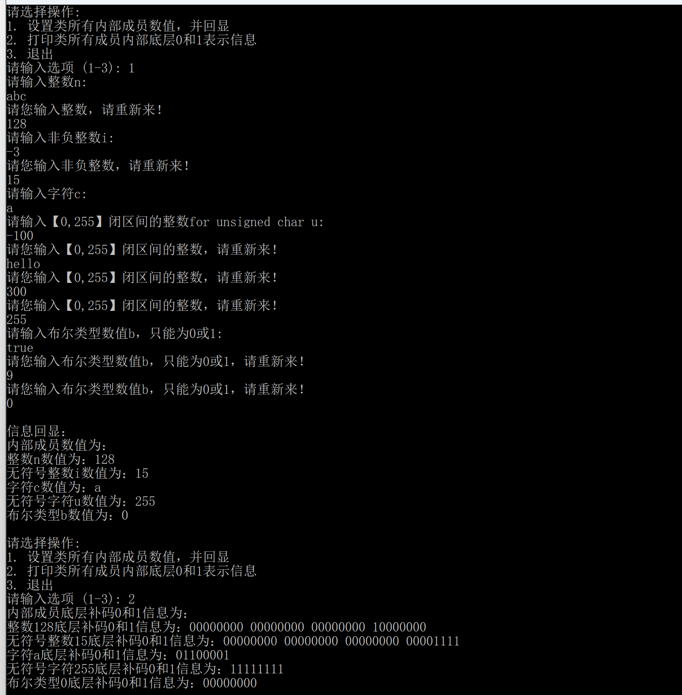

#### 参考答案 

```cpp title="main.cpp"
#include <bits/stdc++.h>

using namespace std;

long long input_int(string str) // 以字符串形式读入一个正整数，从之前写的随机数类作业中拿过来的
{
    long long res = 0;
    long long i = 0;
    bool negative = false;
    if (str.front() == '-') // 处理负号
    {
        negative = true;
        i++;
    }
    for (; i < str.size(); i++)
    {
        if (str[i] >= '0' && str[i] <= '9')
        {
            res *= 10;
            res += str[i] - '0';
        }
        else //非法值一律返回0，在函数内再进行判断
        {
            return 0;
        }
    }
    return negative ? -res : res;
}

class CTypes
{
public:
    CTypes();                                                       // 缺省构造函数，所有成员初始化为0
    CTypes(int n, unsigned int i, char c, unsigned char u, bool b); // 构造函数，所有成员初始化为形参
    void setValue();                                                // 设置内部成员数据数值
    void printValue();                                              // 输出内部成员数据数值
    void printDeep();                                               // 输出所有内部成员数据底层补码的存放信息

private:
    void printBinary(void *var, size_t size); // 打印指针var指向任意变量（字节数为size）的底层二进制表示
    // size_t 是一个无符号整数类型,32位系统unsigned int（4字节）64位系统unsigned long（8字节）
    // void * 是一种特殊的指针类型，称为 "无类型指针" 或 "泛型指针",在解引用,或者+-操作之前，必须将其转换为具体的指针类型。

    // 内部成员：
    int n;
    unsigned int i;
    char c;
    unsigned char u;
    bool b;
};

CTypes::CTypes() //缺省构造
{
    this->n = 0;
    this->i = 0;
    this->c = '\0';
    this->u = '\0';
    this->b = false;
}

CTypes::CTypes(int n, unsigned int i, char c, unsigned char u, bool b) //给定值构造
{
    this->n = n;
    this->i = i;
    this->c = c;
    this->u = u;
    this->b = b;
}

void CTypes::setValue()
{
    string str;
    long long temp;
    cout << "请输入整数n:\n";
    while (1)
    {
        getline(cin, str);
        temp = input_int(str);
        if (temp == 0 && str != "0") //此处判断返回值为0是读入了非法值还是读入了0
        {
            cout << "请您输入整数，请重新来！\n";
        }
        else
        {
            this->n = temp;
            break;
        }
    }

    cout << "请输入非负整数i:\n";
    while (1)
    {
        getline(cin, str);
        temp = input_int(str);
        if (temp == 0 && str != "0")
        {
            cout << "请您输入非负整数，请重新来！\n";
        }
        else if (temp < 0) //返回负数的时候同样作为非法值处理
        {
            cout << "请您输入非负整数，请重新来！\n";
        }
        else
        {
            this->i = temp;
            break;
        }
    }

    cout << "请输入字符c:\n"; // 按照样例程序，此处输入字符串时保留第一个字符
    getline(cin, str);
    this->c = str.front();

    cout << "请输入【0,255】闭区间的整数for unsigned char u:\n";
    while (1)
    {
        getline(cin, str);
        temp = input_int(str);
        if (temp == 0 && str != "0")
        {
            cout << "请您输入【0,255】闭区间的整数，请重新来！\n";
        }
        else if (temp < 0 || temp > 255) //处理返回范围外的非法值
        {
            cout << "请您输入【0,255】闭区间的整数，请重新来！\n";
        }
        else
        {
            this->u = temp;
            break;
        }
    }

    cout << "请输入布尔类型数值b，只能为0或1:\n";
    while (1) //因为布尔类型情形简单，只需要判断两种情况，便不调用字符串转整数函数了
    {
        getline(cin, str);
        if (str == "0")
        {
            this->b = false;
            break;
        }
        else if (str == "1")
        {
            this->b = true;
            break;
        }
        else
        {
            cout << "请您输入布尔类型数值b，只能为0或1，请重新来！\n";
        }
    }

    return;
}

void CTypes::printValue() //打印变量
{
    cout << "内部成员数值为：" << endl;
    cout << "整数n数值为：" << this -> n << endl;
    cout << "无符号整数i数值为：" << this -> i << endl;
    cout << "字符c数值为：" << this -> c << endl;
    cout << "无符号字符u数值为：" << (int)(this -> u) << endl; //以数值形式打印无符号整数
    cout << "布尔类型b数值为：" << this -> b << endl;
    return;
}

void CTypes::printDeep()
{
    cout << "内部成员底层补码0和1信息为：" << endl;

    cout << "整数" << this->n << "底层补码0和1信息为：";
    this->printBinary(&(this->n), sizeof(this->n));
    cout << endl;

    cout << "无符号" << this->i << "底层补码0和1信息为：";
    this->printBinary(&(this->i), sizeof(this->i));
    cout << endl;

    cout << "字符" << this->c << "底层补码0和1信息为：";
    this->printBinary(&(this->c), sizeof(this->c));
    cout << endl;

    cout << "无符号字符" << (int)(this->u) << "底层补码0和1信息为："; //这里同样以数值形式打印无符号整数
    this->printBinary(&(this->u), sizeof(this->u));
    cout << endl;

    cout << "布尔类型" << this->b << "底层补码0和1信息为：";
    this->printBinary(&(this->b), sizeof(this->b));
    cout << endl;

    return;
}

void CTypes::printBinary(void *var, size_t size)
{
    unsigned long long now = (1LL << (size*8-1)); // 将 now 设为最高位为 1 ，其余位为0的形式
    unsigned long long value;
    switch(size) { // 以对应的无符号类型读取 var 指向的值，便于后续位运算处理
        case 1:
        value = *((unsigned char*)var);
        break;
        case 2:
        value = *((unsigned short*)var);
        break;
        case 4:
        value = *((unsigned long*)var);
        break;
        case 8:
        value = *((unsigned long long*)var);
        break;
        default:
        value = (1LL << 63);
    }
    int num = 0;
    while(now) {
        cout << (bool)(now&value);
        num ++;
        now >>=1; // 通过 now 每次右移自左向右打印底层存储
        if(num == 8) // 字节之间以空格隔开
        {
            cout << ' ';
            num = 0;
        }
    }
    return;
}

int main()
{
    CTypes t1;
    CTypes t2(-10, 10, 'K', 200, 1);
    cout << "注意，整数在底层是按照补码存放，正整数的原码 = 反码 = 补码；" << endl;
    cout << "负数的反码是原码符号位不变，数值位取反，补码是反码加1。" << endl;
    cout << "下面是缺省构造成员底层内部信息：" << endl;
    t1.printDeep();
    cout << "下面是t2(-10,10,'K',200,1)构造后，成员底层内部信息：" << endl;
    t2.printDeep();
    cout << endl;

label1:
    string input = "";
    cout << "请选择操作:" << endl;
    cout << "1. 设置类所有内部成员数值，并回显" << endl;
    cout << "2. 打印类所有成员内部底层0和1表示信息" << endl;
    cout << "3. 退出" << endl;
    cout << "请输入选项 (1-3):";
    while (input != "3")
    {
        getline(cin, input);
        if (input == "1")
        {
            t1.setValue();
            cout << endl;
            cout << "信息回显：" << endl;
            t1.printValue();
            cout << endl;
            goto label1; // 使用 goto 来重新打印默认信息
        }
        else if (input == "2")
        {
            t1.printDeep();
            cout << endl;
            goto label1;
        }
        else if (input == "3")
        {
            break;
        }
        else
        {
            cout << "请您输入选项 (1-3)，为正整数，请重新来！" << endl;
        }
    }
    return 0;
}
```

### 期末大作业

#### 题目

Move.h

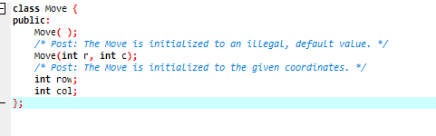

MyStack.h

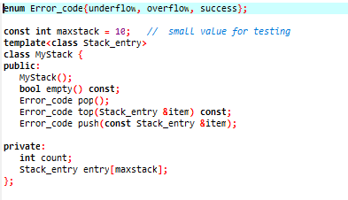

Board.h

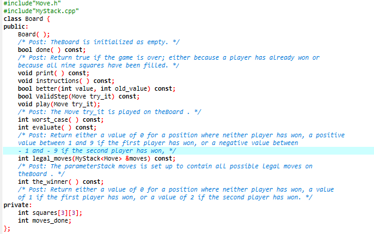

1. 当输入无效棋谱文件名称时，程序要求人自行和电脑对战，运行效果如下图

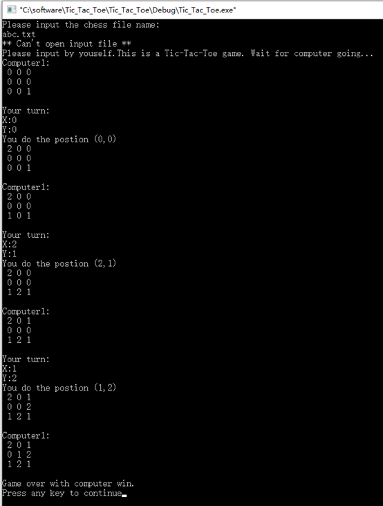

2. 当输入初学者棋谱beginer.txt时，运行效果如下图

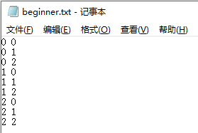

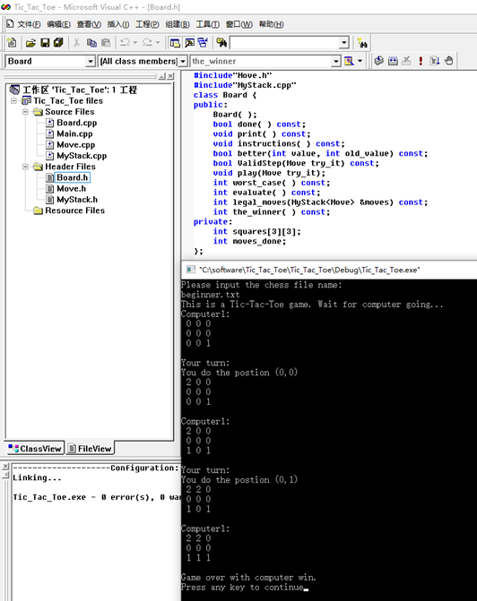

3. 当输入高手棋谱master.txt时，运行效果如下图

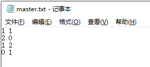

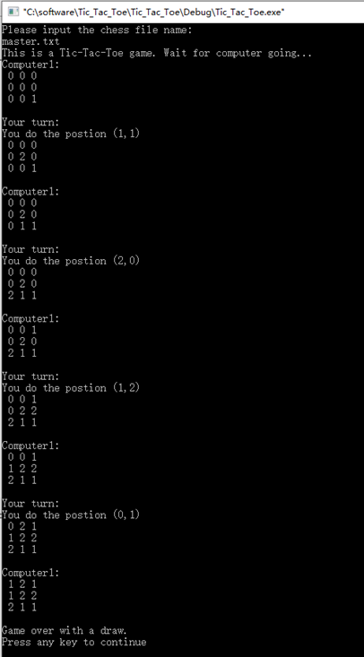

<Tabs>
<TabItem value="beginner.txt" label="beginner.txt">
```text title="beginner.txt"
0 0
0 1
0 2
1 0
1 1
1 2
2 0
2 1
2 2
```
</TabItem>
<TabItem value="master.txt" label="master.txt">
```text title="master.txt"
1 1
2 0
1 2
0 1
```
</TabItem>
</Tabs>

#### 参考答案

<Tabs>
<TabItem value="Move.h" label="Move.h">
```cpp title="Move.h"
class Move
{
public:
    Move();
    Move(int r, int c);
    int row;
    int col;
};

Move::Move()
{
    row = -1;
    col = -1;
}

Move::Move(int r, int c)
{
    row = r;
    col = c;
}
```
</TabItem>
<TabItem value="MyStack.h" label="MyStack.h">
```cpp title="MyStack.h"
enum Error_code
{
    underflow,
    overflow,
    success
};

const int maxstack = 10;

template <class Stack_entry>
class MyStack
{
public:
    MyStack();
    bool empty() const;
    Error_code pop();
    Error_code top(Stack_entry &item) const;
    Error_code push(const Stack_entry &item);

private:
    int count;
    Stack_entry entry[maxstack];
};

template <class Stack_entry>
MyStack<Stack_entry>::MyStack()
{
    count = 0;
}

template <class Stack_entry>
bool MyStack<Stack_entry>::empty() const
{
    return count <= 0;
}

template <class Stack_entry>
Error_code MyStack<Stack_entry>::pop()
{
    if(empty())
    {
        return underflow;
    }
    count--;
    return success;
}

template <class Stack_entry>
Error_code MyStack<Stack_entry>::top(Stack_entry &item) const
{
    if(empty())
    {
        return underflow;
    }
    item = entry[count - 1];
    return success;
}

template <class Stack_entry>
Error_code MyStack<Stack_entry>::push(const Stack_entry &item)
{
    if(count >= maxstack)
    {
        return overflow;
    }
    entry[count] = item;
    count++;
    return success;
}
```
</TabItem>
<TabItem value="Board.h" label="Board.h">
```cpp title="Board.h"
#include <iostream>
#include "Move.h"
#include "MyStack.h"

class Board
{
public:
    Board();
    bool done() const;
    void print() const;
    void instructions() const;
    bool better(int value, int old_value) const;
    bool ValidStep(Move try_it) const;
    void play(Move try_it);
    int worst_case() const;
    int evaluate() const;
    int legal_moves(MyStack<Move> &moves) const;
    int the_winner() const;

private:
    int squares[3][3];
    int moves_done;
};

Board::Board()
{
    for (int i = 0; i < 3; i++)
        for (int j = 0; j < 3; j++)
            squares[i][j] = 0;
    moves_done = 0;
}

bool Board::done() const
{
    return moves_done == 9 || the_winner() > 0;
}

void Board::print() const
{
    for (int i = 0; i < 3; i++)
    {
        for (int j = 0; j < 3; j++)
        {
            std::cout << " " << squares[i][j];
        }
        std::cout << '\n';
    }
    std::cout << '\n';
}

void Board::instructions() const
{
    std::cout << "This is a Tic-Tac-Toe game. Wait for computer going...\n";
}

bool Board::ValidStep(Move try_it) const
{
    return (squares[try_it.row][try_it.col] == 0);
}

void Board::play(Move try_it)
{
    squares[try_it.row][try_it.col] = moves_done % 2 + 1;
    moves_done++;
}

int Board::the_winner() const
{
    for (int i = 0; i < 3; i++)
    {
        if (squares[i][1] != 0 &&
            squares[i][1] == squares[i][0] &&
            squares[i][1] == squares[i][2])
            return squares[i][1];
        if (squares[1][i] != 0 &&
            squares[1][i] == squares[0][i] &&
            squares[1][i] == squares[2][i])
            return squares[1][i];
    }
    if (squares[1][1] != 0)
    {
        if (squares[1][1] == squares[0][0] &&
            squares[1][1] == squares[2][2])
            return squares[1][1];
        if (squares[1][1] == squares[0][2] &&
            squares[1][1] == squares[2][0])
            return squares[1][1];
    }
    return 0;
}

int Board::legal_moves(MyStack<Move> &moves) const
{
    int count = 0;
    while (!moves.empty())
        moves.pop();
    for (int i = 0; i < 3; i++)
        for (int j = 0; j < 3; j++)
            if (squares[i][j] == 0)
            {
                moves.push(Move(i, j));
                count++;
            }
    return count;
}

int Board::evaluate() const
{
    int winner = the_winner();
    if(winner == 1) return 10-moves_done;
    else if(winner == 2) return moves_done-10;
    else return 0;
}

bool Board::better(int value, int old_value) const
{
    if(moves_done%2) return value<old_value;
    else return value>old_value;
}

int Board::worst_case() const
{
    if(moves_done%2) return 10;
    else return -10;
}
```
</TabItem>
<TabItem value="main.cpp" label="main.cpp">
```cpp title="main.cpp"
#include "Board.h"
#include <vector>
#include <utility>
#include <string>
#include <sstream>
#include <fstream>

int look_ahead(const Board &game, int depth, Move &recommended)
{
    if (game.done() || depth == 0)
        return game.evaluate();
    else
    {
        MyStack<Move> moves;
        game.legal_moves(moves);
        int value, best_value = game.worst_case();
        while (!moves.empty())
        {
            Move try_it, reply;
            moves.top(try_it);
            Board new_game = game;
            new_game.play(try_it);
            value = look_ahead(new_game, depth - 1, reply);
            if (game.better(value, best_value))
            {
                best_value = value;
                recommended = try_it;
            }
            moves.pop();
        }
        return best_value;
    }
}

void play(std::vector<std::pair<int, int>> rem)
{
    Board game;
    Move recommended;
    int x, y;
    int i = 9;
    int now = 0;
    game.instructions();
    while (!game.done())
    {
        look_ahead(game, i, recommended);
        game.play(recommended);
        std::cout << "Computer:\n";
        game.print();
        if (game.done())
            break;
        std::cout << "Your turn:\n";
        if (now < rem.size())
        {
            x = rem[now].first;
            y = rem[now].second;
        }
        else
        {
            std::cout << "X:";
            std::cin >> x;
            std::cout << "Y:";
            std::cin >> y;
        }
        Move me(x, y);
        game.play(me);
        game.print();
        i--;
    }
    if (game.the_winner() == 1)
        std::cout << "Game over with computer win.\n";
    else if (game.the_winner() == 2)
        std::cout << "Game over with you win.\n";
    else
        std::cout << "Game over with a draw.\n";
}

std::vector<std::pair<int, int>> read(std::string file)
{
    freopen(file.c_str(),"r",stdin);
    std::string line;
    std::vector<std::pair<int, int>> rem;
    while(std::getline(std::cin,line))
    {
        if(line.size()==0) break;
        std::istringstream record(line);
        int x,y;
        record >> x >> y;
        rem.push_back({x,y});
    }
    freopen("CON","r",stdin);
    return rem;
}

int main()
{
    std::string filename;
    std::cout << "Please input the chess file name:\n";
    std::cin >> filename;
    std::ifstream file(filename);
    std::vector<std::pair<int, int>> rem;
    if(file.good())
    {
        rem = read(filename);
    }
    else
    {
        std::cout << "** Can't open input file **\n";
        std::cout << "Please input by youself.";
    }
    play(rem);
    return 0;
}
```
</TabItem>
</Tabs>