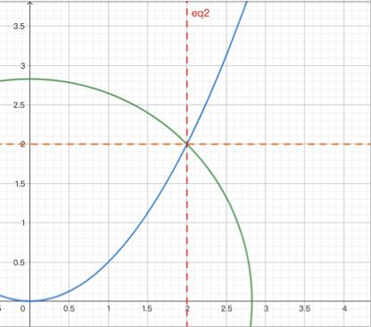

## 2022-2023学年下学期期中试卷（含答案）

### 一、选择题（25 分，每题 5 分）

1. $\displaystyle\lim_{\substack{x\to0\\y\to0}}\frac{\sin(x-y)}{x+y}=$（ ）。

    A. $1$

    B. $\infty$

    C. $0$

    D. 不存在

    

    
答案：

    D

    

    ***

2. 设 $|\boldsymbol\alpha|=3$，$|\boldsymbol\beta|=1$，$|\boldsymbol\alpha\times\boldsymbol\beta|=\sqrt5$，则 $\boldsymbol\alpha\cdot\boldsymbol\beta$ 的值为（ ）。

    A. $\pm2$

    B. $2$

    C. $\pm\sqrt5$

    D. $\sqrt5$

    

    
答案：

    A

    

    ***

3. 过点 $(1,2,3)$ 且与 $x$ 轴、直线

    $$
    L:\frac{x+1}{-1}=\frac{y+3}{2}=\frac{z+6}{4}
    $$

    都相交的直线方程是（ ）。

    A. $\dfrac{x-1}{2}=\dfrac{y-2}{-1}=\dfrac{z-3}{1}$

    B. $\dfrac{x-1}{7}=\dfrac{y-2}{4}=\dfrac{z-3}{6}$

    C. $\dfrac{x-1}{5}=\dfrac{y-2}{3}=\dfrac{z-3}{\frac64}$

    D. $\dfrac{x-1}{2}=\dfrac{y-2}{-2}=\dfrac{z-3}{1}$

    

    
答案：

    B

    

    ***

4. 若 $z=f(x,y)$ 在点 $P(x_0,y_0)$ 处可微，则 $f(x,y)$ 在点 $P(x_0,y_0)$ 处沿任何方向的方向导数（ ）。

    A. 必定存在

    B. 一定不存在

    C. 可能存在，也可能不存在

    D. 仅在 $x$ 轴、$y$ 轴方向存在，其他方向不存在

    

    
答案：

    A

    

    ***

5. 判断下列积分值的大小：

    $$
    J_i=\iint_{D_i}e^{-(x^2+y^2)}\,dxdy,\quad i=1,2,3,
    $$

    其中

    $$
    D_1=\{(x,y)\mid x^2+y^2\le R^2\},
    $$

    $$
    D_2=\{(x,y)\mid x^2+y^2\le2R^2\},
    $$

    $$
    D_3=\{(x,y)\mid |x|\le R,\ |y|\le R\},
    $$

    则 $J_1,J_2,J_3$ 之间的大小顺序为（ ）。

    A. $J_1\le J_2\le J_3$

    B. $J_2\le J_3\le J_1$

    C. $J_1\le J_3\le J_2$

    D. $J_3\le J_2\le J_1$

    

    
答案：

    C

    

***

### 二、填空题（25 分，每题 5 分）

1. 设 $u=2xy-z^2$，$u$ 在点 $(2,-1,1)$ 处方向导数的最大值为 $\underline{\qquad}$。

    

    
答案：

    $$
    2\sqrt6
    $$

    

    ***

2. 球面 $x^2+y^2+z^2=9$ 在点 $(2,2,1)$ 处的切平面方程为 $\underline{\qquad}$，法线方程为 $\underline{\qquad}$。

    

    
答案：

    $$
    2x+2y+z-9=0,
    $$

    $$
    \frac{x-2}{4}=\frac{y-2}{4}=\frac{z-1}{2}
    $$

    

    ***

3. 设 $z(x,y)$ 由方程

    $$
    2xz-2xyz+\ln(xyz)=0
    $$

    确定的函数，则 $\displaystyle\frac{\partial z}{\partial x}=\underline{\qquad}$。

    

    
答案：

    $$
    -\frac{z}{x}
    $$

    

    ***

4. 设 $D$ 为圆心在原点，半径为 $a$ 的上半圆，则

    $$
    \iint_D\sqrt{a^2-x^2-y^2}\,d\sigma=\underline{\qquad}.
    $$

    

    
答案：

    $$
    \frac{\pi}{3}a^3
    $$

    

    ***

5. 设 $\Omega:x^2+y^2+z^2\le z$，则

    $$
    \iiint_\Omega\sqrt{x^2+y^2+z^2}\,dV=\underline{\qquad}.
    $$

    

    
答案：

    $$
    \frac{\pi}{10}
    $$

    

***

### 三、（10 分）

求经过直线

$$
l_1:
\begin{cases}
x+y+1=0,\\
x+2y+2z=0
\end{cases}
$$

且与平面 $\Pi:2x-y-z=0$ 垂直的平面方程。

答案：

解法一：设所求平面 $\Pi_1$ 为

$$
(x+2y+2z)+\lambda(x+y+1)=0,
$$

即

$$
(1+\lambda)x+(2+\lambda)y+2z+\lambda=0.
$$

由 $\Pi_1\perp\Pi$ 得

$$
2(1+\lambda)-(2+\lambda)-2=0\Longrightarrow \lambda=2,
$$

故 $\Pi_1$ 为

$$
3x+4y+2z+2=0.
$$

解法二：因所求平面垂直于 $2x-y-z=0$，故它平行于 $(2,-1,1)$，又由

$$
\begin{cases}
x+y+1=0,\\
x+2y+2z=0
\end{cases}
$$

可得 $l_1$ 上两点 $(0,-1,1)$ 和 $(-2,1,0)$。故可得平面方程

$$
\begin{vmatrix}
x&y+1&z-1\\
2&-1&1\\
0-(-2)&-1-1&1-0
\end{vmatrix}=0,
$$

即

$$
3x+4y+2z+2=0.
$$

***

### 四、（10 分）

设方程组

$$
\begin{cases}
x+y+z+z^2=0,\\
x+y^2+z+z^3=0,
\end{cases}
$$

求 $\displaystyle\frac{dy}{dx}$，$\displaystyle\frac{dz}{dx}$。

答案：

方程组两边同时对 $x$ 求导，得

$$
\begin{cases}
1+\dfrac{dy}{dx}+(1+2z)\dfrac{dz}{dx}=0,\\
1+2y\dfrac{dy}{dx}+(1+3z^2)\dfrac{dz}{dx}=0.
\end{cases}
$$

因此，

$$
\frac{dy}{dx}=\frac{2z-3z^2}{1+3z^2-2y-4yz},
$$

$$
\frac{dz}{dx}=\frac{2y-1}{1+3z^2-2y-4yz}.
$$

***

### 五、（10 分）

设

$$
I=\int_0^2dx\int_0^{\frac{x^2}{2}}xy\,dy
+\int_2^{2\sqrt2}dx\int_0^{\sqrt{8-x^2}}xy\,dy,
$$

交换其积分次序并计算。

答案：

积分区域由两部分组成，如图所示，

其中

$$
D_1:
\begin{cases}
0\le x\le2,\\
0\le y\le\dfrac{x^2}{2},
\end{cases}
\quad
D_2:
\begin{cases}
2\le x\le2\sqrt2,\\
0\le y\le\sqrt{8-x^2}.
\end{cases}
$$

将 $D=D_1+D_2$ 视为 $y$ 型区域，则

$$
D:
\begin{cases}
\sqrt{2y}\le x\le\sqrt{8-y^2},\\
0\le y\le2.
\end{cases}
$$

从而

$$
\begin{aligned}
I
&=\iint_Dxy\,dxdy\\
&=\int_0^2dy\int_{\sqrt{2y}}^{\sqrt{8-y^2}}xy\,dx\\
&=\int_0^2\frac{y(8-y^2-2y)}{2}\,dy\\
&=\frac12\left(4y^2-\frac{y^4}{4}-\frac{2y^3}{3}\right)\bigg|_0^2\\
&=\frac{10}{3}.
\end{aligned}
$$

***

### 六、（10 分）

求密度为 $\rho=z$ 的半椭球体

$$
\frac{x^2}{a^2}+\frac{y^2}{a^2}+\frac{z^2}{c^2}\le1,\quad z\ge0
$$

的质心。

答案：

由对称性容易得到质心的坐标形式为 $(0,0,\bar z)$，其中

$$
\bar z=\frac{\iiint z\rho\,dV}{\iiint\rho\,dV}
=\frac{\iiint z^2\,dV}{\iiint z\,dV}.
$$

利用柱面坐标系计算这两个三重积分：

$$
\begin{aligned}
\iiint z\,dV
&=\int_0^{2\pi}d\theta\int_0^a r\,dr
\int_0^{\frac ca\sqrt{a^2-r^2}}z\,dz\\
&=2\pi\int_0^a r\cdot\frac12z^2\bigg|_0^{\frac ca\sqrt{a^2-r^2}}\,dr\\
&=\pi\int_0^a r\cdot\frac{c^2}{a^2}(a^2-r^2)\,dr\\
&=-\frac12\cdot\frac{\pi c^2}{a^2}\int_0^a(a^2-r^2)\,d(a^2-r^2)\\
&=-\frac12\cdot\frac{\pi c^2}{a^2}\cdot\frac12(a^2-r^2)^2\bigg|_0^a\\
&=\frac{\pi a^2c^2}{4}.
\end{aligned}
$$

$$
\begin{aligned}
\iiint z^2\,dV
&=\int_0^{2\pi}d\theta\int_0^a r\,dr
\int_0^{\frac ca\sqrt{a^2-r^2}}z^2\,dz\\
&=2\pi\int_0^a r\cdot\frac13z^3\bigg|_0^{\frac ca\sqrt{a^2-r^2}}\,dr\\
&=\frac{2\pi}{3}\int_0^a r\cdot\frac{c^3}{a^3}(a^2-r^2)^{\frac32}\,dr\\
&=-\frac12\cdot\frac{2\pi c^3}{3a^3}\int_0^a(a^2-r^2)^{\frac32}\,d(a^2-r^2)\\
&=-\frac13\cdot\frac{\pi c^3}{a^3}\cdot\frac25(a^2-r^2)^{\frac52}\bigg|_0^a\\
&=\frac{2\pi a^2c^3}{15}.
\end{aligned}
$$

于是

$$
\bar z=\frac{\frac{2\pi a^2c^3}{15}}{\frac{\pi a^2c^2}{4}}=\frac{8c}{15}.
$$

故质心为

$$
\left(0,0,\frac{8c}{15}\right).
$$

***

### 七、（10 分）

求

$$
x^2+y^2+\frac{z^2}{4}=1
$$

在第一卦限上的点，使得该点处的切平面与三个坐标平面所围的四面体的体积最小。

答案：

设点 $P(x_0,y_0,z_0)$ 在曲面

$$
x^2+y^2+\frac{z^2}{4}=1
$$

上，则曲面在该点的法向量为

$$
\left(2x_0,2y_0,\frac{z_0}{2}\right).
$$

切平面方程为

$$
2x_0(x-x_0)+2y_0(y-y_0)+\frac{z_0}{2}(z-z_0)=0,
$$

即

$$
x_0x+y_0y+\frac{z_0}{4}z=1.
$$

容易求得平面在三个坐标轴上的截距分别为

$$
\frac1{x_0},\quad \frac1{y_0},\quad \frac4{z_0}.
$$

则围成的四面体体积为

$$
\frac13\cdot\frac12\cdot\frac1{x_0}\cdot\frac1{y_0}\cdot\frac4{z_0}
=
\frac23\cdot\frac1{x_0y_0z_0}.
$$

要使得其体积最小，则 $x_0y_0z_0$ 最大。问题转变为求曲面在第一卦限上的点使得该点处三个坐标乘积最大。

使用拉格朗日乘数法求该条件极值问题，拉格朗日函数为

$$
L=xyz+\lambda\left(x^2+y^2+\frac{z^2}{4}-1\right).
$$

令 $L_x=L_y=L_z=L_\lambda=0$，解得

$$
x=y=\frac1{\sqrt3},\quad z=\frac2{\sqrt3}.
$$

经验证可知该点处 $xyz$ 乘积最大，四面体体积最小，

$$
V_{\min}=\sqrt3.
$$

